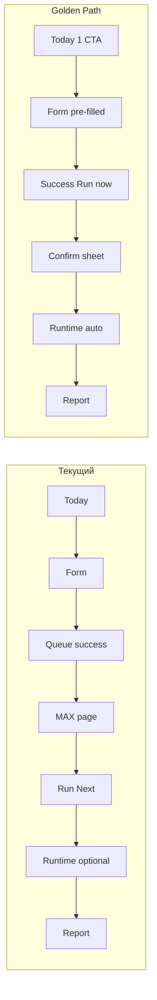

# AI-COMPANY-107P — Owner Task Flow Audit

## Цель

Новый Owner без инструкций должен **поставить и запустить первую задачу MAX < 30 секунд** и пройти непрерывный путь:

**идея → задача → запуск → выполнение → отчёт**

Аудит — анализ существующих экранов, без нового дизайна.

---

## Вердикт

| Метрика | Сейчас | Цель |
|---------|--------|------|
| Минимум тапов (оптимальный путь) | **7–9** | **4–5** |
| Время до запуска Worker Loop | **60–120 с** (с чтением copy) | **< 30 с** |
| Разрывов в narrative | **3** (queue / run / runtime) | **0** (ощущается одним процессом) |
| Очевидность «почему не выполняется сразу» | Частично (copy есть) | Явный 2-step indicator |

**Вывод:** поставить задачу можно быстро; **запустить и понять выполнение** — нет. Главный разрыв: **create ≠ run**, success не ведёт к run, runtime не открывается автоматически.

---

## Текущий сценарий (пошагово)

### Шаг 1 — Открыть `/mobile/today`

| Критерий | Оценка |
|----------|--------|
| Очевидно? | **Частично** — hero «Что сейчас происходит?» не говорит «поставь задачу» |
| Кликов | 0 (landing) |
| Потеря | Owner видит 5+ одинаковых entry points |

**Entry points на Today (все ведут к assign, не к run):**

| Элемент | Кликов | Куда |
|---------|--------|------|
| Standard Task Quick Start | 1 | `/mobile/tasks/new?…&template=standard_health_check` |
| Next Action `launch_first` | 1 | `tasksNewMax` |
| Next Action `continue_max` | 1 | `/mobile/employees/ag-max` (очередь, не форма) |
| Empty state CTA | 1 | `tasksNewMax` |
| Quick Actions ×4 | 1 каждый | assign / MAX / morning / decisions |
| FAB «+» | 2 | sheet → `tasksNewMax` |

**Лишнее для нового Owner:** Quick Actions (4 кнопки), FAB sheet, empty + next action + standard banner — **дублируют одну идею**.

**Что объединить:** один primary hero «Дать задачу MAX» + secondary «Обучение» (first launch guide).

---

### Шаг 2 — Решение «Хочу дать MAX новую работу»

| Критерий | Оценка |
|----------|--------|
| Очевидно? | **Да**, если нажал Standard Task или Next Action |
| Кликов | +1 |
| Потеря | Owner может уйти в «MAX сегодня» (очередь без задачи) или «Утренний отчёт» |

**continue_max** copy: «Продолжить работу MAX» — звучит как run, но ведёт только на страницу MAX **без автозапуска**.

---

### Шаг 3 — Поставить задачу (`/mobile/tasks/new`)

| Критерий | Оценка |
|----------|--------|
| Очевидно? | **Частично** — форма длинная (employee, 6 templates, composer) |
| Кликов | +1 submit («Добавить в очередь») |
| Потеря | Owner ждёт instant run; copy предупреждает, но мелко |

**Copy (хорошо):**

- intro: «Задача попадёт в очередь — Runtime не запускается автоматически»
- submit: «Добавить в очередь»
- submitNote: «Запуск Worker Loop — отдельное действие Owner»

**Лишнее на первом визите:**

- Employee picker (только MAX enabled — всё равно показывается)
- 6 шаблонов при уже выбранном standard template
- Standard Task banner повторно на форме (если не standard template)

**Оптимальный путь:** standard template pre-filled → **0 правок** → submit = **2 клика** от Today.

---

### Шаг 4 — Найти задачу в очереди

| Критерий | Оценка |
|----------|--------|
| Очевидно? | **Нет** — после success Owner на success screen, не в очереди |
| Кликов | +1 «Открыть MAX» |
| Потеря | Tasks tab, Employees roster — альтернативы без подсказки |

**Success screen (`MobileRunTaskPage`):**

- Primary: «Открыть MAX»
- Secondary: «Добавить ещё»
- **Не показаны** (есть в i18n): `runNext`, `startWorkday`, `openQueue`, `maxHint`

**Tasks Center** (`/mobile/tasks`):

- Pending item: next step «Откройте MAX и запустите…» — **хорошо**
- Кнопка «Поставить задачу» на карточке pending — **misleading** (ведёт на новую форму)
- Кнопка «Открыть MAX» — правильная, но вторичная

---

### Шаг 5 — Запустить задачу (`/mobile/employees/ag-max`)

| Критерий | Оценка |
|----------|--------|
| Очевидно? | **Да** — «Запустить следующую» primary |
| Кликов | +1 |
| Потеря | Workday block выше по scroll — Owner может думать, что сначала «Начать рабочий день» |

**Run Next confirmation (107I):** компонент `MobileRunNextSheetFlow` **существует, не подключён**. Run — мгновенный tap без preview/warning/success→report.

**Workday:** не блокирует queue/run, но **визуально конкурирует** с primary action на первом экране MAX.

**Runtime placeholder:** когда loop не активен — hint «Когда MAX выполняет задачу, здесь появится баннер…» — **хорошо для обучения**, но ниже fold после hero/workday.

---

### Шаг 6 — Понять, что задача выполняется

| Критерий | Оценка |
|----------|--------|
| Очевидно? | **Частично** — banner появляется после run, но Owner должен **заметить** |
| Кликов | +1 опционально «Смотреть выполнение» |
| Потеря | Нет auto-nav в Runtime; FAB скрыт на runtime; **Runtime нет в More links** |

**Runtime Live** (`/mobile/runtime`):

- 7 фаз, progress bar, polling 500ms — **достаточно для V1**
- Empty: «Запустите задачу из очереди MAX» — связь с шагом 5

---

### Шаг 7 — Дождаться результата

| Критерий | Оценка |
|----------|--------|
| Очевидно? | **Да** на Runtime Live (фазы + elapsed) |
| Кликов | 0 (wait) |
| Потеря | Owner может уйти с MAX page — banner есть, но только если вернётся на MAX |

---

### Шаг 8 — Открыть отчёт

| Критерий | Оценка |
|----------|--------|
| Очевидно? | **Частично** — 5 entry points, нет единого «следующий шаг» |
| Кликов | +1 «Открыть отчёт» (Runtime) или Last Result / Today results |

**Entry points после completion:**

1. Runtime Live → «Открыть отчёт»
2. MAX → Last Result card
3. Today → Employee Results
4. Tasks Center → completed card
5. More → Reports

**Run Next sheet success** (не подключён): обещает «Открыть отчёты» — недоступно.

---

## Карта кликов (текущий minimum path)

```
Today → Standard Task (1)
  → Submit queue (1)
  → Success → Open MAX (1)
  → Run Next (1)
  → [optional] Watch Runtime (1)
  → Open Report (1)
─────────────────────────
Итого: 5–6 intentional taps + cognitive load между экранами
```

**vs цель 30 сек:** форма + 2 экрана переключения + отсутствие «Запустить сейчас» на success.

---

## Проблемы (системные, не отдельные кнопки)

### P1 — Разорванный narrative (create / run / watch)

- Domain: `createEmployeeWorkItem` ≠ `runMaxEmployeeWorkQueueNextItem` — by design
- UI не **сшивает** два шага в один процесс
- Success — тупик, не мост к run

### P2 — Избыток entry points на Today

- 5 способов assign без иерархии
- New Owner не знает, какой «правильный»

### P3 — Run Next без confirmation flow

- 107I built but not wired
- Нет success→runtime/report bridge после run

### P4 — Misleading secondary actions

- Task Center «Поставить задачу» на pending item
- `continue_max` звучит как run, открывает только MAX page

### P5 — Конкурирующие секции на MAX

- Workday + Queue + Runtime placeholder + Standard Task + Hero — **5 зон внимания**
- Для first run workday **не обязателен**, но выглядит равнозначным

### P6 — Runtime discovery

- Banner только на MAX (после run)
- More: i18n runtime есть, **ссылки в UI нет**
- Нет post-run redirect

### P7 — Обучение оторвано от flow

- First Launch Guide (10 шагов) — в More, не auto для нового Owner
- 3–5 минут vs цель 30 секунд — разные продукты

---

## Предлагаемый сценарий — «Golden Path» (существующие экраны)

Единый поток **без новых экранов**, только приоритеты, copy и navigation glue.

### Фаза A — Intent (Today, ≤5 с)

```
/mobile/today
  └─ [PRIMARY] Next Action / Hero: «Дать задачу MAX»
       → /mobile/tasks/new?employee=ag-max&template=standard_health_check
```

**Убрать с первого визита (не удалять навсегда):**

- Quick Actions block (или collapse после first task)
- FAB как primary (оставить для power users)
- Дубли empty + standard + next action → **один** next action card

**Оставить:** Company Status (context), First Launch Guide в More.

---

### Фаза B — Task (Run Task, ≤10 с)

```
/mobile/tasks/new (standard pre-filled)
  └─ [PRIMARY] «Добавить в очередь» (1 tap, 0 edits)
```

**Copy на форме:** one-liner step indicator:

> **Шаг 1 из 2** — задача попадёт в очередь MAX. Запуск — на следующем экране.

**Скрыть на first-run:** template grid если `template=standard_health_check` в URL.

---

### Фаза C — Bridge (Success, ≤5 с) — **ключевое изменение**

```
Success screen (тот же MobileRunTaskPage)
  Step indicator: ✓ В очереди  →  ○ Запуск
  [PRIMARY] «Запустить сейчас»  →  open Run Next sheet (107I)
  [SECONDARY] «Открыть MAX»
  [TERTIARY] «Добавить ещё»
```

i18n уже есть: `success.runNext`, `success.maxHint`.

---

### Фаза D — Run (MAX / Sheet, ≤5 с)

```
MobileRunNextSheetFlow (bottom sheet)
  Preview task → «Запустить» → running → success
  On success: auto-navigate → /mobile/runtime?loop={id}
```

Если sheet skipped (power user на MAX page): тот же sheet при «Запустить следующую».

---

### Фаза E — Execution (Runtime Live, wait)

```
/mobile/runtime?loop=…
  Progress + phases (existing)
  Owner sees live proof without returning to MAX
```

---

### Фаза F — Report (completion)

```
Runtime Live → [PRIMARY] «Открыть отчёт»
  или Today Next Action → view_results
```

**Post-completion Today next action:** автоматически `view_results` с report href.

---

### Golden Path click budget

| Шаг | Экран | Тaps |
|-----|-------|------|
| 1 | Today → Standard/Next Action | 1 |
| 2 | Submit queue | 1 |
| 3 | Success → Run now | 1 |
| 4 | Sheet confirm | 1 |
| 5 | (auto) Runtime Live | 0 |
| 6 | Open report | 1 |
| **Итого** | | **5 taps + wait** |

При pre-filled template — **реалистично < 30 с** для мотивированного Owner.

---

## Какие изменения нужны

Приоритет **P0** (сшивка потока):

| # | Изменение | Экран | Тип |
|---|-----------|-------|-----|
| 1 | Success primary = «Запустить сейчас» + step indicator 1/2 | `MobileRunTaskPage` | UI + copy |
| 2 | Подключить `MobileRunNextSheetFlow` к run from success и MAX | `MobileEmployeePage`, hook | wiring |
| 3 | After run success → `navigate(/mobile/runtime?loop=)` | sheet flow | navigation |
| 4 | `continue_max` CTA → «Запустить задачу из очереди» | i18n + next action | copy |

Приоритет **P1** (убрать шум):

| # | Изменение | Экран |
|---|-----------|-------|
| 5 | First visit Today: hide Quick Actions / dedupe CTAs | `MobileTodayPage` + `useMobileOwnerHome` |
| 6 | Task Center pending: replace «Поставить задачу» → «Запустить на MAX» | `MobileTaskCenterCard` |
| 7 | MAX first-run: collapse Workday below fold or «Необязательно для первой задачи» | copy |
| 8 | Add Runtime Live to More links | `MobileTabPages` |

Приоритет **P2** (polish):

| # | Изменение |
|---|-----------|
| 9 | Auto-offer First Launch Guide if `!hasPriorActivity` (once) |
| 10 | Run Task: hide template grid when standard template in URL |
| 11 | Sheet success → direct report link if `reportId` ready |
| 12 | Update 107J doc: mobile runtime exists |

**Explicitly NOT in scope:** auto-run on submit (нарушает Owner control), новые экраны, redesign.

---

## Сравнение: текущий vs предлагаемый



---

## Manual check (подтверждение сценария)

Проверено по коду и navigation graph (build green):

```bash
npm --prefix apps/ai-company run build
```

| Step | Route | Статус audit |
|------|-------|--------------|
| Today entry | `/mobile/today` | ✅ multiple paths verified |
| Assign | `/mobile/tasks/new?…` | ✅ queue-only submit |
| Find queue | `/mobile/employees/ag-max` | ✅ work queue card |
| Run | MAX «Запустить следующую» | ✅ direct run, sheet **not wired** |
| Execution | `/mobile/runtime` | ✅ 107L live page |
| Report | `/mobile/reports/…` | ✅ via reportHref |

**Ручной smoke (рекомендуется перед 107Q implementation):**

1. Clear localStorage → open `/mobile/today`
2. Standard Task → submit → measure taps to run
3. Confirm banner appears after run
4. Open report after loop completes

---

## Связанные тикеты

| Ticket | Связь |
|--------|-------|
| 107D | Run Task V1 — queue-only |
| 107I | Run Next sheet — **not wired** |
| 107J | MVP flow doc — outdated runtime note |
| 107L | Runtime Live page |
| 107M | UX polish — Runtime missing in More |
| **107Q** (suggested) | Implement Golden Path wiring |

---

## Expected result после remediation

Owner открывает Today → 5 taps → видит live execution → report.  
Процесс ощущается **одной цепочкой**, а не тремя несвязанными приложениями (form / queue / runtime).
