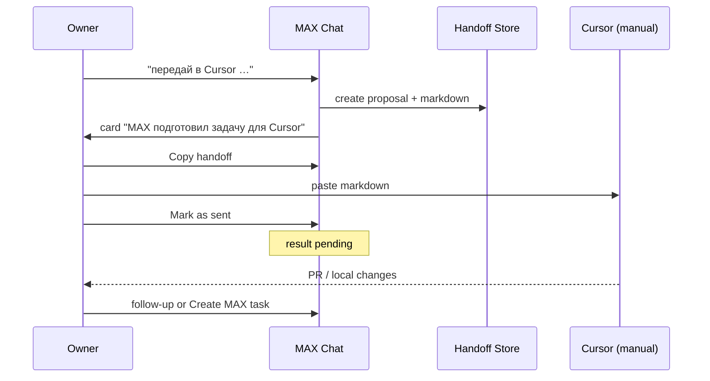

# AI-COMPANY-110C — Cursor Handoff from MAX Chat V1

## Goal

Подключить MAX Chat к **Cursor** как внешнему исполнителю через безопасный handoff.

**Важно:**
- **Cursor** — инструмент (tool registry: `cursor-automation`), **не** цифровой сотрудник
- **MAX** (`ag-max`) — цифровой сотрудник; готовит handoff после решения Owner
- **V1 без Cursor API** — Owner вручную копирует markdown в Cursor / Cursor Automation

## MAX → Cursor flow



## Где открыть

| Entry | Path |
|-------|------|
| MAX Chat (desktop) | `/ops/chats/conv:ag-max` |
| MAX Chat (mobile) | `/mobile/chat` |
| Employees → MAX → Open conversation | same chat id |

## Trigger phrases (Owner)

- «сделай в Cursor»
- «передай в Cursor»
- «пусть Cursor исправит»
- «подготовь задачу для Cursor»

(+ EN variants: hand off to Cursor, pass to Cursor, …)

## Handoff payload (markdown)

Секции prompt:

1. Цель
2. Контекст (чат, MAX как preparer)
3. Файлы / зоны проекта
4. Что нельзя трогать
5. Expected result
6. Checks
7. Branch
8. Commit rules
9. Report format
10. `.cursor/rules` catalog

**No IP rule:** markdown sanitizes `http://192.*`, `http://83.*`, direct Ollama IP. Allowed: relative routes, env config, same-origin `/runtime/ollama`.

## UI card actions

| Action | Effect |
|--------|--------|
| Скопировать handoff | clipboard + chat history `copied` |
| Создать задачу MAX | Work Queue item for follow-up/review |
| Отметить как отправлено | status `result_pending` + system message |
| Отклонить | status `rejected` |

## Chat history events

System messages in thread:

- handoff created
- copied
- marked sent
- result pending
- rejected / MAX task created

## Как вернуть результат обратно (V1)

1. Owner выполняет работу в Cursor локально
2. Owner сообщает MAX в чате текстом (V1 — без auto-ingest)
3. Опционально: **Создать задачу MAX** для review/integration в Work Queue
4. V2: Cursor Automation result adapter → Runtime report / knowledge candidate

## Почему Cursor не employee

- Tool registry explicitly lists Cursor as **external executor**
- MAX остаётся owner of reasoning, planning, and company context
- Handoff separates **decision** (Owner + MAX) from **code execution** (Cursor)
- Avoids org chart pollution and permission model confusion

## Files

```
src/domain/cursorHandoffFromChat/
src/components/chats/ChatCursorHandoffCard.tsx
src/mission-control/data/conversation.ts  (cursor_handoff message type)
src/hooks/useChat.ts                      (intent hook on send)
```

## Manual check

1. Open `/ops/chats/conv:ag-max`
2. Send: «передай в Cursor — добавь CSS для task history mobile»
3. Card appears — Copy → paste into Cursor
4. Mark sent → system messages + result pending
5. Create MAX task → Work Queue entry on `/mobile/employees/ag-max`

## V2 backlog

- Cursor API / Automation webhook ingest
- Native chat (non-conv) handoff path
- Auto branch detection from git
- Result paste-back parser in chat
- Owner Approval gate integration before copy
