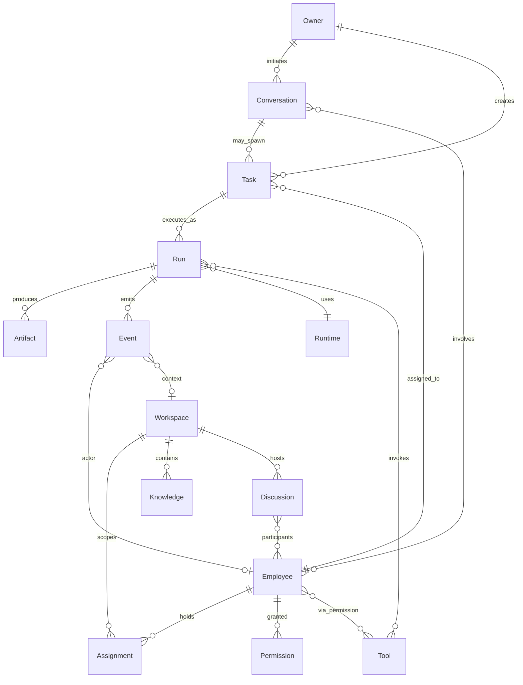
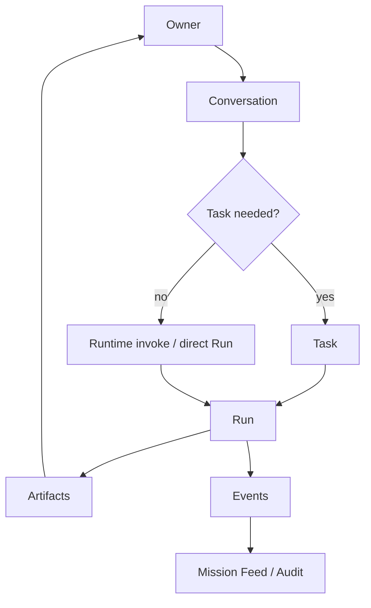
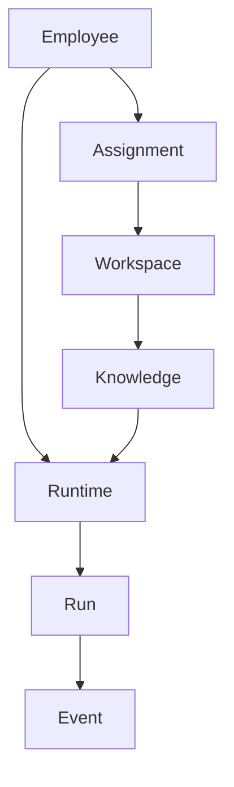
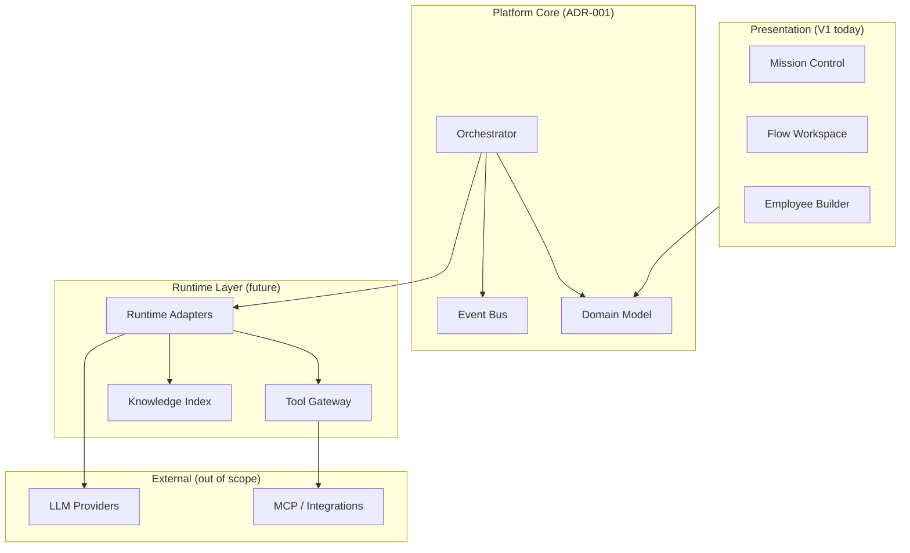

# ADR-001 — AI Company Platform Core Architecture

| Field | Value |
|-------|-------|
| **Status** | Accepted (design) |
| **Date** | 2026-06-24 |
| **Scope** | `apps/ai-company/**` — platform domain & boundaries |
| **Supersedes** | — |
| **Related** | [Domain Model](../domain/domain-model.md) |

---

## Context

AI Company V1 — standalone local UI с mock-данными: Mission Control, Flow Workspace, Employee Builder (localStorage). Следующая фаза — **Platform Runtime**: оркестрация цифровых сотрудников, знаний, задач и исполнения без привязки к ServiceManager.

Нужен единый доменный фундамент **до** реализации Runtime, API и persistence, чтобы:

- не смешать Employee с «агентом проекта»;
- не зашить LLM-провайдера в модель сотрудника;
- разделить диалог (Conversation), работу (Task) и исполнение (Run);
- сохранить audit trail через Event.

---

## Decision

Принимаем **Employee-centric platform model** с двумя главными осями:

1. **Work axis** — как Owner инициирует и получает результат работы.
2. **Capacity axis** — как Employee подключается к проектам и исполняет через Runtime.

Детали сущностей — в [domain/](../domain/domain-model.md). Runtime, backend и ServiceManager **не входят** в scope ADR-001.

---

## Core Principles

| # | Principle | Implication |
|---|-----------|-------------|
| P1 | **Employee — главная сущность платформы** | Все операции авторизуются и аудируются относительно Employee identity, а не «session LLM». |
| P2 | **LLM — сменяемый Runtime Engine** | `primaryModel`, tools и prompts живут у Employee; конкретный провайдер/endpoint — у Runtime. |
| P3 | **Employee не принадлежит проекту** | Employee — persistent org asset. Участие в проекте — только через Assignment. |
| P4 | **Employee может иметь несколько Assignment** | Один CTO может быть assigned к нескольким Workspace с разным scope. |
| P5 | **Workspace содержит знания проекта** | Knowledge scoped by Workspace; не смешивается с глобальным Employee profile. |
| P6 | **Conversation — самостоятельная сущность** | Диалог не сводится к Task; Task может порождаться из Conversation, но не обязан. |
| P7 | **Task — лишь один из способов взаимодействия с Employee** | Также: Conversation turn, Discussion reply, scheduled Run, ad-hoc invoke. |

Дополнительные инварианты (наследие V1 governance):

- Human **Owner** сохраняет финальное одобрение на deploy, merge, production.
- Permission — least-privilege; неявный deny.
- Event — append-only; состояние Run/Task восстанавливается из Events + snapshots.

---

## Domain Overview

---

## Primary Flows

### Flow A — Owner work delivery

Owner инициирует работу через диалог или явную задачу. Исполнение материализуется в Run и артефактах.

**Semantics:**

| Step | Entity | Notes |
|------|--------|-------|
| Owner | Human operator | Не доменная сущность платформы; external actor |
| Conversation | Standalone thread | Может содержать turns без Task |
| Task | Work unit | Optional; assignee = Employee |
| Run | Execution instance | 1..n Runs per Task (retries, steps) |
| Artifacts | Outputs | Plans, diffs, docs, reports — typed blobs + metadata |

### Flow B — Employee capacity & execution

Employee подключается к Workspace через Assignment, читает Knowledge, исполняет через Runtime.

**Semantics:**

| Step | Entity | Notes |
|------|--------|-------|
| Employee | Platform identity | Role, skills, permissions, prompts |
| Assignment | Employee ↔ Workspace link | Scope, priority, active window |
| Workspace | Project container | Boundaries for Knowledge & Discussion |
| Knowledge | Scoped memory/docs | RAG indices, ADRs, runbooks |
| Runtime | Engine adapter | LLM + tool gateway; hot-swappable |

---

## Layering (future implementation)

| Layer | Responsibility |
|-------|----------------|
| Presentation | NOC UI, roster, builder — **no business rules** |
| Platform Core | Lifecycle, policies, assignment resolution |
| Runtime Layer | Model routing, tool calls, token accounting |
| External | Providers; never referenced directly from domain entities |

---

## Mapping from V1 local app

| V1 artifact | Platform entity | Gap |
|-------------|-----------------|-----|
| `CustomEmployee` (localStorage) | Employee draft | Needs server identity, Assignment |
| Mission Control `Agent` | Employee **projection** | Runtime telemetry overlay |
| Mission Control `Task` | Task (mock) | No Run, no Conversation link |
| Tools Registry | Tool catalog | No Permission binding enforcement |
| Flow Workspace graph | Visualization | Not yet Workspace/Run model |
| Mission Feed | Event stream (subset) | Incomplete schema |

---

## Consequences

### Positive

- Чёткое разделение **identity** (Employee) и **execution** (Runtime/Run).
- Workspace изолирует Knowledge — multi-project без fork Employee.
- Conversation-first UX совместим с task-driven ops.
- Event-sourced audit готов к NOC/Mission Feed.

### Negative / trade-offs

- Больше сущностей, чем в V1 mock — нужен orchestrator и persistence.
- Assignment resolution добавляет latency при каждом Run.
- Discussion vs Conversation требует UX-диscipline (когда что использовать).

### Out of scope (explicit)

- Backend API, database schema, queue
- ServiceManager / AgentTask integration
- Concrete Runtime adapters (Ollama, Claude, etc.)
- AuthN/AuthZ for multi-tenant Owner

---

## Entity index

| Entity | Doc |
|--------|-----|
| Employee | [employee.md](../domain/employee.md) |
| Workspace | [workspace.md](../domain/workspace.md) |
| Assignment | [assignment.md](../domain/assignment.md) |
| Conversation | [conversation.md](../domain/conversation.md) |
| Discussion | [discussion.md](../domain/discussion.md) |
| Task | [task.md](../domain/task.md) |
| Run | [run.md](../domain/run.md) |
| Runtime | [runtime.md](../domain/runtime.md) |
| Knowledge | [knowledge.md](../domain/knowledge.md) |
| Tool | [tool.md](../domain/tool.md) |
| Permission | [permission.md](../domain/permission.md) |
| Event | [event.md](../domain/event.md) |

---

## Revision history

| Version | Date | Change |
|---------|------|--------|
| 1.0 | 2026-06-24 | Initial platform ADR + domain model reference |
