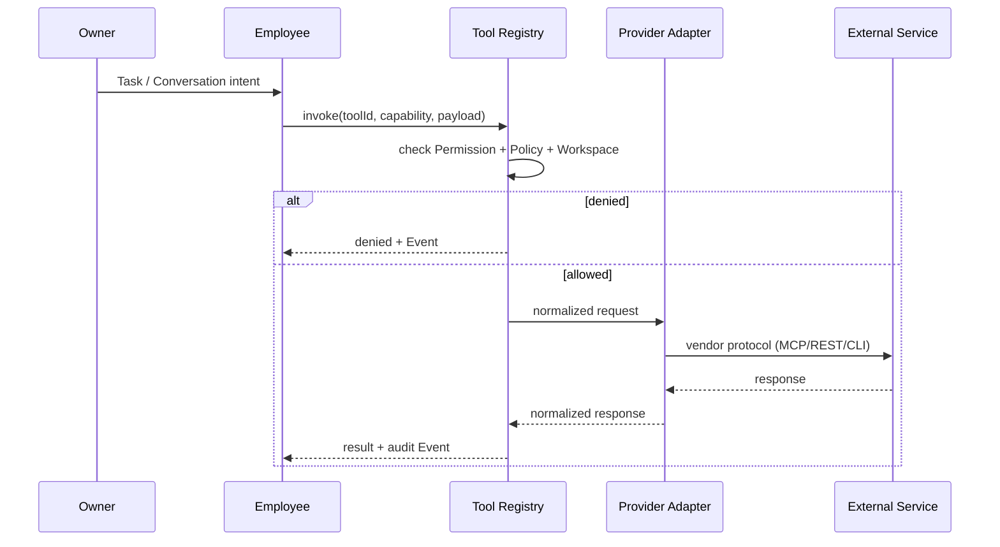

# ADR-002 — Tool Registry as Mandatory Mediation Layer

| Field | Value |
|-------|-------|
| **Status** | Accepted (design) |
| **Date** | 2026-06-24 |
| **Scope** | `apps/ai-company/**` — Tool Registry, Capabilities, Access Policies |
| **Supersedes** | — |
| **Related** | [ADR-001](./adr-001-ai-company-platform.md), [Domain Model](../domain/domain-model.md) |

---

## Context

Digital Employees in AI Company must interact with external systems: GitHub, Docker, PostgreSQL, Figma, Telegram, MCP servers, REST APIs, and local resources.

Without a unified mediation layer, each integration would:

- bypass Permission and audit boundaries;
- couple Employee identity directly to vendor SDKs or MCP transports;
- make Workspace scoping impossible to enforce consistently;
- require Employee model changes for every new connector.

V1 Mission Control already lists tools in mock inventory. Platform Runtime (future) will invoke tools during Runs. We need a **stable contract** before any real connection is implemented.

---

## Decision

**Tool Registry is the single mandatory gateway** between Employee (via Runtime) and any external capability.

Employees **never** call MCP, GitHub, Docker, or REST endpoints directly. All external access flows:

```text
Employee → Permission → Tool Registry → Provider Adapter → External Service
```

The Registry owns:

| Concern | Owner |
|---------|--------|
| Tool identity (`id`, `name`, `category`) | Tool Registry |
| Transport type (`provider`: MCP, REST, CLI, Native, Local) | Tool Registry |
| Capability matrix (`read`, `write`, `execute`, …) | Tool Registry |
| Access policies (`always-allowed`, `require-approval`, …) | Tool Registry |
| Connection status (mock in V1) | Tool Registry |
| Workspace scope & audit flags | Tool Registry |

Employee profile stores **references** to allowed tools (by name/id), not connection credentials or transport details.

---

## Core Principles

| # | Principle | Implication |
|---|-----------|-------------|
| T1 | **Single integration point** | New MCP server, API, or CLI wraps as a Registry Tool — Employee model unchanged. |
| T2 | **Capability-first, not vendor-first** | Authorization checks capabilities (`deploy`, `write`) not raw HTTP methods. |
| T3 | **Policy overlay** | Tool-level policies combine with Employee Permission and Workspace context. |
| T4 | **No implicit allow** | Default deny; `always-allowed` is explicit and rare. |
| T5 | **Audit by default** | `supportsAudit: true` for production-grade tools; Events emitted on invoke. |
| T6 | **Workspace scope where applicable** | Tools with `supportsWorkspaceScope` bind credentials/context to Workspace, not Employee. |

---

## Tool Model (V1)

```typescript
type RegistryTool = {
  id: string
  name: string
  category: ToolRegistryCategory   // Development, Infrastructure, …
  provider: ToolRegistryProvider     // MCP, REST API, CLI, Native, Local
  capabilities: ToolCapability[]     // Read, Write, Execute, …
  permissions: ToolAccessPolicy[]    // Always Allowed, Require Approval, …
  connectionStatus: ConnectionStatus // mock in V1
  requiresApproval: boolean
  supportsWorkspaceScope: boolean
  supportsAudit: boolean
}
```

Categories: Development, Infrastructure, Communication, Business, Knowledge, Storage, AI, Automation.

Providers: MCP, REST API, CLI, Native, Local.

Capabilities: Read, Write, Execute, Search, Create, Delete, Deploy, Review, Analyze, Generate, Notify.

Policies: Always Allowed, Require Approval, Workspace Only, Owner Only, Disabled.

---

## Why Registry Is Mandatory

### 1. Security & governance

Direct Employee → GitHub MCP access would skip Owner approval on `deploy` and `delete`. Registry enforces policy evaluation **before** adapter execution.

### 2. Stable Employee model

Adding Telegram or Google Drive does not extend Employee schema — only Registry catalog and Permission grants change.

### 3. Multi-Workspace isolation

Assignment scopes Employee to Workspace; Registry resolves which tool credentials and Knowledge apply. Employee never holds project secrets in profile.

### 4. Runtime swap

Ollama (local) and OpenRouter (cloud) share the `generate` capability; Runtime picks adapter by Tool Registry entry, not hardcoded in Employee prompt.

### 5. Future MCP explosion

MCP ecosystem grows unbounded. Registry categorizes and policies each connector once; N Employees reuse the same Tool definition.

---

## Flow (conceptual)



---

## V1 Scope (this ADR)

| In scope | Out of scope |
|----------|--------------|
| Universal Tool model & catalog UI | Real MCP connections |
| Capability & Policy matrices | Backend persistence |
| Provider taxonomy | Runtime invocation |
| Mock `connectionStatus` | ServiceManager bridge |
| ADR + local static catalog | npm package installs |

Data lives in `apps/ai-company/src/mission-control/data/tools.ts` (static). Future: Registry API backed by config store; UI unchanged.

---

## Consequences

**Positive**

- Any integration (MCP, GitHub, Docker, Telegram, Figma, …) plugs in without Employee refactor.
- Permission, Workspace, and audit rules have one enforcement choke point.
- Mission Control catalog becomes source of truth for NOC visibility.

**Negative / trade-offs**

- Extra indirection latency (acceptable — governance > raw speed).
- Registry maintenance overhead for each new Tool (mitigated by provider adapters sharing capability templates).

**Follow-up ADRs / tasks**

- Runtime Tool Invoke protocol
- Registry persistence & credential vault
- Workspace-scoped tool credentials
- Live connection health probes

---

## Compliance with ADR-001

- **P1 Employee-centric**: Tools invoked *on behalf of* Employee; audit ties to Employee identity.
- **P3/P4 Assignment**: Workspace-scoped tools respect Assignment boundary.
- **P7 Task is one interaction mode**: Tool invoke also occurs from Conversation and Run — Registry serves all channels equally.

---

## References

- `apps/ai-company/src/mission-control/data/tools.ts`
- `apps/ai-company/src/mission-control/pages/ToolsCatalogPage.tsx`
- `apps/ai-company/src/mission-control/pages/ToolDetailsPage.tsx`
