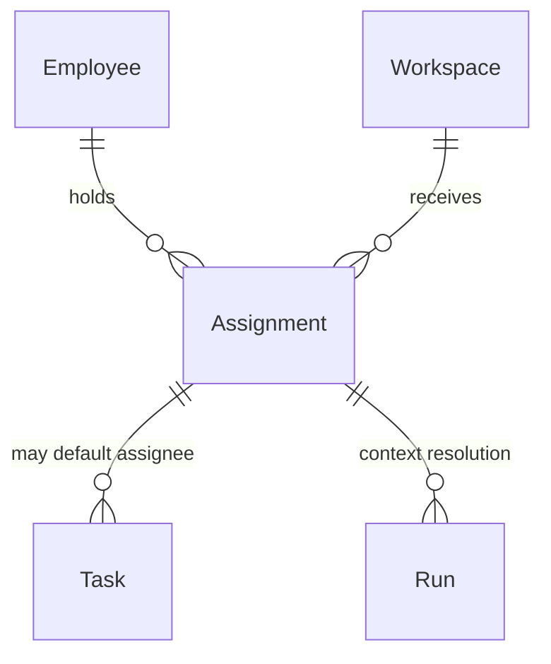
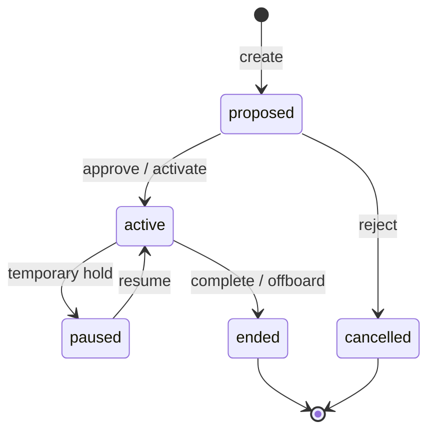

# Assignment

**Aggregate root:** yes (join entity)  
**Parent:** [Domain Model](./domain-model.md)

---

## Purpose

**Assignment** — явная связь Employee ↔ Workspace с определённым scope. Единственный поддерживаемый способ участия Employee в проекте (принцип P3/P4 ADR-001).

---

## Responsibilities

| Area | Responsibility |
|------|----------------|
| Linkage | Bind `employeeId` + `workspaceId` |
| Scope | Role-in-project, capacity weight, allowed Task types |
| Temporal | Active window, pause, end |
| Authorization | Narrow Permission for this Workspace (optional overlay) |
| Resolution | Orchestrator uses Assignment to pick Knowledge + policies |

Assignment **does not**:

- Duplicate full Employee profile
- Replace global Permission profile (may overlay stricter rules)

---

## Relationships

| Relation | Cardinality | Notes |
|----------|-------------|-------|
| Employee | n..1 | Required |
| Workspace | n..1 | Required |
| Task | 0..n | Default assignee hint |
| Run | 0..n | Resolved at schedule time |

---

## Lifecycle

| State | Meaning |
|-------|---------|
| `proposed` | Pending Owner approval |
| `active` | Employee may execute in Workspace |
| `paused` | No new Runs; in-flight may complete |
| `ended` | Historical record |
| `cancelled` | Never activated |

**Rule:** Employee may have **multiple active Assignments** to different Workspaces; orchestrator resolves conflicts by priority field.

---

## Attributes (conceptual)

| Attribute | Type | Notes |
|-----------|------|-------|
| `id` | UUID | |
| `employeeId` | ref | |
| `workspaceId` | ref | |
| `roleLabel` | string | e.g. "Lead Developer on SMA" |
| `priority` | int | Conflict resolution |
| `capacityPct` | 0–100 | Planning / NOC load |
| `status` | enum | Lifecycle |
| `permissionOverlay` | optional | Stricter than Employee global |
| `startsAt` | timestamp | |
| `endsAt` | timestamp | optional |

---

## Future Extensions

- **Auto-assignment** — rules from squad capacity (AI COO projection).
- **Acting assignment** — substitute Employee during suspension.
- **SLA on response** — Assignment-level SLA for Tasks.
- **Billing unit** — cost allocation per Assignment.
- **Conflict detection** — warn when total `capacityPct` > 100% across Workspaces.
