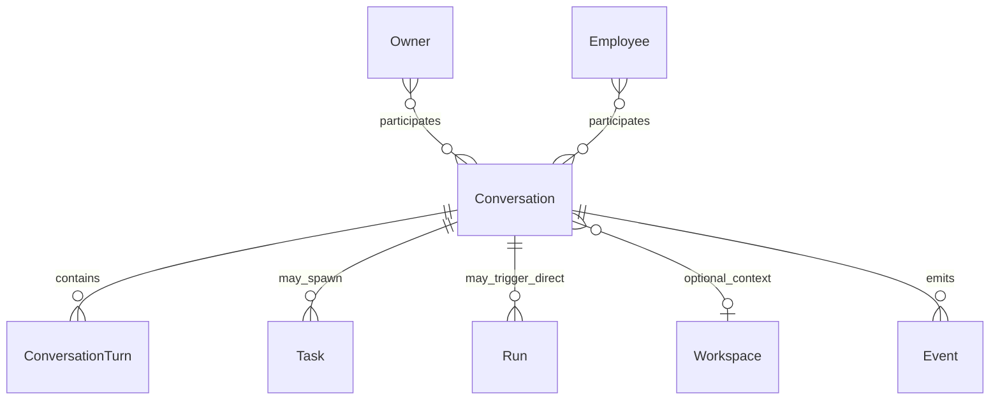
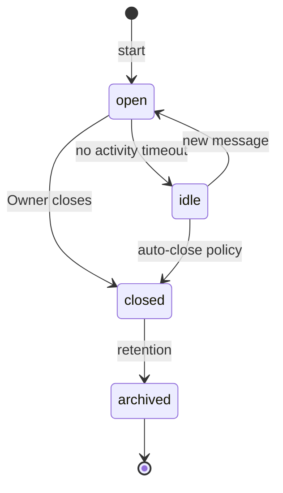

# Conversation

**Aggregate root:** yes  
**Parent:** [Domain Model](./domain-model.md)

---

## Purpose

**Conversation** — самостоятельный многотуровый диалог между Owner (и другими участниками) и одним или несколькими Employee. Не сводится к Task: Conversation может существовать без задач, а Task может быть **порождён** из Conversation (принцип P6/P7).

---

## Responsibilities

| Area | Responsibility |
|------|----------------|
| Channel | Ordered turns (messages) with author attribution |
| Participants | Owner, Employee(s), optional Observer |
| Intent capture | Natural language goals before formal Task |
| Spawn control | Optional creation of Task from turn |
| Context handoff | Pass summary + refs to Run/Task |
| Retention | Conversation history for audit and continuity |

Conversation **does not**:

- Guarantee execution (Run is separate)
- Replace structured Discussion in Workspace
- Store long-form Knowledge (links to Knowledge instead)

---

## Relationships

| Relation | Cardinality | Notes |
|----------|-------------|-------|
| ConversationTurn | 1..n | Messages / tool summaries |
| Task | 0..n | `spawnedFromConversationId` |
| Run | 0..n | Direct invoke without Task |
| Workspace | 0..1 | Optional scope for Knowledge |
| Event | 0..n | `conversation.message`, `conversation.spawn_task` |

---

## Lifecycle

| State | Meaning |
|-------|---------|
| `open` | Active dialogue |
| `idle` | No recent turns; still readable |
| `closed` | No new turns |
| `archived` | Cold storage |

---

## Attributes (conceptual)

| Attribute | Type | Notes |
|-----------|------|-------|
| `id` | UUID | |
| `title` | string | Auto or Owner-set |
| `workspaceId` | ref | optional |
| `participantIds` | ref[] | Employee + Owner refs |
| `status` | enum | Lifecycle |
| `lastActivityAt` | timestamp | |
| `summary` | text | Rolling summary for context window |

**ConversationTurn:** `id`, `conversationId`, `authorType`, `authorId`, `content`, `attachments`, `createdAt`.

---

## Future Extensions

- **Branching conversations** — fork from turn for alternate plans.
- **Voice / multimodal turns** — artifact refs instead of inline blobs.
- **Shared Conversation links** — read-only export for stakeholders.
- **Auto-summarize to Knowledge** — Owner-approved promotion to Workspace.
- **Conversation → Discussion bridge** — escalate to async Workspace thread.
- **Typing / presence** — realtime UI (presentation layer only).
