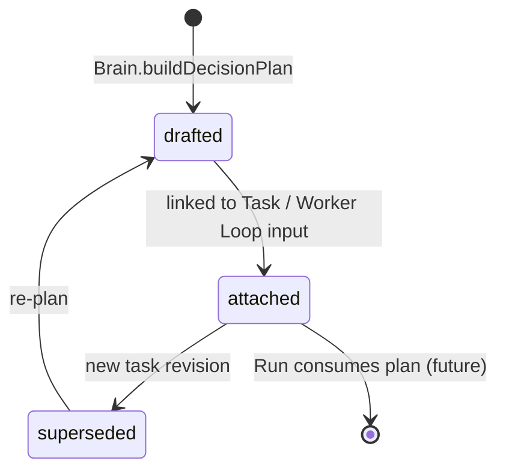
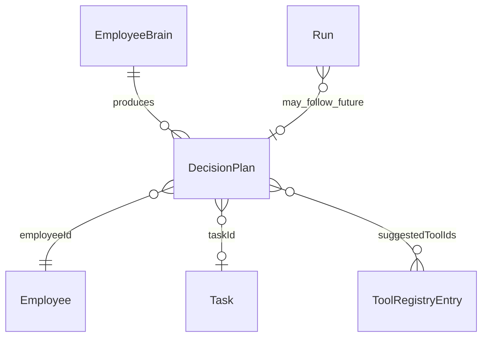

# Decision Plan

**Aggregate root:** yes (per task episode)  
**Parent:** [Domain Model](./domain-model.md) · [Employee Brain](./employee-brain.md) · [Decision Strategy](./decision-strategy.md)

---

## Purpose

**Decision Plan** — отдельная сущность, которую **Employee Brain** строит **сразу после получения задачи**, до Runtime Run и Worker Loop.

Plan фиксирует **как** сотрудник намерен выполнить работу: модели, инструменты, gates и ожидаемый результат. Это не LLM output и не Runtime config snapshot.

---

## Responsibilities

| Area | Responsibility |
|------|----------------|
| Model choice | Best-fit local Ollama model + optional multi-model pipeline |
| Tool path | Need Tool Registry, suggested tool ids |
| External executor | Cursor Automation required or not |
| Governance | Owner Approval required + reasons |
| Outcome | Expected deliverables and acceptance criteria |
| Trace | Rationale and matched task signals (catalog-driven) |

Decision Plan **does not**:

- Execute inference (Run + Runtime do)
- Invoke Tool Registry adapters
- Replace Worker Loop phases
- Store long-term Memory or Knowledge

---

## Fields (V1)

| Field | Type | Notes |
|-------|------|-------|
| `primaryModel` | `DecisionPlanModelChoice` | First reasoning step |
| `useMultipleModels` | `boolean` | Multi-step pipeline |
| `modelPipeline` | `DecisionPlanModelChoice[]` | primary / secondary / verification |
| `toolRegistryRequired` | `boolean` | Any registry tool matched |
| `suggestedToolIds` | `ToolRegistryV1ToolId[]` | From signal catalog |
| `cursorAutomationRequired` | `boolean` | External code/PR path |
| `ownerApprovalRequired` | `boolean` | Aggregated gates |
| `ownerApprovalReasons` | `string[]` | Human-readable |
| `expectedResult` | summary + deliverables + acceptance | Intent template |
| `classifiedIntent` | analysis / implementation / qa / … | From strategy catalog |
| `rationale` | `string[]` | Brain trace (not LLM) |

Version: `DECISION_PLAN_VERSION = 'v1'`.

---

## Lifecycle

V1: pure function `buildEmployeeBrainDecisionPlan()` — no persistence layer yet.

---

## Relationships

---

## Implementation

| Module | Role |
|--------|------|
| `src/domain/decisionPlan/` | Entity types + parse |
| `src/domain/decisionStrategy/` | Catalog + `buildDecisionPlan()` |
| `src/domain/employeeBrain/` | `buildEmployeeBrainDecisionPlan()` entry |

**Task:** AI-COMPANY-101E

---

## Revision

| Version | Date | Change |
|---------|------|--------|
| 1.0 | 2026-07-07 | Decision Plan entity + Brain integration (101E) |
