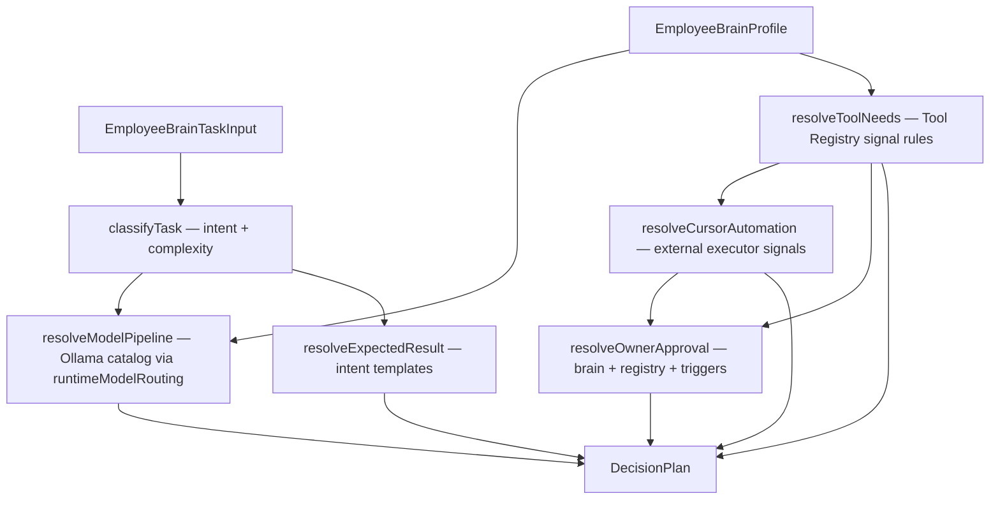

# Decision Strategy

**Parent:** [Decision Plan](./decision-plan.md) · [Employee Brain](./employee-brain.md) · [Tool Registry](../architecture/adr-002-tool-registry.md)

---

## Purpose

**Decision Strategy** — catalog-driven engine, который классифицирует задачу и собирает [Decision Plan](./decision-plan.md).

Правила живут в **catalog**, не в inline hardcode engine. Runtime orchestrator **не меняется** в V1 — strategy только **read** model routing helpers.

---

## Pipeline



---

## Catalogs (declarative)

| Catalog | File constant | Purpose |
|---------|---------------|---------|
| Task intent | `DECISION_TASK_INTENT_RULES` | Keywords → intent, default model mode |
| Cursor automation | `CURSOR_AUTOMATION_SIGNAL_RULES` | External executor need |
| Tool need | `DECISION_TOOL_NEED_RULES` | Tool id + patterns + min weight |
| Multi-model | `DECISION_MULTI_MODEL_TRIGGERS` | When to add secondary/verification model |
| Expected result | `DECISION_EXPECTED_RESULT_TEMPLATES` | Deliverables per intent |
| Owner approval | `DECISION_APPROVAL_TRIGGERS` | Brain triggers + tool risk + autonomy |

Helper: `scoreDecisionSignals(text, rules)` — shared matcher.

---

## Model selection (no hardcode in engine)

1. Classify task intent from catalog.
2. Apply Brain `modelSelectionStrategy` (`single_best` | `multi_step` | `fast_first`).
3. Resolve route via existing `resolveRuntimeModelRoute()` (Ollama catalog, employee locks).
4. Optionally append verification model from `DECISION_MULTI_MODEL_TRIGGERS` or Brain `preferVerification`.

---

## Tool Registry & Cursor

- Tool need: pattern score against `DECISION_TOOL_NEED_RULES`.
- Brain `toolSelectionStrategy`:
  - `minimal` → skip tool matching
  - `registry_first` / `external_when_needed` → full catalog match
- Cursor Automation: tool `cursor-automation` **or** cursor signal score ≥ threshold.

---

## Owner Approval

Aggregates:

- Registry `requiresOwnerApproval` on matched tools
- Brain `ownerApprovalTriggers` (git_push, production, cursor_automation, …)
- Brain `acceptableRisk` vs matched tool risk
- Brain `autonomyLevel === supervised` + medium+ tool risk
- Cursor Automation required

---

## Entry points

```typescript
import { buildEmployeeBrainDecisionPlan } from '../domain/employeeBrain'

const plan = buildEmployeeBrainDecisionPlan({
  task: { taskText: '...', title: '...' },
})
```

Lower level:

```typescript
import { buildDecisionPlan } from '../domain/decisionStrategy'
```

---

## Non-goals (V1)

- No Runtime Run scheduling changes
- No LLM call for planning
- No persistence / UI screen (future 102+)
- No mutation of `runtimeOrchestrator`

---

## Revision

| Version | Date | Change |
|---------|------|--------|
| 1.0 | 2026-07-07 | Decision Strategy catalog + engine (101E) |
