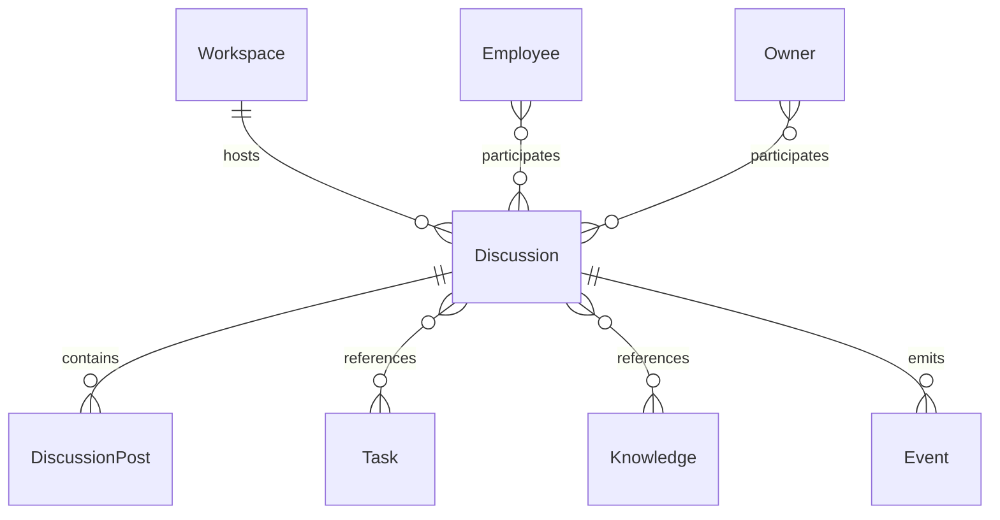
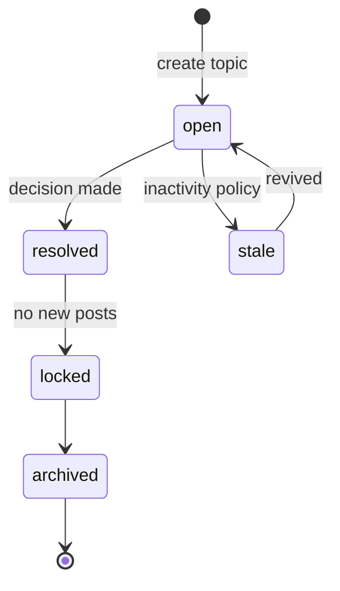

# Discussion

**Aggregate root:** yes  
**Parent:** [Domain Model](./domain-model.md)

---

## Purpose

**Discussion** — структурированная асинхронная ветка внутри Workspace: тема, комментарии, решения. Отличается от Conversation тем, что привязана к проекту, персистентна для команды и не требует realtime диалога с Owner.

---

## Responsibilities

| Area | Responsibility |
|------|----------------|
| Topic | Title, description, labels, status |
| Threading | Ordered posts / replies |
| Participants | Employees + Owner on record |
| Resolution | Mark resolved / decision outcome |
| Linkage | Reference Tasks, Knowledge docs, Runs |
| Notification | Emit Events for Mission Feed subscribers |

Discussion **does not**:

- Execute Runs directly (may request Task creation)
- Replace Conversation for exploratory Owner chat
- Cross Workspace boundaries

---

## Relationships

| Relation | Cardinality | Notes |
|----------|-------------|-------|
| Workspace | 1 | Required parent |
| DiscussionPost | 1..n | Thread body |
| Task | 0..n | Linked work items |
| Knowledge | 0..n | Cited documents |
| Event | 0..n | `discussion.post`, `discussion.resolved` |

---

## Lifecycle

| State | Meaning |
|-------|---------|
| `open` | Accepting posts |
| `resolved` | Outcome recorded |
| `stale` | Warning state |
| `locked` | Read-only |
| `archived` | Hidden from default views |

---

## Attributes (conceptual)

| Attribute | Type | Notes |
|-----------|------|-------|
| `id` | UUID | |
| `workspaceId` | ref | Required |
| `title` | string | |
| `status` | enum | Lifecycle |
| `createdBy` | ref | Owner or Employee |
| `resolvedAt` | timestamp | optional |
| `resolutionSummary` | text | optional |

**DiscussionPost:** `id`, `discussionId`, `parentPostId`, `authorId`, `body`, `createdAt`.

---

## Conversation vs Discussion

| Aspect | Conversation | Discussion |
|--------|--------------|------------|
| Scope | Often Owner-centric | Workspace-centric |
| Mode | Realtime dialogue | Async thread |
| Task spawn | Common | Via explicit link |
| Audience | Small | Team-visible |

---

## Future Extensions

- **Reactions / votes** — lightweight consensus without full Task.
- **ADR mode** — template for architecture decisions → auto-Knowledge.
- **Mention routing** — `@Employee` triggers notification Run.
- **Merge discussions** — dedupe topics with audit trail.
- **External comments** — webhook from GitHub PR (federated Event).
