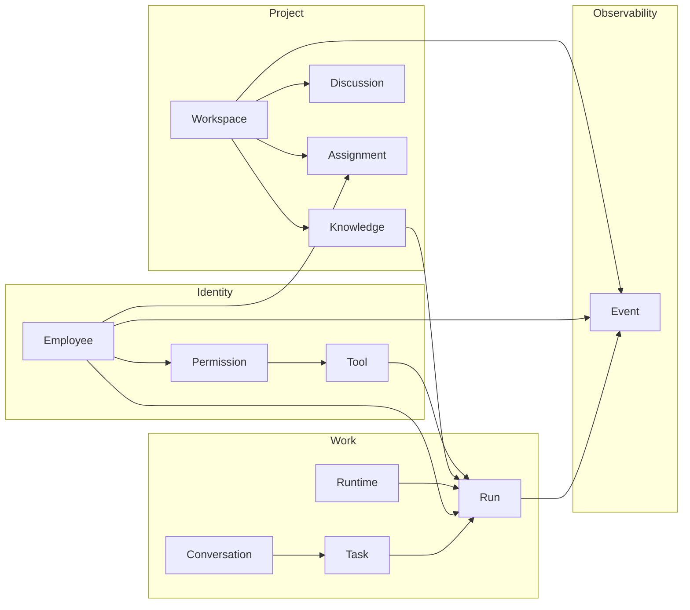
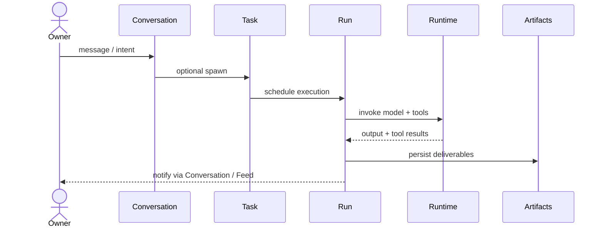
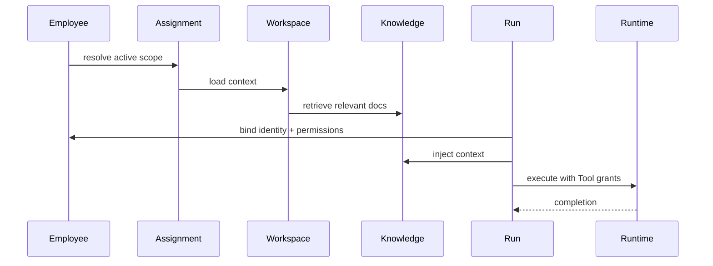
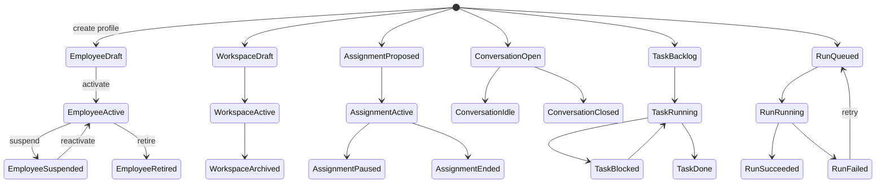

# AI Company Platform — Domain Model

> Canonical reference for platform entities. Implementation-agnostic; maps to future Runtime, not to V1 mock types directly.

**Parent:** [ADR-001](../architecture/adr-001-ai-company-platform.md)

---

## Purpose

Единый словарь домена AI Company Platform: сущности, связи, жизненные циклы и границы ответственности **до** написания Runtime-кода.

---

## Core Principles (summary)

1. **Employee** — центральная сущность; не принадлежит проекту.
2. **Runtime (LLM)** — сменяемый engine; не смешивается с identity.
3. **Assignment** — единственный способ связать Employee с Workspace.
4. **Workspace** — контейнер Knowledge и Discussion для проекта.
5. **Conversation** — автономный канал; Task — опциональный производный.
6. **Event** — append-only источник правды для NOC и audit.

---

## Entity catalog

| Entity | One-line definition |
|--------|----------------------|
| [Employee](./employee.md) | Persistent digital specialist identity |
| [Workspace](./workspace.md) | Project / company context container |
| [Assignment](./assignment.md) | Employee participation in a Workspace |
| [Conversation](./conversation.md) | Standalone multi-turn dialogue channel |
| [Discussion](./discussion.md) | Structured async topic thread in Workspace |
| [Task](./task.md) | Assignable unit of work for an Employee |
| [Run](./run.md) | Single execution attempt (LLM + tools) |
| [Runtime](./runtime.md) | Pluggable inference & tool execution engine |
| [Knowledge](./knowledge.md) | Scoped documents & memory in Workspace |
| [Tool](./tool.md) | Registered capability (MCP, agent, model) |
| [Permission](./permission.md) | Least-privilege grant on Tool/resource |
| [Event](./event.md) | Immutable platform occurrence record |

**External actors (not platform entities):** Owner (human), Observer (read-only user).

---

## Relationship graph

---

## Primary flows

### Owner → Artifacts

### Employee → Runtime

---

## Lifecycle overview

---

## Aggregate boundaries

| Aggregate root | Contains / references | Consistency rule |
|----------------|----------------------|------------------|
| Employee | Permission profile, Tool refs | Global identity; no Workspace FK |
| Workspace | Knowledge refs, Discussion refs | Knowledge never leaks cross-workspace |
| Assignment | EmployeeId + WorkspaceId + scope | Unique active assignment per pair (policy TBD) |
| Conversation | Turns, participant refs | Tasks spawned retain `conversationId` |
| Task | Assignee EmployeeId, Run ids | One active Run per Task (default) |
| Run | Runtime ref, Event stream | Terminal states immutable |

---

## V1 local app mapping

| Platform entity | V1 stand-in | Location |
|-----------------|-------------|----------|
| Employee | `CustomEmployee` | `mission-control/data/customEmployees.ts` |
| Employee template | `EmployeeTemplate` | `mission-control/data/employeeTemplates.ts` |
| Tool | `Tool` mock | `mission-control/data/mock.ts` |
| Permission | `CustomEmployeePermissions` | `customEmployees.ts` |
| Task | Mock `Task` | `mission-control/data/mock.ts` |
| Event | `FeedEvent` | `mission-control/data/mock.ts` |
| Workspace | — | Not implemented |
| Assignment | — | Not implemented |
| Conversation | — | Not implemented |
| Run / Runtime | Flow execution log | `flow-workspace/` (visual only) |

---

## Future extensions (cross-cutting)

- **Multi-tenant Owner org** — Workspace belongs to org; Employee pool shared or isolated.
- **Policy engine** — Permission evaluated at Run time, not only at profile edit.
- **Artifact versioning** — Git-backed or blob store with lineage to Run.
- **Scheduler** — cron Runs without Task or Conversation.
- **Federation** — read-only mirror of ServiceManager Knowledge (explicit boundary).

---

## Document index

- [employee.md](./employee.md)
- [workspace.md](./workspace.md)
- [assignment.md](./assignment.md)
- [conversation.md](./conversation.md)
- [discussion.md](./discussion.md)
- [task.md](./task.md)
- [run.md](./run.md)
- [runtime.md](./runtime.md)
- [knowledge.md](./knowledge.md)
- [tool.md](./tool.md)
- [permission.md](./permission.md)
- [event.md](./event.md)
