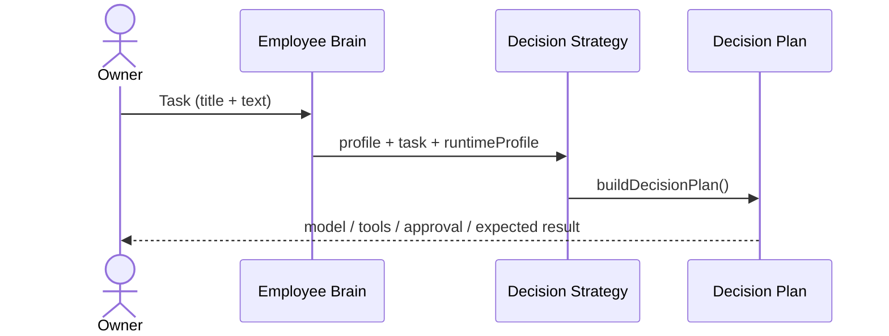

# Employee Brain

**Aggregate root:** yes (per Employee)  
**Parent:** [Domain Model](./domain-model.md) · [Employee](./employee.md)

---

## Purpose

**Employee Brain** — слой **принятия решений** цифрового сотрудника.

| Brain is | Brain is not |
|----------|--------------|
| Decision policy profile | LLM / Runtime |
| Model & tool strategy | Memory storage |
| Autonomy & risk bounds | Knowledge corpus |
| Constraints & approval triggers | Worker Loop state machine |

Brain **не вызывает** inference. После получения задачи Brain строит [Decision Plan](./decision-plan.md) через [Decision Strategy](./decision-strategy.md).

---

## Profile fields (V1)

| Field | Description |
|-------|-------------|
| `specialization` | Role focus (implementation, QA, architecture, …) |
| `decisionStyle` | conservative / balanced / pragmatic |
| `modelSelectionStrategy` | single_best / multi_step / fast_first |
| `toolSelectionStrategy` | minimal / registry_first / external_when_needed |
| `autonomyLevel` | supervised / guided / semi_autonomous |
| `acceptableRisk` | low / medium / high |
| `reasoningPreferences` | level, verification, structured output |
| `constraints` | Hard boundaries (scope, deploy, repos) |
| `ownerApprovalTriggers` | git_push, production, cursor_automation, … |

Presets: `employeeBrainCatalog.ts` for built-in employees (`ag-max`, `ag-cto`, `ag-qa`).

---

## Primary flow

Entry: `buildEmployeeBrainDecisionPlan({ task })`.

---

## Implementation

| Module | Role |
|--------|------|
| `src/domain/employeeBrain/employeeBrain.ts` | Types |
| `src/domain/employeeBrain/employeeBrainCatalog.ts` | Presets |
| `src/domain/employeeBrain/employeeBrainDecision.ts` | Plan builder facade |

Related: AI-COMPANY-101D (full Brain V1 scaffold), AI-COMPANY-101E (Decision Strategy).

---

## Revision

| Version | Date | Change |
|---------|------|--------|
| 1.0 | 2026-07-07 | Brain types + Decision Plan integration (101D/101E subset) |
