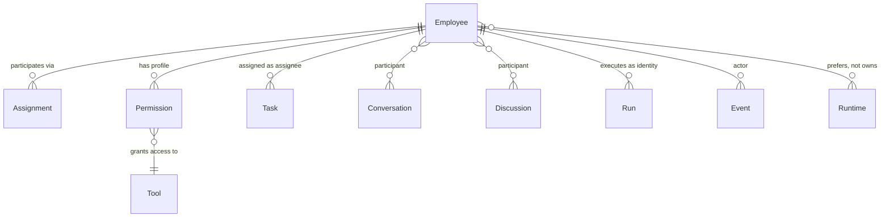
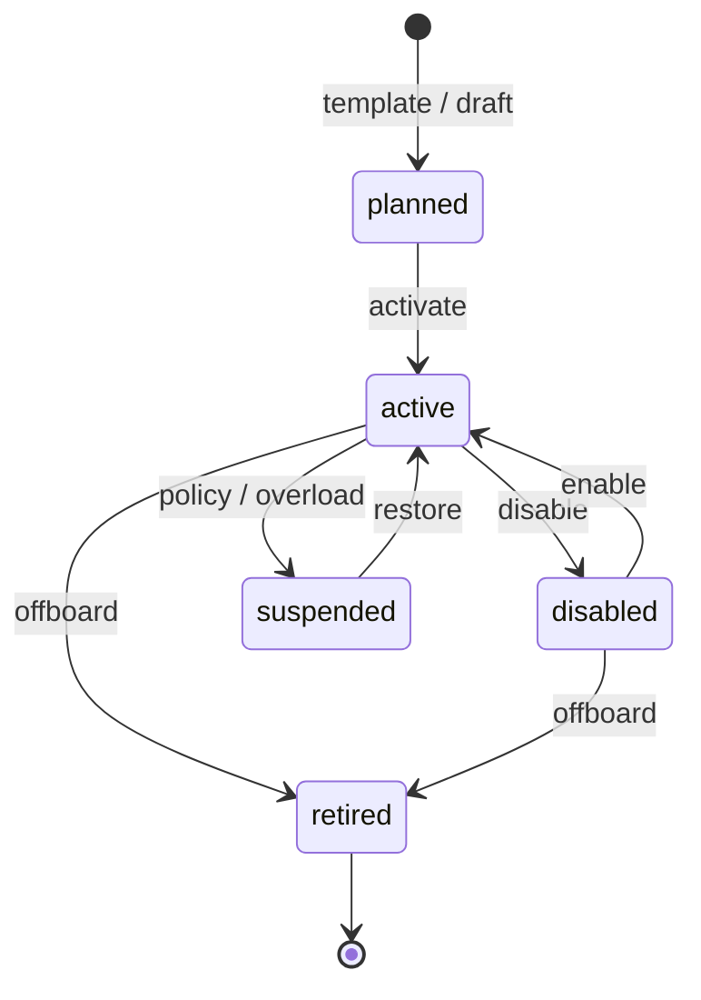

# Employee

**Aggregate root:** yes  
**Parent:** [Domain Model](./domain-model.md) · [ADR-001](../architecture/adr-001-ai-company-platform.md)

---

## Purpose

**Employee** — persistent identity цифрового специалиста в AI Company Platform. Это не «агент сессии LLM» и не учётная запись проекта: Employee существует в org roster независимо от Workspace и может участвовать в нескольких проектах через Assignment.

---

## Responsibilities

| Area | Responsibility |
|------|----------------|
| Identity | `name`, `codename`, `role` — stable human-facing identifiers |
| Capability profile | `skills`, `restrictions`, `description`, `workflow` |
| Cognition config | `systemPrompt`, default reasoning style |
| Decision policy | [Employee Brain](./employee-brain.md) — specialization, autonomy, model/tool strategy (V1 scaffold) |
| Runtime preference | `primaryModel`, `fallbackModels` — **preference**, not hard binding |
| Tool access | Permission profile → Tool grants |
| Memory policy | `memoryScope` — **allowed** Knowledge domains (not storage itself) |
| Operational state | `status`: active / planned / disabled / suspended / retired |

Employee **does not**:

- Own Knowledge blobs (Workspace does)
- Execute inference directly (Run + Runtime do)
- Belong to a single project

---

## Relationships

| Relation | Cardinality | Notes |
|----------|-------------|-------|
| Assignment | 0..n | Required for Workspace-scoped work |
| Permission | 1 profile | Versioned over time (future) |
| Task | 0..n | One assignee per Task |
| Conversation | 0..n | Direct chat without Task |
| Run | 0..n | Telemetry + audit anchor |
| Runtime | preference | Resolved at Run scheduling |

---

## Lifecycle

| State | Meaning |
|-------|---------|
| `planned` | Profile defined; no Runs scheduled |
| `active` | Eligible for Assignment and Runs |
| `disabled` | Visible in roster; cannot execute |
| `suspended` | Temporary block (quota, incident) |
| `retired` | Archived; Assignments must end |

**Transitions emit** `employee.lifecycle.*` Events.

---

## Attributes (conceptual)

| Attribute | Type | Notes |
|-----------|------|-------|
| `id` | UUID | Platform-wide |
| `codename` | string | Unique within org |
| `role` | string | e.g. AI CTO, Senior Developer |
| `status` | enum | See lifecycle |
| `primaryModel` | string | Runtime routing hint |
| `fallbackModels` | string[] | Ordered fallback |
| `skills` | string[] | Competency tags |
| `restrictions` | string[] | Hard guardrails |
| `systemPrompt` | text | Base instruction |
| `workflow` | text | Operating procedure |
| `memoryScope` | string[] | Allowed Knowledge namespaces |
| `createdAt` | timestamp | |
| `updatedAt` | timestamp | |

V1 local mapping: `CustomEmployee` in `customEmployees.ts`.

---

## Future Extensions

- **Employee versioning** — immutable snapshots when Permission or prompt changes mid-Run.
- **Squad / org chart** — grouping for capacity planning (Mission Control projection).
- **Template lineage** — `sourceTemplateId` from Employee Builder presets.
- **Runtime affinity** — prefer local Ollama vs cloud by policy, not hardcoded model string.
- **Delegation** — temporary sub-delegation to another Employee (with audit).
- **Cost budget** — token/$ caps per Employee per period.
- **Health score** — derived from Run success rate for NOC dashboard.
