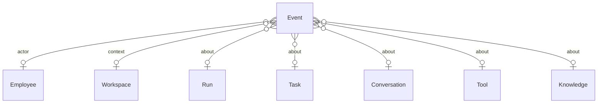
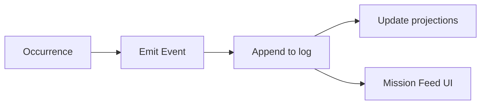
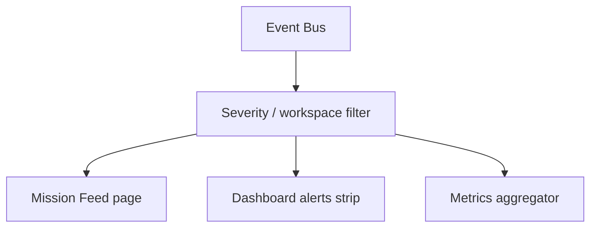

# Event

**Aggregate root:** yes (immutable log entry)  
**Parent:** [Domain Model](./domain-model.md)

---

## Purpose

**Event** — append-only запись о произошедшем в платформе: transitions, tool calls, alerts, health probes. Питает Mission Feed, audit trail и read-model projections (Dashboard metrics). Source of truth for observability alongside Run snapshots.

---

## Responsibilities

| Area | Responsibility |
|------|----------------|
| Recording | Immutable insert; no updates |
| Typing | `type` + `severity` + structured payload |
| Correlation | Links to Run, Task, Employee, Workspace |
| Fan-out | Mission Feed, webhooks, metrics |
| Retention | Tiered storage policy |
| Replay | Rebuild projections for NOC |

Event **does not**:

- Mutate domain state directly (commands do; Events notify)
- Replace Run output storage
- Grant permissions

---

## Relationships

| Relation | Cardinality | Notes |
|----------|-------------|-------|
| Employee | 0..1 | `source` / actor |
| Workspace | 0..1 | Context filter |
| Run / Task | 0..1 | Correlation ids |

---

## Event taxonomy (initial)

| Type prefix | Examples |
|-------------|----------|
| `employee.lifecycle.*` | activated, suspended, retired |
| `assignment.*` | created, ended |
| `conversation.*` | message, spawn_task |
| `discussion.*` | post, resolved |
| `task.transition` | backlog → running → done |
| `run.*` | started, succeeded, failed, tool_call |
| `tool.health` | probe ok / degraded |
| `permission.denied` | tool blocked |
| `system.alert` | platform warnings |

V1 mock: `FeedEvent` in `mission-control/data/mock.ts`.

---

## Lifecycle

Events have **no state machine** — created once:

Optional **archival** moves old Events to cold storage; original hash chain preserved.

---

## Attributes (conceptual)

| Attribute | Type | Notes |
|-----------|------|-------|
| `id` | UUID | |
| `at` | timestamp | ISO-8601 |
| `severity` | enum | info, success, warn, error |
| `type` | string | Taxonomy key |
| `source` | string | Employee codename or subsystem |
| `message` | string | Human-readable |
| `payload` | json | Structured details |
| `workspaceId` | ref | optional |
| `runId` | ref | optional |
| `taskId` | ref | optional |
| `correlationId` | string | trace across Events |

---

## Mission Feed projection

---

## Future Extensions

- **Event schema registry** — versioned payload contracts.
- **Webhook subscriptions** — Owner-configured fan-out.
- **SIEM export** — security audit stream.
- **GraphQL subscription** — realtime NOC UI.
- **Compaction** — rollup old `run.tool_call` into summaries.
- **Signed events** — tamper-evident audit for compliance.
