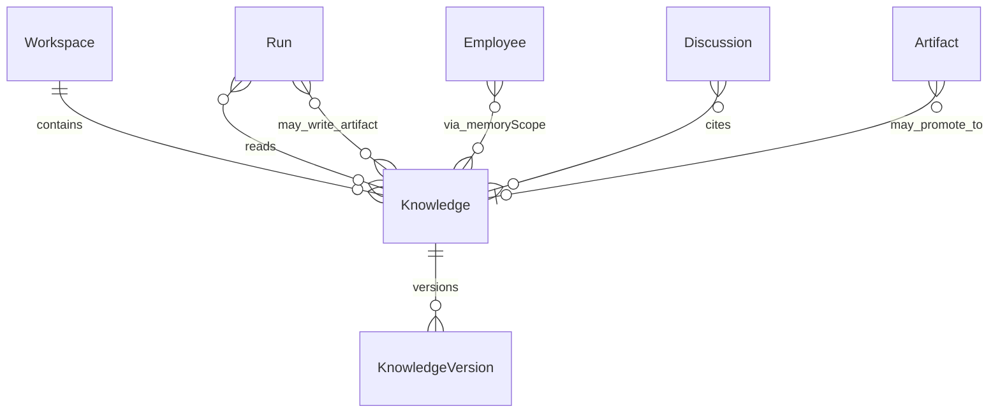
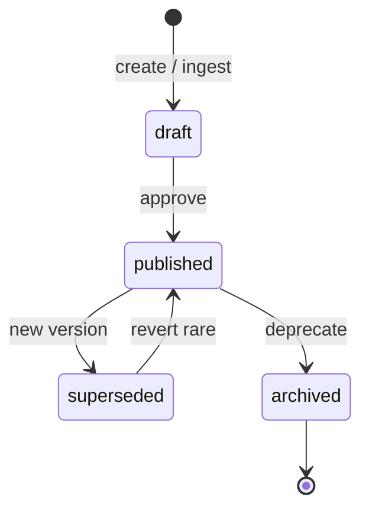

# Knowledge

**Aggregate root:** yes (per document / collection)  
**Parent:** [Domain Model](./domain-model.md)

---

## Purpose

**Knowledge** — scoped documents, memory и индексы **внутри Workspace**. Реализует принцип P5: знания проекта живут в Workspace, не в Employee. Employee обращается к Knowledge через Assignment + `memoryScope` policy.

---

## Responsibilities

| Area | Responsibility |
|------|----------------|
| Storage | Markdown, ADR, runbook, code summaries |
| Scoping | Namespace within Workspace |
| Indexing | Embeddings / search index for RAG |
| Versioning | Document revision history |
| Access policy | Read/write rules per Employee Permission |
| Promotion | Owner-approved ingest from Run Artifacts |

Knowledge **does not**:

- Replace Employee `systemPrompt`
- Cross Workspace without explicit share link
- Execute Runs

---

## Relationships

| Relation | Cardinality | Notes |
|----------|-------------|-------|
| Workspace | 1 | Required parent |
| KnowledgeVersion | 1..n | Immutable history |
| Run | read/write | Context injection / approved writes |
| Employee | policy | `memoryScope` allow-list |

---

## Lifecycle

| State | Meaning |
|-------|---------|
| `draft` | Not yet visible to Runs |
| `published` | Searchable / injectable |
| `superseded` | Old version kept for audit |
| `archived` | Excluded from default RAG |

Employee V1 field `memoryScope` lists **allowed namespace names** (e.g. `AI Company`, `Finance`) — maps to Knowledge namespaces in future.

---

## Attributes (conceptual)

| Attribute | Type | Notes |
|-----------|------|-------|
| `id` | UUID | |
| `workspaceId` | ref | |
| `namespace` | string | Aligns with memoryScope |
| `title` | string | |
| `contentType` | enum | markdown, adr, json, … |
| `status` | enum | Lifecycle |
| `currentVersionId` | ref | |
| `tags` | string[] | |
| `createdAt` | timestamp | |

**KnowledgeVersion:** `id`, `knowledgeId`, `body`, `authorRunId`, `createdAt`.

---

## Future Extensions

- **Auto-RAG from repo** — scheduled index of git tree (read-only).
- **Conflict merge** — two Employees edit same doc with CRDT or lock.
- **Knowledge graph** — entity links beyond flat docs.
- **Retention policies** — GDPR / TTL per namespace.
- **Export** — bundle for offline Owner review.
- **Federated slice** — read-only ServiceManager docs (explicit adapter).
