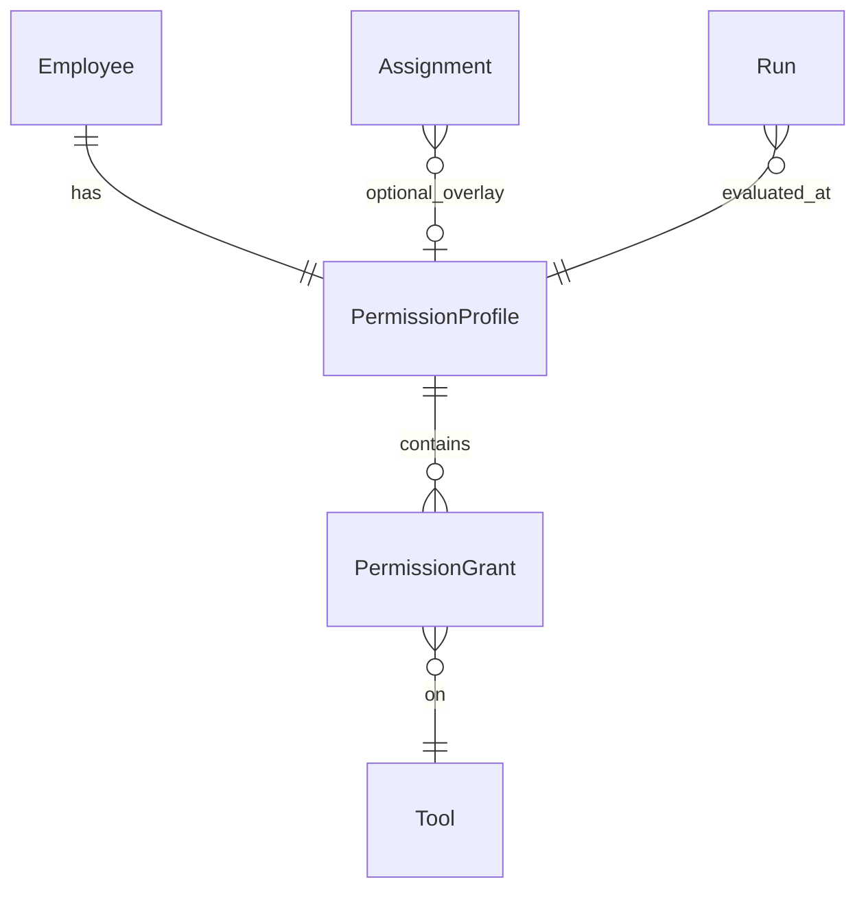
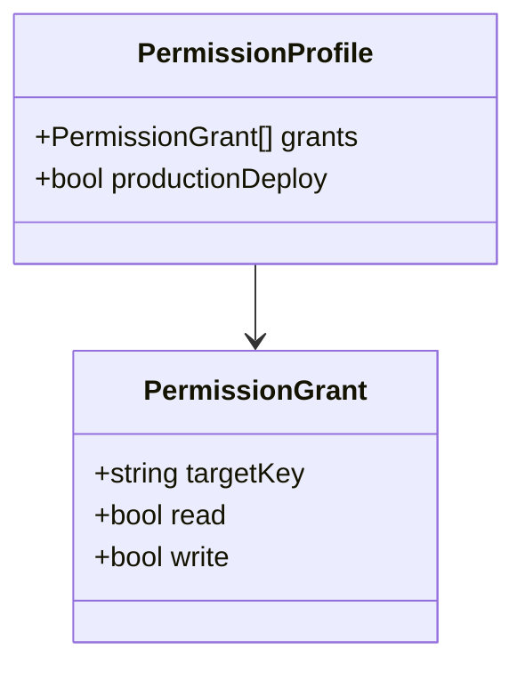
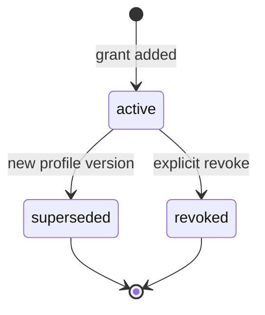
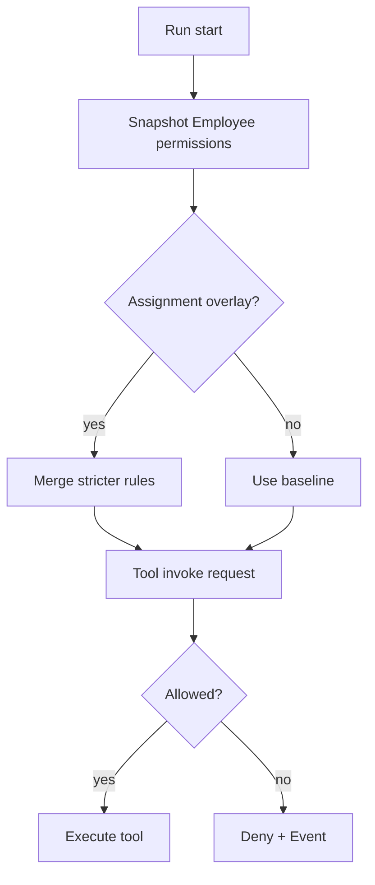

# Permission

**Aggregate root:** part of Employee profile (value object cluster)  
**Parent:** [Domain Model](./domain-model.md)

---

## Purpose

**Permission** — least-privilege grant, связывающий Employee с Tool или protected action (e.g. Production Deploy). Evaluated at Run schedule and before each tool invoke. Default deny for anything not explicitly granted.

---

## Responsibilities

| Area | Responsibility |
|------|----------------|
| Grant model | read / write / enabled flags per integration |
| Enforcement | Orchestrator + Runtime gateway |
| Profile storage | Part of Employee; optional Assignment overlay |
| Audit | Deny attempts emit Events |
| UI projection | Employee Builder matrix (V1) |
| Safety defaults | No production deploy, no DB write by default |

Permission **does not**:

- Replace Owner approval for irreversible ops
- Apply globally without Employee binding
- Implicitly grant Tool access

---

## Relationships

| Relation | Cardinality | Notes |
|----------|-------------|-------|
| Employee | 1 profile | Global baseline |
| PermissionGrant | 1..n | Per Tool or action |
| Assignment | 0..1 overlay | Stricter workspace rules |
| Tool | 1 per grant | Target |

---

## Grant shapes

**Integration grant** (read/write):

V1 mapping: `CustomEmployeePermissions` — github, docker, postgresql, figma, n8n, filesystem, servicemanagerApi, productionDeploy.

| Target | read | write | Notes |
|--------|------|-------|-------|
| GitHub | ✓ | optional | PR flow later |
| Docker | ✓ | optional | No prod deploy |
| PostgreSQL | ✓ | optional | Default read-only |
| Figma | ✓ | optional | Designer role |
| n8n | ✓ | optional | Automation |
| Filesystem | ✓ | optional | Scoped paths at Runtime |
| ServiceManager API | ✓ | optional | Federation boundary |
| Production Deploy | enabled flag | — | Owner gate always |

---

## Lifecycle

Permissions on profile are **versioned logically**, not deleted silently:

In-flight Runs pin **Permission snapshot** at start.

---

## Evaluation flow

---

## Future Extensions

- **Capability tokens** — time-limited elevation for single Run.
- **Owner approval token** — one-time productionDeploy unlock.
- **ABAC** — attribute rules beyond boolean matrix.
- **Permission templates** — bundled with Employee templates.
- **Cross-Employee delegation** — scoped sub-grant with audit.
- **External IAM** — map OIDC roles to PermissionProfile (future).
