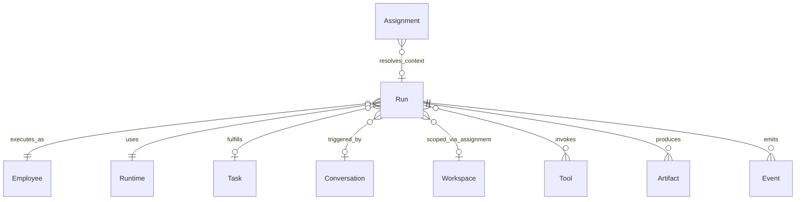
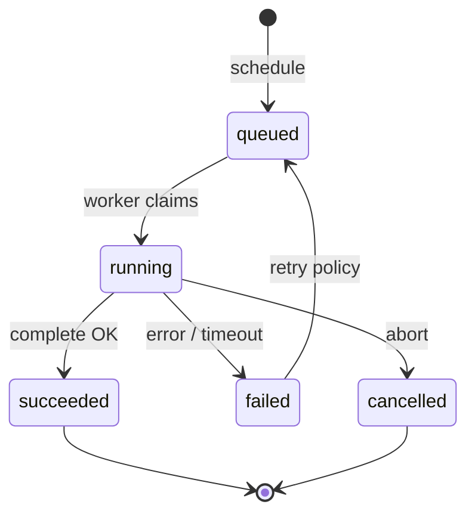

# Run

**Aggregate root:** yes  
**Parent:** [Domain Model](./domain-model.md)

---

## Purpose

**Run** — одна попытка исполнения: вызов Runtime от имени Employee с конкретным контекстом (Task, Conversation turn, или ad-hoc). Materializes Flow A terminal step before Artifacts; emits Events for NOC.

---

## Responsibilities

| Area | Responsibility |
|------|----------------|
| Execution unit | Single bounded inference + tool session |
| Identity binding | Employee + resolved Assignment + Permissions |
| Runtime selection | Pick adapter from Employee preference + policy |
| Context assembly | Knowledge retrieval, prompt, tool list |
| Output | Structured result → Artifacts |
| Telemetry | Token usage, latency, tool call log |
| Idempotency | `idempotencyKey` for safe retries |

Run **does not**:

- Own long-term Knowledge writes without explicit approval
- Change Employee profile
- Bypass Permission checks

---

## Relationships

| Relation | Cardinality | Notes |
|----------|-------------|-------|
| Employee | 1 | Required identity |
| Runtime | 1 | Per Run |
| Task | 0..1 | Optional parent |
| Artifact | 0..n | Deliverables |
| Event | 1..n | Stream during execution |

---

## Lifecycle

| State | Meaning |
|-------|---------|
| `queued` | Waiting worker / Runtime capacity |
| `running` | Active inference or tool loop |
| `succeeded` | Outputs persisted |
| `failed` | Error; may retry |
| `cancelled` | Owner or policy abort |

V1 visual-only: Flow Workspace `ExecutionLog` / `LogEntry` — not yet platform Run.

---

## Attributes (conceptual)

| Attribute | Type | Notes |
|-----------|------|-------|
| `id` | UUID | |
| `employeeId` | ref | |
| `runtimeId` | ref | Resolved engine |
| `taskId` | ref | optional |
| `conversationTurnId` | ref | optional |
| `workspaceId` | ref | via Assignment resolution |
| `status` | enum | Lifecycle |
| `input` | structured | Prompt + context refs |
| `output` | structured | Raw model output |
| `artifactIds` | ref[] | |
| `tokenUsage` | metrics | |
| `startedAt` / `finishedAt` | timestamp | |
| `error` | structured | on failure |

---

## Future Extensions

- **Run steps** — multi-phase plan (plan → act → verify) as child Runs.
- **Human-in-the-loop** — pause for Owner approval mid-Run.
- **Sandbox** — isolated filesystem/network for coding agents.
- **Replay** — reproduce Run from Event log for debugging.
- **Cost attribution** — chargeback to Workspace / Assignment.
- **Parallel Runs** — policy limits per Employee.
