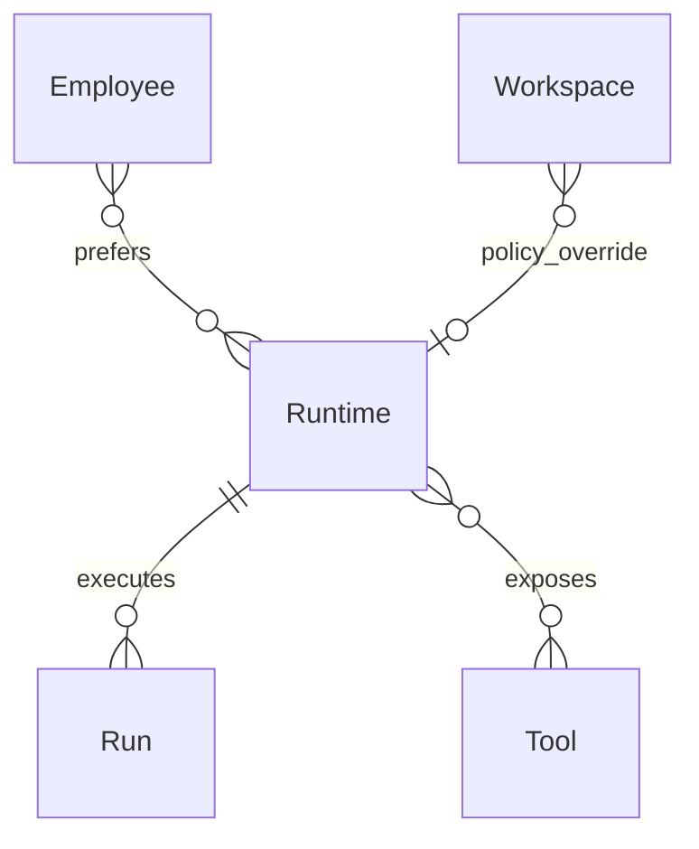
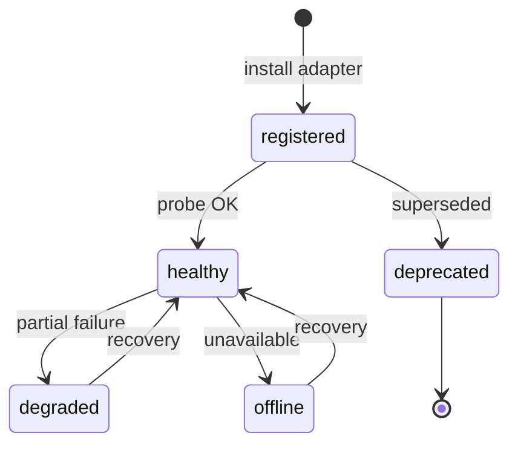
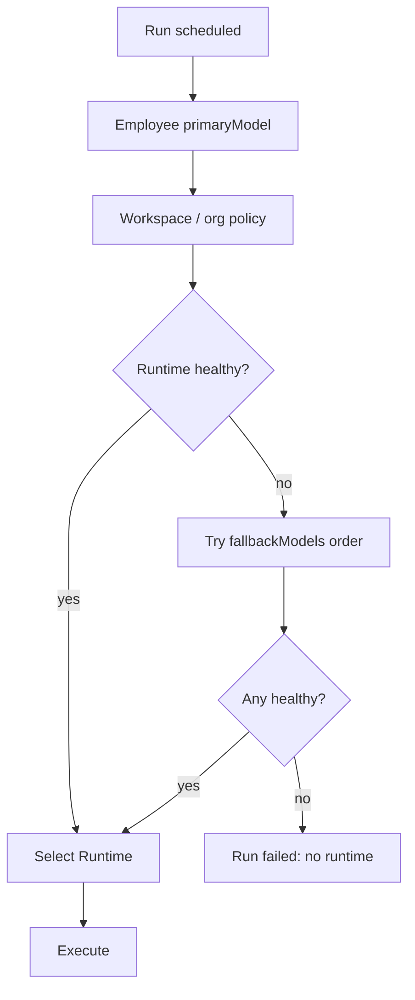

# Runtime

**Aggregate root:** no (infrastructure service)  
**Parent:** [Domain Model](./domain-model.md)

---

## Purpose

**Runtime** — сменяемый **Runtime Engine**: адаптер, который выполняет inference и tool calls для Run. LLM-провайдер (Claude, GPT, Ollama, Qwen, …) — implementation detail, не часть Employee identity (принцип P2).

---

## Responsibilities

| Area | Responsibility |
|------|----------------|
| Adapter | Normalize API across providers |
| Routing | Honor Employee `primaryModel` + fallbacks |
| Tool gateway | Execute MCP / HTTP tools per Permission |
| Context window | Manage prompt assembly and truncation |
| Streaming | Token stream to UI / Event bus |
| Health | Probe status for Tools Registry |
| Safety | Enforce restrictions before tool invoke |

Runtime **does not**:

- Store Employee or Workspace state
- Own Tasks or Conversations
- Grant Permissions (reads Employee profile)

---

## Relationships

| Relation | Cardinality | Notes |
|----------|-------------|-------|
| Run | 0..n | Consumer |
| Tool | 0..n | Models + MCP registered |
| Employee | preference | Not ownership |

---

## Lifecycle

| State | Meaning |
|-------|---------|
| `registered` | Known to platform |
| `healthy` | Accepting Runs |
| `degraded` | Fallbacks / limited tools |
| `offline` | Reject new Runs |
| `deprecated` | Migrate to new adapter |

V1 mock: Tools Registry `category: models` entries.

---

## Attributes (conceptual)

| Attribute | Type | Notes |
|-----------|------|-------|
| `id` | string | e.g. `runtime-ollama-local` |
| `kind` | enum | `llm`, `coding-agent`, `composite` |
| `provider` | string | ollama, anthropic, openai, … |
| `modelId` | string | e.g. `qwen3.6:27b` |
| `endpoint` | url | local or remote |
| `status` | enum | Health |
| `capabilities` | flags | streaming, tools, vision |
| `maxContextTokens` | int | |

---

## Runtime selection algorithm (conceptual)

---

## Future Extensions

- **Runtime pools** — load balance across replicas.
- **Local-first policy** — prefer Ollama when air-gapped.
- **Model routing by task type** — cheap model for classify, strong for plan.
- **Credential vault** — API keys outside domain entities.
- **Runtime plugins** — register at platform boot.
- **Benchmark registry** — latency/cost scores for NOC.
