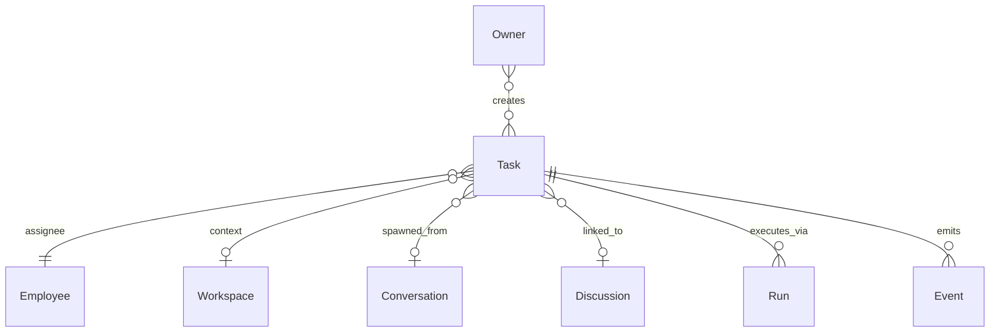
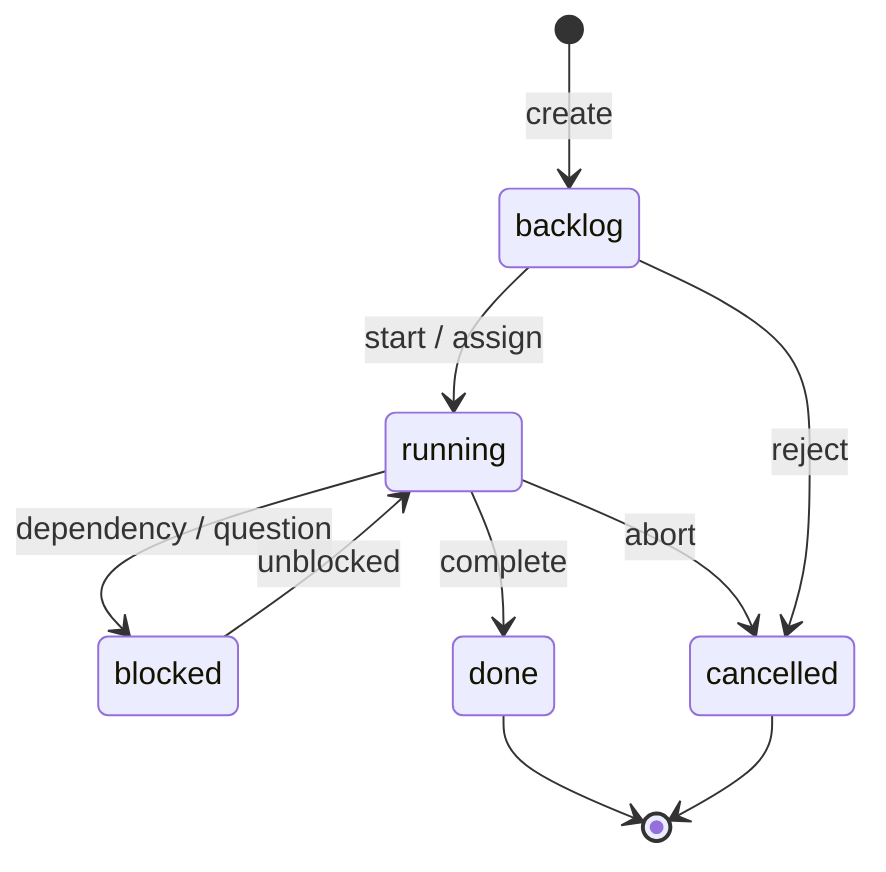

# Task

**Aggregate root:** yes  
**Parent:** [Domain Model](./domain-model.md)

---

## Purpose

**Task** — формализованная единица работы с assignee (Employee), приоритетом и статусом. **Один из** способов взаимодействия с Employee (наряду с Conversation, Discussion, scheduled Run) — принцип P7.

---

## Responsibilities

| Area | Responsibility |
|------|----------------|
| Work unit | Title, description, acceptance criteria |
| Assignment | Single assignee Employee (default) |
| Priority / SLA | P0–P3, deadlines, breach tracking |
| Status | backlog → running → done / blocked |
| Execution bridge | Schedule Run(s) to fulfill Task |
| Provenance | Link to Conversation, Discussion, Owner request |
| Context | Optional `workspaceId` for Knowledge scope |

Task **does not**:

- Execute LLM (Run does)
- Define Employee identity
- Replace Conversation for exploratory Q&A

---

## Relationships

| Relation | Cardinality | Notes |
|----------|-------------|-------|
| Employee | 1 assignee | Future: co-assignees via sub-Tasks |
| Run | 0..n | Retries, multi-step |
| Conversation | 0..1 | Spawn source |
| Workspace | 0..1 | Knowledge scope |
| Event | 0..n | `task.transition`, SLA alerts |

---

## Lifecycle

| State | Meaning |
|-------|---------|
| `backlog` | Queued, not executing |
| `running` | Active; at least one Run may be in flight |
| `blocked` | Waiting external input |
| `done` | Accepted completion |
| `cancelled` | Will not execute |

V1 mock: `Task` in `mission-control/data/mock.ts` (subset of fields).

---

## Attributes (conceptual)

| Attribute | Type | Notes |
|-----------|------|-------|
| `id` | string | e.g. `TSK-V1-001` |
| `title` | string | |
| `description` | text | optional |
| `assigneeId` | ref | Employee |
| `workspaceId` | ref | optional |
| `conversationId` | ref | optional |
| `priority` | P0–P3 | |
| `status` | enum | Lifecycle |
| `slaMinutes` | int | optional |
| `slaBreached` | bool | derived |
| `createdAt` | timestamp | |
| `completedAt` | timestamp | optional |

---

## Future Extensions

- **Sub-tasks** — decomposition by AI Architect.
- **Task templates** — recurring ops checklists.
- **Human checkpoint** — mandatory Owner approval gate before `done`.
- **Dependency graph** — blockedBy / blocks relations.
- **Batch Tasks** — epic container for roadmap.
- **AgentTask federation** — explicit adapter to ServiceManager (boundary module, not core merge).
