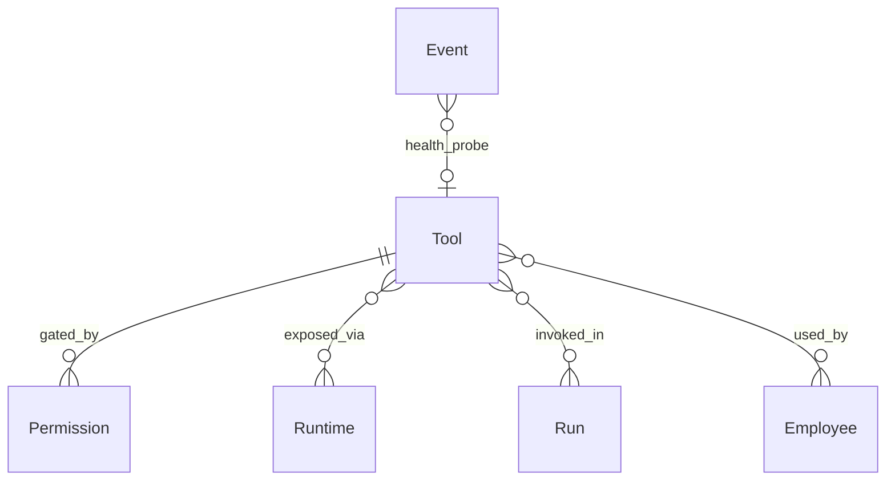
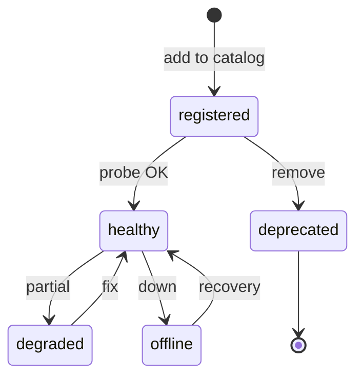

# Tool

**Aggregate root:** yes (catalog entry)  
**Parent:** [Domain Model](./domain-model.md)

---

## Purpose

**Tool** — зарегистрированная capability платформы: LLM runtime surface, coding agent, MCP integration. Catalog item in Tools Registry; **usage** gated by Permission on Employee (and Assignment overlay).

---

## Responsibilities

| Area | Responsibility |
|------|----------------|
| Registration | Name, category, version, scope |
| Health | Probe status for Mission Control |
| Capability metadata | read / write / exec flags |
| Discovery | List available tools for Employee Builder |
| Invocation contract | Schema for Run → Tool gateway |
| Usage tracking | Which Employees / Runs used tool |

Tool **does not**:

- Grant itself access (Permission required)
- Run without Runtime / gateway
- Implies Employee ownership

---

## Relationships

| Relation | Cardinality | Notes |
|----------|-------------|-------|
| Permission | 0..n | Grants per Employee |
| Runtime | 0..n | Models are Tools + Runtime |
| Run | 0..n | Invocation audit |
| Employee | n..m | Via Permission |

---

## Categories

| Category | Examples | Notes |
|----------|----------|-------|
| `models` | Claude, GPT, Ollama, Qwen | Maps to Runtime adapters |
| `coding-agents` | Cursor, Codex, Aider, OpenHands | May wrap Runtime |
| `integrations` | GitHub, Docker, PostgreSQL, Figma, n8n | MCP / HTTP |

V1 mock: `Tool` in `mission-control/data/mock.ts`, `TOOL_OPTIONS` in `customEmployees.ts`.

---

## Lifecycle

---

## Attributes (conceptual)

| Attribute | Type | Notes |
|-----------|------|-------|
| `id` | string | e.g. `int-gh` |
| `name` | string | Display |
| `category` | enum | models / coding-agents / integrations |
| `version` | string | |
| `scope` | string | read, write, exec, inference |
| `status` | enum | healthy / degraded / offline |
| `lastCheck` | timestamp | |
| `usedBy` | string[] | Employee codenames (projection) |

---

## Future Extensions

- **Tool bundles** — preset groups for templates.
- **Custom MCP registration** — Owner-uploaded servers.
- **Rate limits** — per Tool per org.
- **Sandbox classes** — production vs read-only integrations.
- **Tool schema registry** — OpenAPI for each MCP.
- **Synthetic probes** — canary Runs for health.
