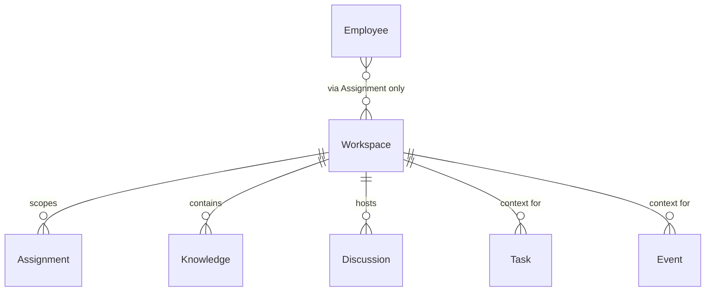
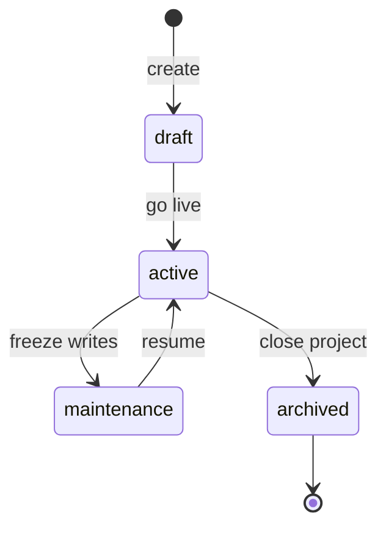

# Workspace

**Aggregate root:** yes  
**Parent:** [Domain Model](./domain-model.md)

---

## Purpose

**Workspace** — контейнер проекта или операционного контекста компании. Содержит Knowledge, Discussion и политики видимости. Employee **не принадлежит** Workspace; доступ только через Assignment.

---

## Responsibilities

| Area | Responsibility |
|------|----------------|
| Boundary | Isolate Knowledge and events per project |
| Context | Provide default scope for Tasks, Discussions, Runs |
| Governance | Workspace-level policies (retention, allowed Tools) |
| Metadata | Name, description, domain, lifecycle status |
| Projections | Squad/capacity views in Mission Control (read models) |

Workspace **does not**:

- Store Employee identity
- Execute LLM calls
- Replace Owner authority on production actions

---

## Relationships

| Relation | Cardinality | Notes |
|----------|-------------|-------|
| Assignment | 0..n | Links Employees |
| Knowledge | 0..n | Documents, indices, embeddings |
| Discussion | 0..n | Async topics |
| Task | 0..n | Optional `workspaceId` |
| Event | 0..n | Filterable in Mission Feed |

---

## Lifecycle

| State | Meaning |
|-------|---------|
| `draft` | Setup; Knowledge ingest allowed |
| `active` | Normal operations |
| `maintenance` | Read-only Runs; no new Tasks |
| `archived` | Historical; no new Assignments |

---

## Attributes (conceptual)

| Attribute | Type | Notes |
|-----------|------|-------|
| `id` | UUID | |
| `slug` | string | URL-safe identifier |
| `name` | string | Display name |
| `domain` | string | Engineering / Operations / … |
| `status` | enum | Lifecycle |
| `defaultRuntimePolicy` | ref | Optional Runtime constraints |
| `ownerId` | ref | Human Owner (external) |
| `createdAt` | timestamp | |

---

## Future Extensions

- **Workspace templates** — bootstrap Knowledge + default Assignments.
- **Cross-workspace Knowledge share** — explicit read-only links (never implicit merge).
- **Environment tags** — `local`, `stage` metadata without coupling to deploy.
- **Quota** — max concurrent Runs, storage limits.
- **Branding / design tokens** — link to design-system scope for AI Designer role.
- **ServiceManager bridge** — optional federated read mirror (out of platform core).
