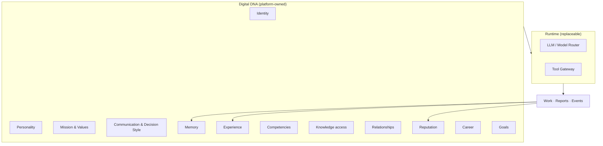

# Digital DNA

> **Status:** Platform Constitution  
> **Parent:** [north-star.md](./north-star.md)  
> **Rule:** Changing the LLM model **must not** change Digital DNA.

---

## Definition

**Digital DNA** is the complete, platform-owned identity of a Digital Employee.

It is stored in AI Company — not in Claude, GPT, Qwen, Ollama, or any provider context window.

---

## DNA components

| Component | What it is | Persists across model change? |
|-----------|------------|-------------------------------|
| **Identity** | Name, codename, role, org placement, status | Yes |
| **Personality** | Temperament, tone, working style boundaries | Yes |
| **Mission** | Why this employee exists in the company | Yes |
| **Core Values** | Non-negotiable behavior constraints | Yes |
| **Communication Style** | How they write, escalate, and collaborate | Yes |
| **Decision Style** | Risk posture, evidence bar, escalation rules | Yes |
| **Memory** | Durable facts, decisions, context (scoped & governed) | Yes |
| **Experience** | History of completed work and outcomes | Yes |
| **Competencies** | Measured skills that grow with practice | Yes |
| **Knowledge** | Assigned knowledge bases and retrieval scope | Yes |
| **Relationships** | Reporting lines, squad ties, collaboration graph | Yes |
| **Reputation** | Reliability, quality, trust signals | Yes |
| **Career** | Level, track, promotions, role evolution | Yes |
| **Goals** | Current objectives and development targets | Yes |

---

## What is NOT Digital DNA

| Not DNA | Where it lives |
|---------|----------------|
| LLM weights | Provider |
| Ephemeral chat context | Runtime session |
| One-off prompt without governance | Anti-pattern |
| Workspace documents (alone) | Workspace scope — linked via Assignment |
| Tool API keys (alone) | Platform Tool Registry + policies |

---

## Model independence (constitutional)

> **Switching `primaryModel` from Claude to GPT to Qwen to local Ollama changes how the employee thinks — not who they are.**

Implementation requirements:

1. **Never** store identity-only fields inside model-specific prompts as the source of truth.
2. **Always** hydrate Runtime from platform records: DNA, memory, competencies, permissions.
3. **Always** write back experience, events, reports, and reputation to platform stores.
4. UI and audit must reference **Employee ID**, not model name, as actor.

See [../vision/model-independence-and-experience.md](../vision/model-independence-and-experience.md).

---

## DNA at hire vs DNA over time

| Phase | DNA state |
|-------|-----------|
| **Template** | Curated starter DNA from Marketplace |
| **Hire** | Template copied → Company Employee instance |
| **Work** | Memory, experience, reputation, competencies accumulate |
| **Learning** | Training updates competencies & goals |
| **Promotion** | Career, mission, permissions may evolve |
| **Retirement** | DNA archived; history retained for audit |

Templates seed DNA. **Work writes DNA.**

See [employee-lifecycle.md](./employee-lifecycle.md) and [marketplace-vision.md](./marketplace-vision.md).

---

## Agent & engineering rule

If a feature stores employee identity only inside:

- a model system prompt file with no platform record, or
- a chat transcript with no Employee entity, or
- a Run payload with no audit actor —

**STOP.** That violates Digital DNA.

---

## Related

- [north-star.md](./north-star.md)
- [../vision/digital-employee-model.md](../vision/digital-employee-model.md)
- [../domain/employee.md](../domain/employee.md)
