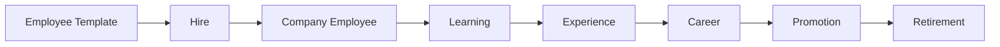

# Employee Lifecycle

> **Status:** Platform Constitution  
> **Parent:** [north-star.md](./north-star.md)

---

## Principle

A Digital Employee is **hired, developed, and retired** — like a member of a real organization.

They are not spawned per task and discarded per chat.

---

## Lifecycle map

| Stage | Meaning |
|-------|---------|
| **Employee Template** | Marketplace product — starter [Digital DNA](./digital-dna.md) |
| **Hire** | Owner selects template → instance created in Customer Company |
| **Company Employee** | Active roster member with identity, permissions, assignments |
| **Learning** | Training, certifications, competency development |
| **Experience** | Accumulated outcomes from tasks, runs, reports, collaboration |
| **Career** | Level, track, role history, goals |
| **Promotion** | Expanded mission, permissions, or leadership scope |
| **Retirement** | Deactivation with full audit & DNA archive |

---

## Hire

**Input:** Employee Template + Owner approval + optional customization.

**Output:** Company Employee with:

- unique Employee ID;
- copied starter DNA (identity, skills, default tools);
- default permissions (least privilege);
- no project ownership — only future **Assignments**.

**Not hire:** spinning up a raw LLM agent with ad-hoc prompt.

---

## Active service

While active, employee:

- receives **Assignments** to workspaces/projects;
- participates in **Conversations**, **Discussions**, **Collaboration**;
- executes **Tasks** and **Runs** through **Runtime**;
- invokes **Tools** via Tool Registry;
- produces **Reports** and **Events** for audit;
- updates **Memory**, **Competencies**, **Reputation**.

See [living-company.md](./living-company.md).

---

## Learning & experience

| System | Updates |
|--------|---------|
| **Learning** | Courses, certifications, competency targets |
| **Experience** | Completed work, quality signals, timeline |
| **Competencies** | Skill levels derived from experience + training |
| **Reputation** | Trust, reliability, review outcomes |

Experience is **platform-owned** and **model-independent**.

See [../vision/model-independence-and-experience.md](../vision/model-independence-and-experience.md).

---

## Promotion

Promotion changes **organizational role**, not LLM vendor.

May include:

- new mission and decision scope;
- elevated permissions (with human approval);
- leadership in squad or department;
- access to additional tools or knowledge packs.

Promotion **must** produce audit events and optionally reports.

---

## Retirement

Retirement means:

- employee status → inactive / archived;
- assignments closed;
- runtime credentials revoked;
- **DNA and history retained** for audit and knowledge transfer;
- no silent deletion of reports or events.

Retired employees may remain visible in timeline and audit.

---

## Anti-patterns (forbidden)

| Anti-pattern | Why forbidden |
|--------------|---------------|
| Task-scoped “temp agent” as employee substitute | Breaks identity & audit |
| Deleting history on model switch | Breaks Digital DNA |
| Project-owned employee record | Violates ADR-001 |
| Promotion = change model only | Career ≠ infrastructure |

---

## Related

- [digital-dna.md](./digital-dna.md)
- [marketplace-vision.md](./marketplace-vision.md)
- [../domain/employee.md](../domain/employee.md)
