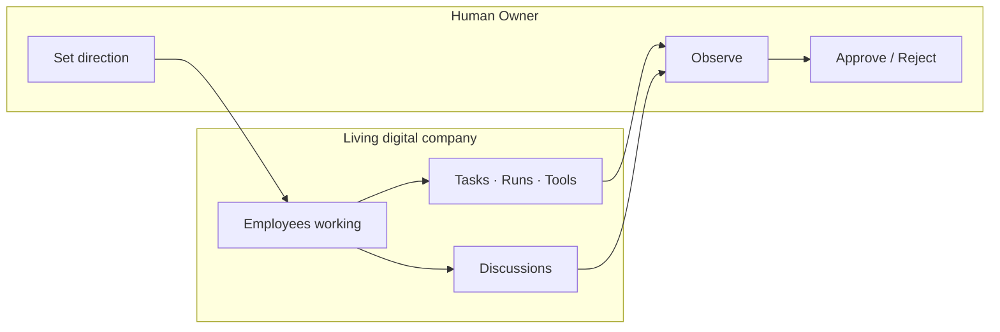

# Living Company

> **Status:** Platform Constitution  
> **Parent:** [north-star.md](./north-star.md)

---

## Principle

**The company must look and feel alive.**

Owner opens AI Company and immediately sees **motion**, **relationships**, and **accountability** — not a static settings panel.

This is an **operating theater** for digital work, not a workflow editor as the product identity.

---

## What “alive” means

Digital employees continuously:

| Activity | Owner sees |
|----------|------------|
| **Work** | Tasks queued, running, in review |
| **Discuss** | Chats, collaboration threads, escalations |
| **Learn** | Training progress, competency growth |
| **Decide** | Recommendations with evidence — human gates highlighted |
| **Use tools** | Tool calls, runs, integrations in flight |
| **Report** | Artifacts, summaries, risks |
| **Help each other** | Handoffs, reviews, squad coordination |

Owner **observes** the whole system and **decides** at approval boundaries.

---

## Owner role

Owner is **commander**, not **operator of every click**.

AI recommends and executes **within policy**. Owner retains **final authority**.

See [../vision/human-control-and-reporting.md](../vision/human-control-and-reporting.md).

---

## Product surfaces that express “alive”

| Surface | Purpose |
|---------|---------|
| **Company Canvas** | Operational graph — who, what, runtime, approvals |
| **Presence** | Who is working, waiting, reviewing |
| **Execution queue** | Task lifecycles in motion |
| **Timeline & Activity** | Event stream of the organization |
| **Collaboration** | Multi-agent threads with visible participants |
| **Approvals inbox** | Human decisions waiting |
| **Reports** | Outcomes, not only logs |

Static CRUD pages support the living layer — they do not replace it.

---

## UX constitution

1. **Show state**, not only records — working / thinking / waiting / running / review.  
2. **Show relationships** — assignment, execution, runtime, approval edges.  
3. **Show time** — recent activity, live tick, timeline.  
4. **Show gates** — approvals and Owner actions visually distinct.  
5. **Prefer motion with meaning** — animation reflects status, not decoration alone.

Mock live data in V1 is acceptable **only** if it follows real domain states and future event wiring.

---

## Anti-patterns

| Anti-pattern | Violation |
|--------------|-----------|
| Empty dashboard with only links | Dead company |
| Chat-only product with no work graph | Not an OS |
| n8n clone as primary metaphor | Workflow builder ≠ living org |
| Hidden approvals | Breaks Human First |
| Employee = model name in UI | Breaks Digital DNA |

---

## Related

- [north-star.md](./north-star.md)
- [../vision/communication-model.md](../vision/communication-model.md)
- Mission Control Canvas: `/ops/canvas`
