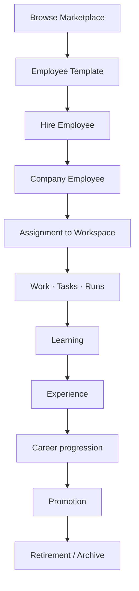

# Marketplace Vision

> **Status:** Platform Constitution  
> **Parent:** [north-star.md](./north-star.md)

---

## Core idea

**The Marketplace sells Employee Templates — not LLM subscriptions disguised as agents.**

Customers buy **organizational capability**: role, DNA, tools, workflows, and learning paths.

Models are selected from the **Platform Model Catalog** at runtime.

---

## What Marketplace offers

| Product type | Examples |
|--------------|----------|
| **Employee Templates** | AI CTO, Senior Developer, QA Lead, DevOps, CFO analyst |
| **Squad packs** | Photo Lab delivery team, security review trio |
| **Tool packs** | GitHub + CI + Docker bundle |
| **Knowledge packs** | Industry playbooks, compliance baselines |
| **Learning paths** | Certification tracks tied to competencies |

---

## Customer journey

| Step | Owner action | Platform action |
|------|--------------|-----------------|
| Browse | Compare templates, reviews, DNA preview | Catalog, licensing |
| Hire | Confirm hire, optional DNA tweaks | Instantiate employee, audit event |
| Operate | Assign, approve, review reports | Runtime, tools, analytics |
| Develop | Assign learning, review promotion | Competency & career engines |
| Retire | Archive employee | Preserve DNA & audit |

See [employee-lifecycle.md](./employee-lifecycle.md).

---

## Template anatomy

Every Employee Template ships with:

1. **Identity & role** — codename, department fit, seniority band  
2. **Digital DNA defaults** — mission, values, communication & decision style  
3. **Starter competencies** — skill tags and baseline levels  
4. **Recommended tools** — Tool Registry references (not raw secrets)  
5. **Workflow patterns** — how work is proposed, executed, reported  
6. **Learning curriculum** — optional certification path  
7. **Compliance tier** — data handling, approval gates  

After hire, the **Company Employee diverges** through experience. Template updates do not overwrite customer history without explicit migration policy.

---

## Pricing philosophy (directional)

| Charge for | Do not charge for (as product) |
|------------|--------------------------------|
| Templates & packs | Raw model tokens alone as “employee” |
| Seats & company tier | Ephemeral chat sessions |
| Premium tools & connectors | Prompt libraries without identity |
| Support & compliance tiers | |

Runtime model usage may be **metered infrastructure** — separate line item from **organizational capability**.

---

## Platform vs customer boundary

| Marketplace (L1) | Customer Company (L2) |
|------------------|------------------------|
| Template catalog | Hired employee instances |
| Publisher reviews | Internal performance & reputation |
| Versioned template releases | Employee-specific DNA drift |
| Global analytics | Private reports & audit |

See [platform-vs-company.md](./platform-vs-company.md).

---

## V1 stance

Local V1 uses **built-in roster + custom employees** as a stand-in for post-hire Company Employees.

Marketplace UI and billing are **future platform surfaces** — lifecycle and DNA rules apply **now** in design and code.

---

## Related

- [digital-dna.md](./digital-dna.md)
- [roadmap-2030.md](./roadmap-2030.md)
- [../vision/digital-employee-model.md](../vision/digital-employee-model.md)
