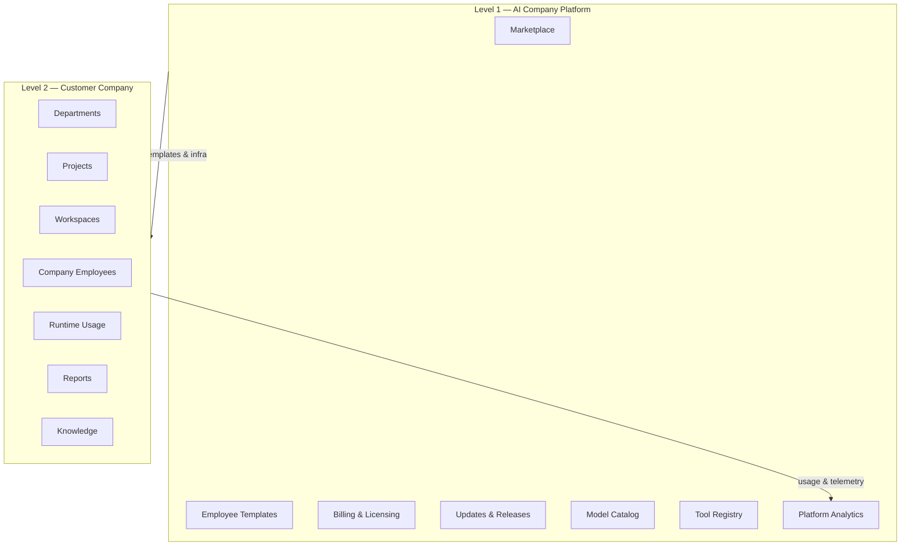

# Platform vs Customer Company

> **Status:** Platform Constitution  
> **Parent:** [north-star.md](./north-star.md)

---

## Two levels, one product

AI Company has **two distinct layers**. Confusing them breaks multi-tenant design, billing, and ownership.

---

## Level 1 — AI Company Platform

**Who operates it:** AI Company vendor / platform operator.

**Purpose:** Sell, ship, and govern the operating system.

| Capability | Description |
|------------|-------------|
| **Marketplace** | Discover and purchase Employee Templates, tool packs, knowledge packs |
| **Employee Templates** | Curated starter Digital DNA + default tools + workflows |
| **Billing** | Plans, seats, usage, marketplace purchases |
| **Licensing** | Entitlements, feature flags, compliance tiers |
| **Updates** | Platform releases, template version bumps, security patches |
| **Model Catalog** | Approved models, routing policies, cost profiles |
| **Tool Registry** | Connectors, MCP, capabilities, access policies ([ADR-002](../architecture/adr-002-tool-registry.md)) |
| **Analytics** | Cross-customer product analytics (aggregated, governed) |

Platform **does not** own Customer delivery work. It **enables** it.

---

## Level 2 — Customer Company

**Who operates it:** Human Owner and their organization.

**Purpose:** Run a living digital company on real projects.

| Capability | Description |
|------------|-------------|
| **Departments** | Org structure, reporting lines |
| **Projects** | Delivery entities with goals and timelines |
| **Workspaces** | Scoped environments for knowledge, tasks, assignments |
| **Employees** | Hired instances of templates with evolving DNA |
| **Runtime** | Model router, runs, tool execution for this company |
| **Reports** | Artifacts, decisions, outcomes ([reports-first](../vision/human-control-and-reporting.md)) |
| **Knowledge** | Company and workspace knowledge bases |

Customer company **owns** its employees, work, and audit trail within its tenant.

---

## Boundary rules (constitutional)

| Rule | Rationale |
|------|-----------|
| Platform templates ≠ Customer employees | Hire creates a **copy/instance** with separate history |
| Customer data ≠ Platform catalog | No leakage of private reports into marketplace |
| Tool Registry is platform-mediated | All external access through registry ([ADR-002](../architecture/adr-002-tool-registry.md)) |
| Model Catalog is platform-curated | Customer chooses from allowed models/policies |
| Employee is org asset, not project asset | Assignment links employee to workspace — employee is not owned by project ([ADR-001](../architecture/adr-001-ai-company-platform.md)) |

---

## V1 today (local mock)

Local V1 simulates **Customer Company** operations in Mission Control with mock platform catalog (tools, templates, roster).

Platform Level 1 marketplace and billing are **design targets** — see [roadmap-2030.md](./roadmap-2030.md).

---

## Related

- [marketplace-vision.md](./marketplace-vision.md)
- [../architecture/adr-001-ai-company-platform.md](../architecture/adr-001-ai-company-platform.md)
- [../domain/domain-model.md](../domain/domain-model.md)
