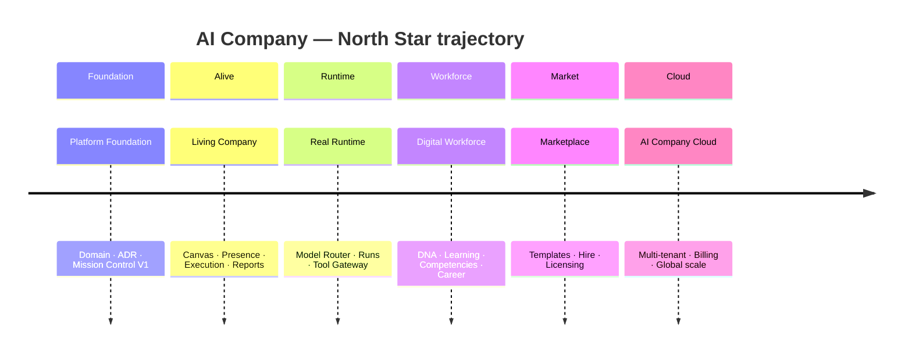

# Roadmap 2030

> **Status:** Platform Constitution · Directional  
> **Parent:** [north-star.md](./north-star.md)

Long-range phases for AI Company. Dates are **intent**, not commitments. Order reflects **dependency** — each phase builds on the previous.

---

## Phase overview

---

## 1. Platform Foundation

**Goal:** Establish the operating system skeleton.

| Delivered / in progress | Outcome |
|-------------------------|---------|
| North Star constitution | Single source of truth |
| Domain model & ADRs | Employee-centric architecture |
| Mission Control V1 | Local org operations UI |
| Tool Registry design | Mediated external access |
| i18n, design system | Productizable shell |

**Exit criteria:** Any feature can be checked against North Star and domain docs without ambiguity.

---

## 2. Living Company

**Goal:** Owner **feels** the organization working.

| Capabilities | Outcome |
|--------------|---------|
| Company Canvas | Operational graph |
| Presence & activity | Who is doing what |
| Execution engine | Task → run → approval flow |
| Collaboration & chats | Communication as first-class |
| Reports & approvals | Human-visible outcomes |

**Exit criteria:** Owner answers “who works on what” without opening five unrelated pages.

See [living-company.md](./living-company.md).

---

## 3. Real Runtime

**Goal:** Replace mock inference with governed execution.

| Capabilities | Outcome |
|--------------|---------|
| Model Router | Policy-based model selection |
| Run orchestration | Durable runs with states |
| Tool Gateway | ADR-002 enforcement live |
| Streaming & recovery | Observable execution |
| Provider adapters | Ollama, cloud APIs — swappable |

**Exit criteria:** Employee DNA unchanged when model provider changes mid-run policy.

See [../vision/model-independence-and-experience.md](../vision/model-independence-and-experience.md).

---

## 4. Digital Workforce

**Goal:** Employees **grow** — not reset every session.

| Capabilities | Outcome |
|--------------|---------|
| Memory governance | Scoped durable memory |
| Experience timeline | Model-independent history |
| Competencies & learning | Skills evolve with work |
| Reputation & career | Promotion-ready signals |
| Handoffs & squads | Multi-employee delivery |

**Exit criteria:** Hire → work → promote → retire lifecycle fully platform-backed.

See [employee-lifecycle.md](./employee-lifecycle.md) and [digital-dna.md](./digital-dna.md).

---

## 5. Marketplace

**Goal:** Platform Level 1 as commercial product.

| Capabilities | Outcome |
|--------------|---------|
| Template catalog | Published Employee Templates |
| Hire flow | Template → Company Employee |
| Licensing & entitlements | Tool/model/template tiers |
| Publisher ecosystem | Third-party templates (governed) |
| Reviews & compliance | Trust layer |

**Exit criteria:** Customer buys **role capability**, not a chat subscription.

See [marketplace-vision.md](./marketplace-vision.md).

---

## 6. AI Company Cloud

**Goal:** Multi-tenant platform at scale.

| Capabilities | Outcome |
|--------------|---------|
| Tenant isolation | Customer company boundaries |
| Billing & usage | Seats, runtime, marketplace |
| Global updates | Safe template & platform rollout |
| Enterprise compliance | Audit, retention, SSO |
| Analytics | Platform + tenant insights |

**Exit criteria:** Many customer companies on shared platform without DNA or audit leakage.

See [platform-vs-company.md](./platform-vs-company.md).

---

## What we will not skip

| Skipping | Consequence |
|----------|-------------|
| Foundation → Cloud | Fragile tenants, identity collapse |
| Living Company → Runtime | “Chat app with API” |
| DNA before Marketplace | Templates without soul |
| Human gates before automation | Unaccountable autonomy |

---

## Related

- [north-star.md](./north-star.md)
- [../architecture/adr-001-ai-company-platform.md](../architecture/adr-001-ai-company-platform.md)
- [../AGENTS.md](../AGENTS.md)
