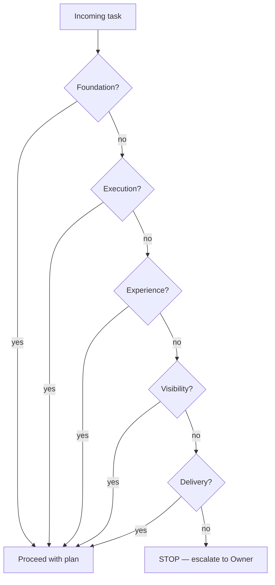

# Task Decision Filter

> **Status:** Mandatory pre-task gate · **Scope:** Every task on `apps/ai-company/**`  
> **Parent:** [senior-product-engineering-rules.md](./senior-product-engineering-rules.md)  
> **Task:** AI-COMPANY-058

---

## Purpose

Before writing code or docs, classify the task.

**Every task must pass at least one of five filters.**

If the task matches **none** → **STOP**. Do not implement. Report to Owner with a better-framed alternative.

---

## The five filters

---

### 1. Foundation

Strengthens platform structure **without** immediate UI — but enables future real work.

**Examples:**

- Domain types, storage contracts, event model
- Runtime orchestrator, provider adapter boundaries
- ADRs, constitution, operating rules
- Permission and approval model in docs/code
- Tool registry / gateway contracts

**Pass test:** “Without this, the next real feature would be hacky or unsafe.”

**Fail test:** “This is refactor for its own sake with no North Star link.”

---

### 2. Execution

Makes digital employees **actually do work** — or prepares the path to real execution.

**Examples:**

- Ollama / Runtime provider integration
- Model Router + Runtime profile
- Tool execution gateway (local V1)
- Handoff packages to external executors
- Run → Report → Timeline pipeline

**Pass test:** “An employee can complete a work episode observable in Run History.”

**Fail test:** “Mock button with no pipeline, logs, or Owner visibility.”

---

### 3. Experience

Improves how Owner and operators **feel** using AI Company.

**Examples:**

- Design System V2 consistency
- i18n EN + RU completeness
- Clear error / timeout / cancel messages
- Employee profile, workspace, chat UX
- Navigation and Command Center clarity

**Pass test:** “Owner trusts the UI more after this change.”

**Fail test:** “Cosmetic shuffle with no clarity or control gain.”

---

### 4. Visibility

Makes work **observable** — living company surfaces.

**Examples:**

- Company Canvas, Live Runtime Monitor
- Timeline, Notifications, Presence, Workday
- Run History, Reports, Audit trail
- Execution queue, tool execution log
- Status badges, pipeline steps, elapsed time

**Pass test:** “Owner can answer who is doing what without opening devtools.”

**Fail test:** “Data exists in localStorage but no screen shows it.”

---

### 5. Delivery

Moves a **project, workspace, or sprint** toward shipped outcome.

**Examples:**

- Task queue, sprint planning, control room
- Project health, demo readiness, handoffs
- Report creation from runs
- Knowledge attached to delivery
- Approval before external send

**Pass test:** “A defined initiative (e.g. AI Photo Lab) is closer to done.”

**Fail test:** “Generic scaffold unrelated to any active initiative.”

---

## Product question gate (mandatory)

After filter match, answer these in the task plan:

| # | Question | Required |
|---|----------|----------|
| 1 | Will the user see value? | At least one **yes** across Q1–Q5 below |
| 2 | Does it move us toward North Star? | |
| 3 | Does it make AI Company feel more alive? | |
| 4 | Does it help digital employees actually work? | |
| 5 | Does it improve trust, clarity, or control for Owner? | |

If **all five are no** → **STOP** even if a filter matched superficially. Re-scope the task.

---

## Quick classification table

| Task example | Filter(s) |
|--------------|-----------|
| Connect Ollama Runtime | Execution + Visibility |
| Live Runtime Monitor | Visibility + Experience |
| North Star constitution | Foundation |
| Canvas V2 polish | Experience + Visibility |
| Sprint / Photo Lab control room | Delivery + Visibility |
| Rename internal helper | **STOP** unless bundled in scoped task |
| New settings page, no user story | **STOP** |
| Mock run with no logs | **STOP** — fails Execution + Visibility |

---

## STOP response template

When stopping, send Owner:

1. **Task summary** — what was requested  
2. **Filter result** — none matched (or product questions all no)  
3. **Why it fails** — North Star / operating rules reference  
4. **Reframed options** — 2–3 tasks that **would** pass filters  

Do not implement “partially” while waiting.

---

## Relation to North Star

Filters implement North Star pillars:

| Filter | North Star link |
|--------|-----------------|
| Foundation | Platform L1, domain model, Digital DNA infrastructure |
| Execution | Runtime, tools, employees that work |
| Experience | Human First, trust, Design System |
| Visibility | Living company |
| Delivery | Workspaces, projects, reports, approvals |

Constitution wins on conflict. Filters win on “should we do this task at all?”

---

## Revision

| Version | Date | Change |
|---------|------|--------|
| 1.0 | 2026-06-24 | Task decision filter (AI-COMPANY-058) |
