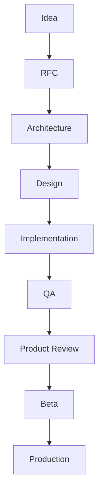

# Feature Lifecycle

> **Status:** Engineering governance · **Scope:** Every user-visible feature on `apps/ai-company/**`  
> **Parent:** [AGENTS.md](../AGENTS.md) · **Task:** AI-COMPANY-062

---

## Purpose

No feature ships as “just code.” Every capability passes a **defined lifecycle** from idea to production.

Agents and humans use the same stages. Skipping a stage requires **Owner waiver** logged in [platform-review-log.md](../reviews/platform-review-log.md).

---

## Lifecycle overview

---

## Stage definitions

### 1. Idea

**Input:** Owner need, North Star gap, or delivery initiative.

**Output:** One-sentence value proposition + filter match ([task-decision-filter.md](../operating-rules/task-decision-filter.md)).

**Exit criteria:**

- Passes at least one of five filters (Foundation / Execution / Experience / Visibility / Delivery).
- Owner or Product Lead acknowledges priority.

**STOP if:** No filter match.

---

### 2. RFC (Request for Comments)

**Purpose:** Align scope before build.

**Document (lightweight):**

- Problem & Owner outcome  
- Non-goals  
- Affected entities (Employee, Run, Canvas, etc.)  
- Risks & open questions  

**Location:** Task description, PR body, or `docs/rfc/` (if multi-sprint).

**Exit criteria:** Owner **approve scope** or request revision.

---

### 3. Architecture

**Purpose:** Fit system shape and constitution.

**Activities:**

- Check [north-star.md](../north-star/north-star.md) and domain model  
- ADR if cross-cutting  
- Trigger [architecture-review-process.md](../reviews/architecture-review-process.md) when required  
- Register foreseen debt in [technical-debt.md](../architecture/technical-debt.md)  

**Exit criteria:** Architecture notes in RFC or ADR; no unresolved constitution conflict.

---

### 4. Design

**Purpose:** Owner can understand and control the feature.

**Activities:**

- Design System V2 patterns  
- Wireflow: entry → action → result → failure  
- i18n plan (EN + RU keys)  
- Living company: where motion appears (Canvas, Timeline, Live Runtime)  

**Exit criteria:** UX reviewer sign-off (agent checklist or Owner ack).

---

### 5. Implementation

**Purpose:** Build under [operating-rules/](../operating-rules/).

**Rules:**

- `apps/ai-company/**` only unless explicit  
- No hidden work  
- Partial logs on failure for execution features  

**Exit criteria:** `npm run build` green; [quality-gate.md](../operating-rules/quality-gate.md) passed.

---

### 6. QA

**Purpose:** Verify behavior, not only compile.

**Minimum:**

- Happy path manual test documented  
- Error / empty / timeout paths checked  
- Routes and links verified  
- EN + RU spot check  

**Exit criteria:** QA notes in PR / task; no open P0 for the feature.

---

### 7. Product Review

**Purpose:** Owner-visible value confirmation.

**Questions:**

- Does Owner see value without explanation?  
- Does it make the company feel more alive?  
- Trust / clarity / control improved?  

**Exit criteria:** Owner or Product Lead **accept** or list fix list.

---

### 8. Beta

**Purpose:** Release to limited Owners with known limits.

**Gate:** [beta-readiness-checklist.md](../release/beta-readiness-checklist.md) + L3 AR log entry.

**Exit criteria:** Beta **Go** in review log.

---

### 9. Production

**Purpose:** First customer / general availability for capability.

**Gate:** [production-readiness.md](../release/production-readiness.md) + L3 AR log entry.

**Exit criteria:** Production **Go** in review log.

---

## Lifecycle by feature size

| Size | RFC | AR | Product Review |
|------|-----|----|--------------------|
| **S** — copy, small fix, i18n | Optional | L1 if 10th task | Optional |
| **M** — new panel, hook, domain slice | Required | L2 if milestone | Required |
| **L** — Runtime provider, Canvas major, new product | Required | L4 required | Owner required |
| **XL** — Backend, multi-tenant, marketplace | RFC + ADR | L3 + L4 | Owner required |

---

## Integration with governance

| Artifact | Lifecycle touchpoint |
|----------|----------------------|
| [task-decision-filter.md](../operating-rules/task-decision-filter.md) | Idea |
| [architecture-review-process.md](../reviews/architecture-review-process.md) | Architecture, Beta, Production |
| [platform-review-log.md](../reviews/platform-review-log.md) | AR outcomes, Beta/Prod Go |
| [technical-debt.md](../architecture/technical-debt.md) | Architecture → ongoing |
| [quality-gate.md](../operating-rules/quality-gate.md) | Implementation |

---

## Revision

| Version | Date | Change |
|---------|------|--------|
| 1.0 | 2026-06-24 | Feature lifecycle (AI-COMPANY-062) |
