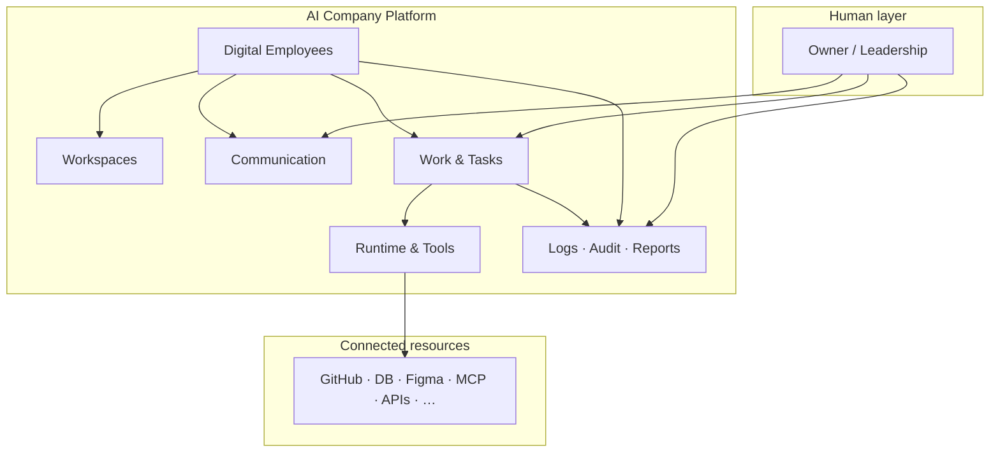

# AI Company Vision

> **Status:** Source of truth · Product direction  
> **Audience:** Human owners, product, engineering, and all AI agents working on `apps/ai-company/**`

---

## What AI Company is

**AI Company is not:**

- a chatbot wrapper
- a prompt launcher
- only an agent runner
- a single-model assistant panel

**AI Company is:**

> **An operating system for a digital organization.**

It provides the structure, identity, permissions, communication, work routing, audit, and reporting needed to run a company where **digital employees** collaborate with a **human owner** on real projects.

---

## Product promise

| For the human owner | For the digital organization |
|---------------------|------------------------------|
| Always in control of strategy and irreversible actions | Persistent employees with identity, not disposable chat sessions |
| Visibility through reports, logs, and explainable outcomes | Clear workspaces, assignments, and permissions |
| Faster automation without blind trust | Model-independent competence that grows over time |
| One place to talk, assign, review, and approve | Tools and MCP as workplace equipment, not ad-hoc scripts |

---

## What we are building (layers)

| Layer | Purpose | V1 today |
|-------|---------|----------|
| **Vision & principles** | Why we build; non-negotiable rules | This document set |
| **Domain model** | Entities, lifecycles, relationships | [domain-model.md](../domain/domain-model.md) |
| **Architecture** | Platform boundaries, ADRs | [adr-001](../architecture/adr-001-ai-company-platform.md) |
| **Mission Control UI** | NOC for roster, workspaces, comms, feed | Local V1 mock + localStorage |
| **Runtime** (future) | Model Router, tool gateway, Runs | Not implemented |

---

## Non-goals (explicit)

- Replacing ServiceManager ticket ownership or multi-tenant product rules
- Autonomous strategic decision-making without human approval
- Hiding actions behind opaque LLM sessions
- Tying employee identity to a single vendor model

---

## Success criteria (long-term)

1. Owner can explain **who did what, why, and with which tools** for any important action.
2. Employees retain identity and accumulated experience when models change.
3. Workspaces organize project context without owning employees.
4. Communication feels like a **corporate messenger for digital staff**, not a disposable chat UI.
5. Automation increases speed and visibility — never removes human accountability.

---

## Related documents

| Document | Focus |
|----------|-------|
| [core-principles.md](./core-principles.md) | 17 platform principles |
| [digital-employee-model.md](./digital-employee-model.md) | Employee anatomy |
| [human-control-and-reporting.md](./human-control-and-reporting.md) | Approval, audit, reports-first |
| [tools-mcp-and-access-model.md](./tools-mcp-and-access-model.md) | Tools, MCP, permissions |
| [model-independence-and-experience.md](./model-independence-and-experience.md) | Model Router, experience |
| [communication-model.md](./communication-model.md) | Unified chat concept |
| [AGENTS.md](../AGENTS.md) | Required reading for agents |

---

## Revision history

| Version | Date | Change |
|---------|------|--------|
| 1.0 | 2026-06-24 | Initial vision document |
