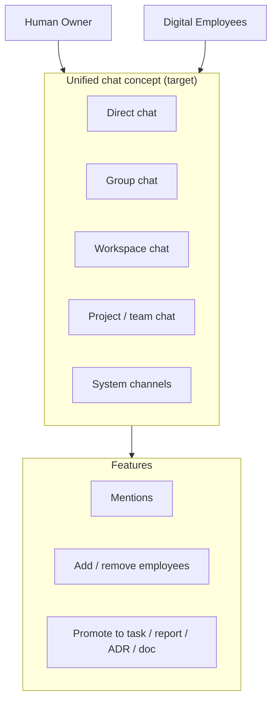
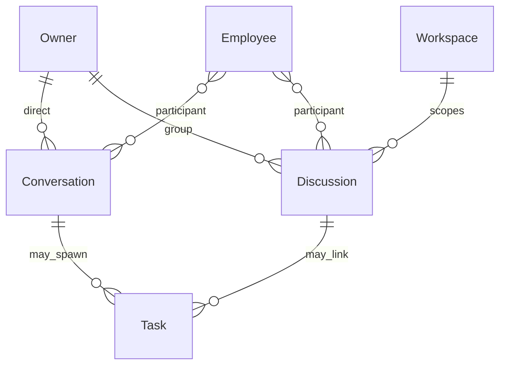

# Communication Model

> **Status:** Source of truth  
> **Parent:** [ai-company-vision.md](./ai-company-vision.md) · **Domain:** [conversation.md](../domain/conversation.md), [discussion.md](../domain/discussion.md)

AI Company should feel like a **corporate messenger for digital employees** — not a disposable chat sidebar bolted onto tasks.

---

## Vision

One unified communication concept spans how humans and digital employees coordinate daily work. Messages persist, participants are explicit, and conversations can spawn tasks, reports, and documents without losing context.

---

## Channel types

| Type | Description | V1 status |
|------|-------------|-----------|
| **Direct chat** | Owner ↔ single Employee; persistent personal thread | ✅ `/ops/employees/:id/conversation` |
| **Group chat** | Owner + multiple Employees; multi-party thread | ✅ Discussions (global) |
| **Workspace chat** | Scoped to Workspace context | 🔜 placeholder on Workspace tab |
| **Project / team chat** | Squad or initiative channel | 🔜 future |
| **System channels** | NOC alerts, deploy feed, health | 🔜 Mission Feed preview |

---

## First-class conversations (principle)

Conversations are **not** inferior to Tasks:

- A Conversation can exist with zero Tasks.
- A Task may be spawned from a Conversation — optional.
- Conversation history survives model and runtime changes.
- Group Discussions are separate from Tasks by design.

See [core-principles.md](./core-principles.md) — principles 11, 12.

---

## Message capabilities (target)

| Capability | Purpose |
|------------|---------|
| **Mentions** | `@Atlas` routes notification to employee |
| **Add / remove participants** | Dynamic group membership |
| **Threads** | Reply within topic |
| **Pinned notes** | Important decisions in sidebar |
| **Promote message → Task** | Work tracking without retyping |
| **Promote message → Report** | Owner review packet |
| **Promote message → ADR / Document** | Knowledge capture |

V1: composer + mock employee replies; promotion actions are **future**.

---

## Communication vs other entities

| Entity | When to use |
|--------|-------------|
| **Conversation** | Personal, exploratory, 1:1 with one employee |
| **Discussion** | Team-visible async thread in workspace |
| **Task** | Formal work unit with assignee and SLA |
| **Run** | Execution of inference/tools |
| **Report** | Structured deliverable for owner review |

---

## UX principles

1. **Persistence** — reopening a chat shows full history (platform-stored).
2. **Identity** — messages show Employee codename, not model name.
3. **Audit** — meaningful promotions and mentions emit Events.
4. **Calm density** — corporate messenger feel (Linear/Slack-like), not consumer chat bubbles only.
5. **Owner voice** — human messages clearly distinguished.

---

## V1 implementation map

| Feature | Route / module |
|---------|----------------|
| Direct conversation | `ConversationPage`, `conversation.ts` localStorage |
| Group discussion | `DiscussionPage`, `discussion.ts` localStorage |
| Workspace discussions tab | Placeholder → links to global Discussions |
| Mission Feed | Event stream preview |
| Mentions / promote | Not implemented |

---

## Future: unified inbox

Target: single **Inbox** showing direct + group + system channels with filters by Workspace and Employee — without merging domain entities internally.

---

## Related documents

- [digital-employee-model.md](./digital-employee-model.md)
- [human-control-and-reporting.md](./human-control-and-reporting.md)
- [conversation.md](../domain/conversation.md)
- [discussion.md](../domain/discussion.md)

---

## Revision history

| Version | Date | Change |
|---------|------|--------|
| 1.0 | 2026-06-24 | Initial communication model |
