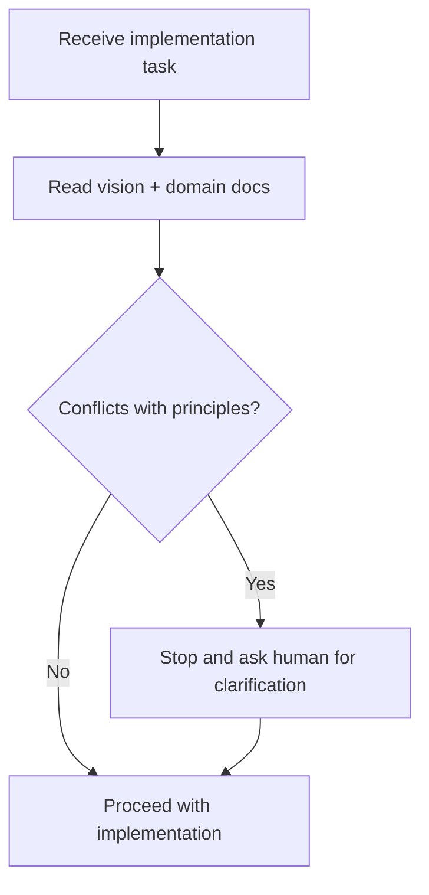

# Core Principles

> **Status:** Source of truth · Mandatory for all AI Company work  
> **Parent:** [ai-company-vision.md](./ai-company-vision.md)

These principles were accepted in product/architecture discussion. **Any implementation that violates them requires explicit human clarification before proceeding.**

---

## Principle index

| # | Principle | One-line summary |
|---|-----------|------------------|
| 1 | Human control | Human is always in control |
| 2 | Strategic decisions | Critical decisions are human-only |
| 3 | Employee role | Digital employees assist — they do not replace ownership |
| 4 | Employee-first | Employee is the primary entity |
| 5 | Replaceable LLM | LLM is a runtime engine, not identity |
| 6 | Model-independent identity | Identity, memory, experience, reputation persist across models |
| 7 | Model Router | Employees use models through routing, not hard binding |
| 8 | Platform-owned experience | Experience lives in AI Company, not inside the model |
| 9 | Assignment mobility | Employees move between Workspaces via Assignment |
| 10 | Workspace scope | Workspace is environment, not employee owner |
| 11 | First-class conversations | Direct and group chat are core workflow |
| 12 | Tasks are one mode | Task is only one form of employee activity |
| 13 | Tools as equipment | MCP/tools are workplace equipment |
| 14 | Two-level permissions | Global capabilities + workspace-specific access |
| 15 | Audit everything | Meaningful actions produce logs and audit trail |
| 16 | Connect resources | Integrate company resources for automation and visibility |
| 17 | Reports-first | Important actions must be explainable and reviewable |

---

## Detailed principles

### 1. Human is always in control

The human owner (or delegated human authority) retains ultimate authority over the digital organization. AI Company surfaces recommendations and automation — it does not silently override human intent.

### 2. Strategic and critical decisions are always made by a human

Budget, production deploy, permission elevation, data deletion, legal commitments, and org-level direction require explicit human decision. Digital employees may **propose**; they must not **decide**.

### 3. Digital employees assist, analyze, automate, report, and execute approved work

Employees are force multipliers: research, drafting, monitoring, routine execution, and structured reporting — within granted permissions and approval gates.

### 4. Employee is the primary entity — not LLM, agent, task, or chat

Authorization, audit, reputation, and UI identity anchor on **Employee**. Tasks, Runs, Conversations, and model calls are activities **of** an employee.

### 5. LLM is a replaceable runtime engine

The inference provider is infrastructure. Swapping Claude → Qwen → GPT must not require redefining the employee.

### 6. Model-independent employee properties

These persist regardless of model:

- Identity (name, codename, role)
- Personality and operating style
- Skills and competence profile
- Experience and reputation
- Memory scopes and relationships
- Permissions and tool grants

See [model-independence-and-experience.md](./model-independence-and-experience.md).

### 7. Model Router

Employees declare **preferences**; the platform **routes** to healthy runtimes via policy (cost, locality, capability, fallback). See [Runtime](../domain/runtime.md).

### 8. Experience is stored in AI Company, not inside the model

Model context windows are ephemeral. Durable learning, summaries, and reputation accrue in platform storage (Experience records, Knowledge, Reports, Events).

### 9. Employees move between Workspaces through Assignments

An employee may hold multiple Assignments concurrently. Assignment defines role-in-project, load, and optional permission overlay.

### 10. Workspace is the working environment, not the owner of the employee

Workspace holds project Knowledge, Documents, scoped Discussions, and Tasks. It never owns Employee records.

### 11. Conversations are first-class

Direct Owner ↔ Employee chat and group Discussions are permanent workflow channels — not secondary to Tasks. See [communication-model.md](./communication-model.md).

### 12. Tasks are only one form of employee activity

Also valid: conversation turns, discussion replies, scheduled Runs, monitoring jobs, report generation, knowledge ingestion.

### 13. MCP/tools are the employee’s workplace equipment

Tools (GitHub, Docker, Figma, MCP servers, APIs) are registered capabilities granted through Permission — analogous to keys, laptops, and system access for human staff.

### 14. Two-level permissions

| Level | Scope | Examples |
|-------|-------|----------|
| **Global** | Employee profile | GitHub read, Docker exec, production deploy flag |
| **Workspace** | Assignment overlay | Stricter DB write ban on Workspace A; Figma write only on Design workspace |

Effective permission = merge(global, workspace overlay) with **stricter wins**.

### 15. Every meaningful action produces logs, audit trail, and reports

No silent side effects. Runs, tool calls, permission denials, approvals, and state transitions emit [Events](../domain/event.md).

### 16. Connect all possible company resources

AI Company integrates with repos, databases, design files, messaging, calendars, infra, and custom MCP — to increase automation, speed, visibility, and reporting. Integration breadth is a product goal; each connector respects permissions.

### 17. Reports-first principle

Every important action should be **explainable** and **reviewable** by the human owner: what was requested, what was done, which tools were used, what changed, and what risks remain.

See [human-control-and-reporting.md](./human-control-and-reporting.md).

---

## Conflict resolution for agents

**Rule:** If a task conflicts with this document or [AGENTS.md](../AGENTS.md), **do not guess**. Stop and ask.

---

## Mapping to ADR-001

| ADR principle | Core principles |
|---------------|-----------------|
| P1 Employee-centric | 4, 5, 6 |
| P2 Replaceable LLM | 5, 7 |
| P3 Employee ≠ project | 9, 10 |
| P4 Multiple Assignments | 9 |
| P5 Workspace Knowledge | 10 |
| P6 Conversation standalone | 11 |
| P7 Task is one mode | 12 |

---

## Revision history

| Version | Date | Change |
|---------|------|--------|
| 1.0 | 2026-06-24 | Initial 17 principles |
