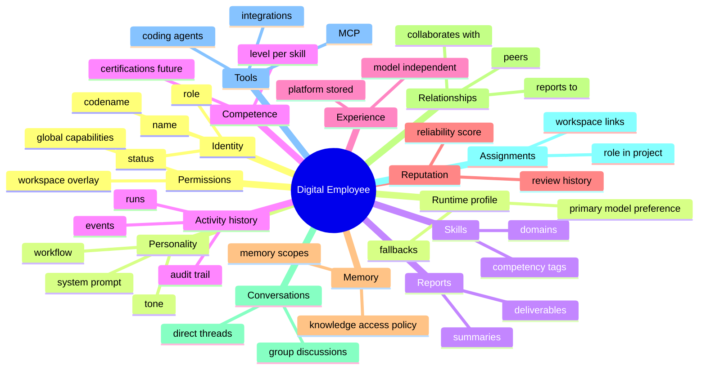

# Digital Employee Model

> **Status:** Source of truth  
> **Parent:** [ai-company-vision.md](./ai-company-vision.md) · **Domain:** [employee.md](../domain/employee.md)

A **digital employee** is a persistent organizational identity — not a chat session, not a model instance, not a project resource.

---

## Definition

> A digital employee is a member of the AI Company roster with stable identity, granted capabilities, accumulated experience, and accountable activity history — who executes work through replaceable runtime engines and assigned tools.

---

## Employee anatomy



---

## Dimension reference

| Dimension | Description | Storage (target) | V1 local app |
|-----------|-------------|------------------|--------------|
| **Identity** | Who this employee is in the org | Employee record | `CustomEmployee` + mock roster |
| **Personality** | How they operate and communicate | `systemPrompt`, `workflow`, `description` | Employee Builder |
| **Skills** | Declared competencies | `skills[]` | Employee Builder |
| **Competence** | Demonstrated ability level | Experience-derived metrics | Future |
| **Experience** | Accumulated platform history | Experience store | Future |
| **Reputation** | Trust and quality signals | Review + outcome aggregation | Future |
| **Memory** | Allowed knowledge domains | `memoryScope[]` + Knowledge refs | Profile field |
| **Relationships** | Org graph edges | Relationship entity | Placeholder UI |
| **Conversations** | Direct persistent threads | Conversation per employee | localStorage |
| **Assignments** | Workspace participation | Assignment entity | localStorage |
| **Tools** | Registered equipment | Tool catalog + grants | Tools Registry + permissions matrix |
| **Permissions** | Global capability profile | PermissionProfile | `CustomEmployeePermissions` |
| **Runtime profile** | Model preferences, not binding | `primaryModel`, `fallbackModels` | Employee Builder |
| **Reports** | Structured outputs for owner | Artifact / Report entity | Future |
| **Activity history** | Immutable audit of actions | Event stream | Mission Feed subset |

---

## Employee vs other entities

| Entity | Relationship to Employee |
|--------|-------------------------|
| **LLM / Runtime** | Engine employee uses; swappable |
| **Task** | Work unit assigned **to** employee |
| **Run** | Execution attempt **by** employee |
| **Conversation** | Communication channel **with** employee |
| **Workspace** | Environment employee joins via Assignment |
| **Tool** | Equipment employee may invoke if permitted |

---

## Lifecycle (summary)

```
planned → active ↔ suspended → retired
```

Employees are org assets. Retirement archives Assignments and blocks new Runs; history remains auditable.

Full lifecycle: [employee.md](../domain/employee.md).

---

## V1 vs target platform

| Capability | V1 (`apps/ai-company`) | Target platform |
|------------|------------------------|-----------------|
| Create employee profile | Employee Builder + templates | + server identity |
| Assign to workspace | Assignment localStorage | + policy engine |
| Direct conversation | Per-employee thread | + unified messenger |
| Group discussion | Global discussions | + workspace-scoped |
| Experience / reputation | Not stored | Platform Experience service |
| Reports | Mock feed | Report entity + export |

---

## Invariants (do not break)

1. Never set Workspace as owner of Employee.
2. Never embed provider API keys in Employee record.
3. Never attribute audit Events to a model name instead of Employee id.
4. Never delete Activity history silently — archive only.

---

## Related documents

- [core-principles.md](./core-principles.md) — principles 4–10, 13–14
- [model-independence-and-experience.md](./model-independence-and-experience.md)
- [communication-model.md](./communication-model.md)
- [assignment.md](../domain/assignment.md)

---

## Revision history

| Version | Date | Change |
|---------|------|--------|
| 1.0 | 2026-06-24 | Initial digital employee model |
