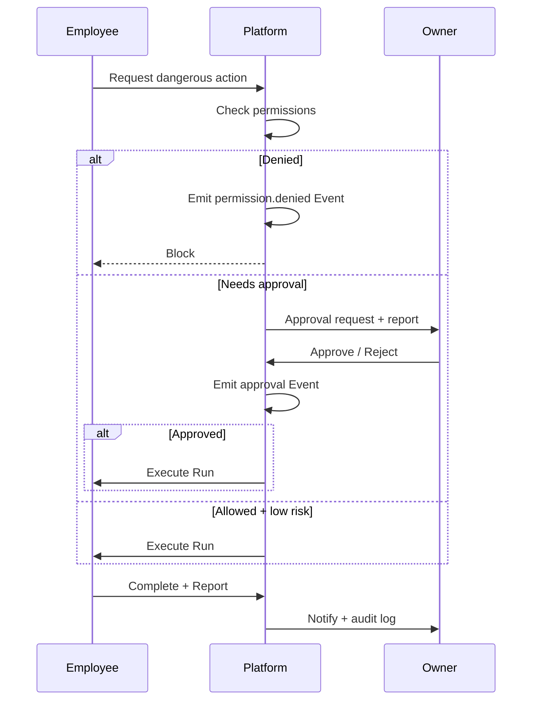

# Human Control and Reporting

> **Status:** Source of truth  
> **Parent:** [ai-company-vision.md](./ai-company-vision.md)

Human ownership is non-negotiable. AI Company exists to **amplify** human decision-making with visibility — not to replace it.

---

## Human control model

```mermaid
flowchart LR
    subgraph Allowed["Digital employees MAY"]
        A1[Analyze]
        A2[Propose]
        A3[Prepare drafts]
        A4[Automate routine]
        A5[Execute approved tasks]
        A6[Generate reports]
        A7[Monitor connected systems]
    end

    subgraph Forbidden["Digital employees MUST NOT autonomously"]
        F1[Strategic decisions]
        F2[Production deploy]
        F3[Spend money]
        F4[Delete important data]
        F5[Change critical permissions]
        F6[Irreversible actions without approval]
    end

    Owner[Human Owner] --> Allowed
    Owner --> Forbidden
    Forbidden -.->|unless explicit approval + permission| Allowed
```

---

## What employees may do

| Category | Examples |
|----------|----------|
| **Analyze** | Code audit, cost review, risk scan, dependency graph |
| **Propose** | Change plans, ADRs, task breakdowns, architecture options |
| **Prepare** | PR drafts, migration scripts (not applied), test plans |
| **Automate** | Scheduled checks, report generation, sync read-only data |
| **Execute approved work** | Runs explicitly authorized by Task, Conversation decision, or Owner click |
| **Generate reports** | Status summaries, incident timelines, SLA dashboards |
| **Monitor** | Health probes, queue depth, tool degradation alerts |

---

## What requires human gate

| Action | Gate type |
|--------|-----------|
| Production deploy | Owner approval + `productionDeploy` permission |
| Database write / migration | Approval + workspace permission |
| Git push / merge to protected branch | Approval + GitHub write |
| Permission elevation | Owner approval only |
| Spend (API budget, cloud, paid services) | Owner approval + budget policy |
| Delete production data or repos | Owner approval + confirmation dialog |
| Strategic roadmap / budget allocation | Human decision — employee proposes only |

---

## Approval gates (platform pattern)

---

## Reports-first principle

> Every important action should be explainable and reviewable by the human owner.

### Report minimum content

| Field | Purpose |
|-------|---------|
| **Who** | Employee id + human initiator if any |
| **What** | Action type and summary |
| **Where** | Workspace / Assignment context |
| **When** | Timestamps, duration |
| **How** | Runtime, model route, tools invoked |
| **Outcome** | Success / failure / partial |
| **Evidence** | Links to artifacts, diffs, logs |
| **Risks** | Remaining concerns, follow-ups |

### Report types (target)

| Type | Trigger |
|------|---------|
| Run completion report | Run terminal state |
| Task summary | Task → done |
| Conversation summary | Owner request or periodic |
| Incident report | Error / SLA breach |
| Approval packet | Before dangerous action |

V1: Mission Feed + Execution Log are **previews** of full reporting.

---

## Audit trail

All meaningful actions emit [Events](../domain/event.md):

- `run.started`, `run.succeeded`, `run.failed`
- `permission.denied`
- `task.transition`
- `assignment.created`, `assignment.ended`
- `tool.health`, `tool.invoke`
- `approval.requested`, `approval.granted`, `approval.rejected`

**Properties:**

- Append-only
- Correlation ids across Run / Task / Conversation
- Retention policy (tiered storage — future)

---

## Owner UX expectations

1. **No silent automation** — owner can see pending approvals.
2. **Explainability** — “why did Atlas do this?” always has an Event trail.
3. **Rollback awareness** — reports note reversibility.
4. **Default deny** — unknown actions blocked until permission exists.

---

## Related documents

- [core-principles.md](./core-principles.md) — principles 1, 2, 15, 17
- [tools-mcp-and-access-model.md](./tools-mcp-and-access-model.md)
- [event.md](../domain/event.md)

---

## Revision history

| Version | Date | Change |
|---------|------|--------|
| 1.0 | 2026-06-24 | Initial human control and reporting |
