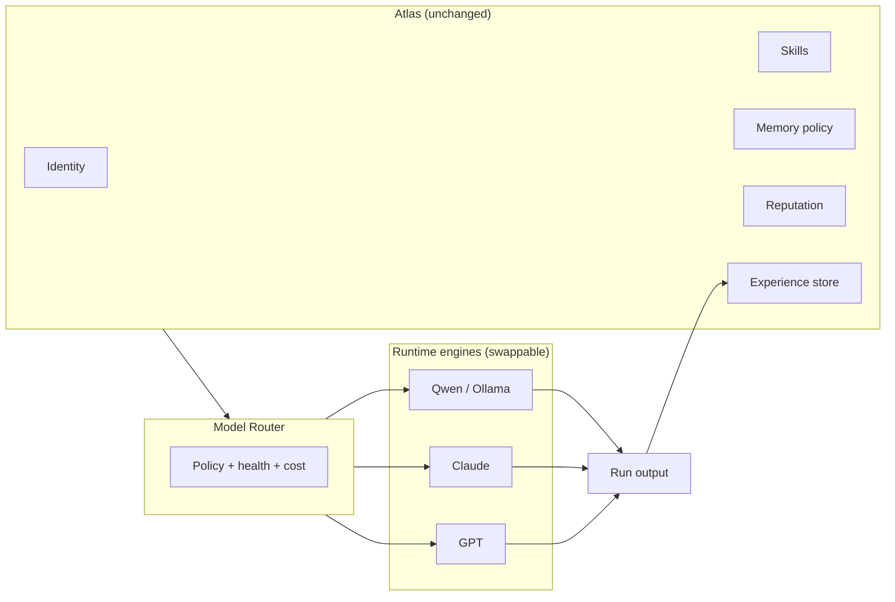
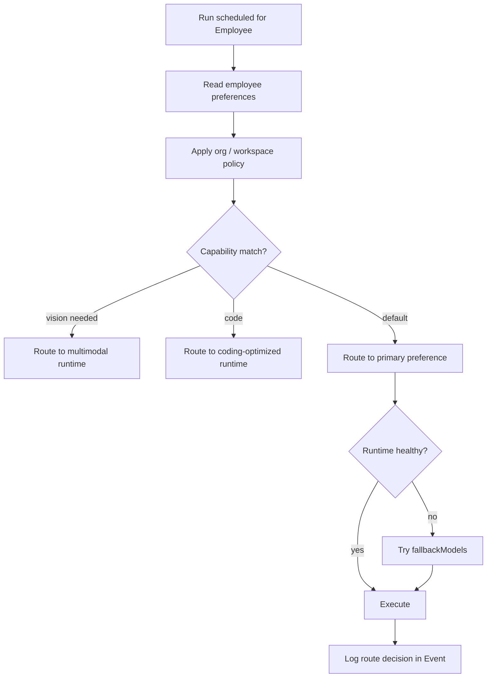
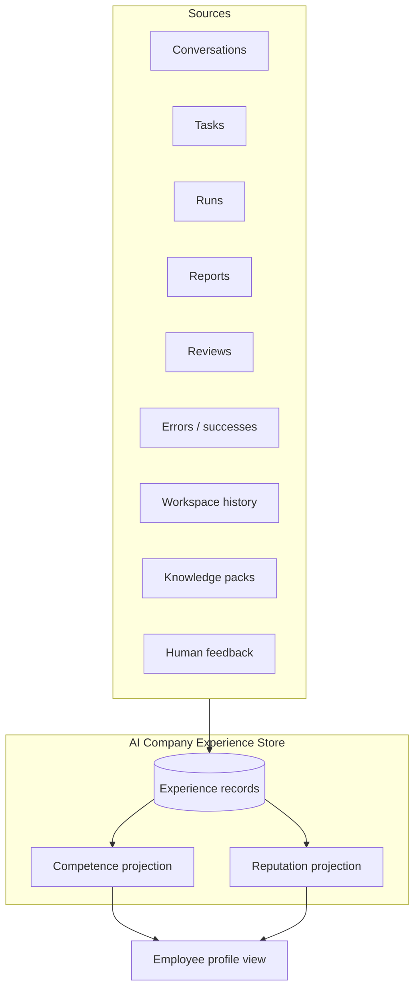

# Model Independence and Experience

> **Status:** Source of truth  
> **Parent:** [ai-company-vision.md](./ai-company-vision.md) · **Domain:** [runtime.md](../domain/runtime.md)

Employee identity is **model-independent**. LLM providers are replaceable runtime engines. Experience accrues in the platform — not in vendor context windows.

---

## Model independence

### Canonical example

> **Atlas** (AI CTO) can use **Qwen** today, **Claude** tomorrow, **GPT** later.  
> **Atlas remains the same employee.**  
> Only the **runtime engine** changes.

### What changes when model changes

| Changes | Does not change |
|---------|-----------------|
| Inference provider endpoint | Employee id, codename, role |
| Token cost / latency profile | Skills, permissions, relationships |
| Context window limits | Conversation history (platform-stored) |
| Tool-calling format adapter | Assignments, reputation, audit trail |

### Employee runtime profile

Employee stores **preferences**, not hard binding:

- `primaryModel` — routing hint
- `fallbackModels` — ordered fallback list
- Runtime policy (org/workspace) — locality, budget, capability flags

Actual selection: [Runtime](../domain/runtime.md) + Model Router at Run schedule time.

---

## Model Router (target behavior)

Router decisions are **audited** — owner can answer “why Qwen and not Claude for this Run?”

---

## Experience model

> Experience is stored in **AI Company**, not inside the model.

Model sessions are ephemeral. Platform persists durable experience for competence growth, reporting, and routing hints.

### Experience sources

| Source | What accrues |
|--------|--------------|
| **Conversations** | Topic familiarity, owner preferences, decision context |
| **Tasks** | Domain exposure, completion patterns |
| **Runs** | Tool usage proficiency, error recovery |
| **Reports** | Deliverable quality signals |
| **Reviews** | Human feedback scores |
| **Errors** | Failure modes to avoid |
| **Successful outcomes** | Verified wins, reusable patterns |
| **Workspace history** | Project-specific context |
| **Knowledge packs** | Ingested docs, ADRs, runbooks |
| **Human feedback** | Explicit approve/reject/correct |

### Experience record (conceptual)

| Field | Purpose |
|-------|---------|
| `employeeId` | Owner of experience |
| `sourceType` | conversation / task / run / … |
| `sourceId` | Correlation |
| `workspaceId` | Optional scope |
| `skillTags` | Affected competencies |
| `outcome` | success / partial / failure |
| `summary` | Human-readable |
| `createdAt` | Timestamp |

### Competence vs declared skills

| Concept | Meaning |
|---------|---------|
| **Skills** | Declared capabilities (Employee Builder) |
| **Competence** | Measured ability from experience data |
| **Reputation** | Trust signal from reviews and outcomes |

V1: skills declared in Employee Builder; experience/competence/reputation are **future platform services**.

---

## Anti-patterns (forbidden)

1. Storing employee identity only in model system prompt with no platform record.
2. Losing conversation history when switching models.
3. Attributing Run audit to model name instead of Employee id.
4. Training/fine-tuning vendor models as substitute for platform Experience store.

---

## V1 local app mapping

| Concept | V1 |
|---------|-----|
| Model preference | `primaryModel`, `fallbackModels` in CustomEmployee |
| Runtime | Tools Registry `models` category (mock) |
| Experience store | Not implemented — document only |
| Model Router | Not implemented |

---

## Related documents

- [core-principles.md](./core-principles.md) — principles 5–8
- [digital-employee-model.md](./digital-employee-model.md)
- [runtime.md](../domain/runtime.md)

---

## Revision history

| Version | Date | Change |
|---------|------|--------|
| 1.0 | 2026-06-24 | Initial model independence and experience |
