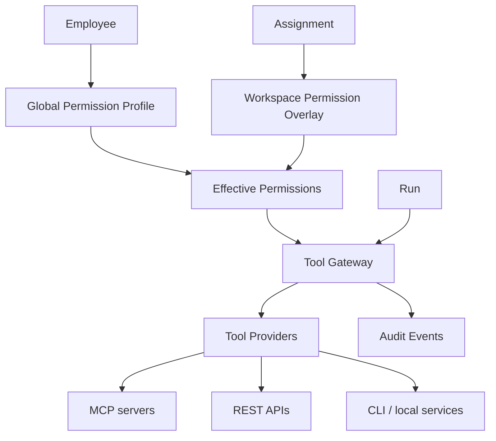

# Tools, MCP, and Access Model

> **Status:** Source of truth  
> **Parent:** [ai-company-vision.md](./ai-company-vision.md) · **Domain:** [tool.md](../domain/tool.md), [permission.md](../domain/permission.md)

Tools and MCP integrations are **workplace equipment** for digital employees — registered, permissioned, audited, and health-checked.

---

## Concept



---

## Tool Provider abstraction

A **Tool Provider** is any adapter that exposes a capability to the platform gateway. Providers are registered in the Tools Registry and invoked during Runs.

| Provider type | Examples | Notes |
|---------------|----------|-------|
| **MCP** | GitHub MCP, Figma MCP, custom MCP servers | Primary integration pattern |
| **REST API** | ServiceManager API (future boundary), internal HTTP | Scoped credentials |
| **CLI** | Local scripts, `gh`, `docker` | Sandboxed execution |
| **Local services** | Ollama, Open WebUI | Inference / UI bridges |
| **Browser** | Playwright, headless Chrome | Read-only by default |
| **Filesystem** | Project tree access | Path allowlists |
| **GitHub** | Repos, PRs, issues | Read/write split |
| **Docker** | Containers, compose | No prod without approval |
| **PostgreSQL** | Queries, migrations | Write gated |
| **Figma** | Design files | Designer roles |
| **n8n** | Workflow automation | Exec scoped |
| **Telegram** | Notifications (future) | Outbound gated |
| **Gmail** | Email read/send (future) | Send gated |
| **Calendar** | Schedule read/write (future) | Write gated |
| **Google Drive** | Docs/files (future) | Share gated |
| **SSH** | Remote hosts (future) | High risk — approval required |

V1 local app: Tools Registry mock + Employee Builder permission matrix for GitHub, Docker, PostgreSQL, Figma, n8n, filesystem, ServiceManager API, production deploy.

---

## Tool categories

| Category | Role |
|----------|------|
| **Models** | LLM runtimes (Claude, GPT, Qwen, …) — routed via [Runtime](../domain/runtime.md) |
| **Coding agents** | Cursor, Codex, Aider, OpenHands |
| **Integrations** | MCP and infrastructure connectors |

---

## Access model (two levels)

### Level 1 — Global employee capabilities

Stored on Employee profile. Defines what this employee **may ever** do across the org.

Example (AI Developer):

| Tool | Read | Write |
|------|------|-------|
| GitHub | ✓ | ✓ (PR only, no merge) |
| Docker | ✓ | ✓ (dev) |
| PostgreSQL | ✓ | ✗ |
| Production Deploy | ✗ | — |

### Level 2 — Workspace-specific permissions

Stored on Assignment overlay (optional). **Stricter** rules for a specific project.

Example (Workspace “Finance”):

| Tool | Overlay |
|------|---------|
| PostgreSQL | read only, finance schema |
| Filesystem | deny write |
| Figma | deny |

### Effective permission evaluation

```
effective = merge(global, workspace_overlay)
rule: if either layer denies → deny
      if write requested → both must allow write
```

---

## Approval gates

| Risk class | Gate |
|------------|------|
| Low (read, analyze) | Permission check only |
| Medium (write dev, draft PR) | Permission + Run log |
| High (prod deploy, delete, spend) | Permission + **Owner approval** + confirmation |
| Critical (permission change, SSH prod) | Owner only |

Dangerous actions emit `approval.requested` Events; execution blocked until `approval.granted`.

---

## Audit trail

Every tool invocation during a Run records:

| Field | Example |
|-------|---------|
| `employeeId` | `ag-cto` |
| `runId` | `run-abc123` |
| `toolId` | `int-gh` |
| `operation` | `github.create_pr` |
| `result` | success / denied / error |
| `timestamp` | ISO-8601 |

Denied calls emit `permission.denied` — never silent failure.

---

## Health and registry

Tools Registry tracks:

- Registration (name, version, scope)
- Health probes (`healthy` / `degraded` / `offline`)
- Last check time
- Used-by employees (projection)

Mission Control **Tools** page is the operator view.

---

## Agent implementation rules

1. Do not bypass Tool Gateway with direct MCP calls from UI.
2. Do not grant write permissions by default.
3. Do not conflate Tool with Runtime — models route separately.
4. New integrations must declare risk class and approval requirements.

---

## Related documents

- [core-principles.md](./core-principles.md) — principles 13, 14, 15
- [human-control-and-reporting.md](./human-control-and-reporting.md)
- [digital-employee-model.md](./digital-employee-model.md)

---

## Revision history

| Version | Date | Change |
|---------|------|--------|
| 1.0 | 2026-06-24 | Initial tools and access model |
