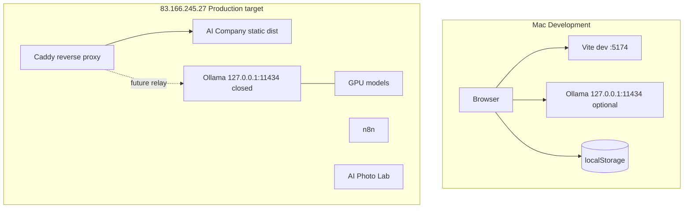

# AI-COMPANY-094A — Environment Strategy

**Ticket:** AI-COMPANY-094A  
**Роль:** AI Company Environment Engineer  
**Дата:** 2026-07-06  
**Ветка:** `ai-company-flow`  
**Проект:** `apps/ai-company`

---

## Резюме

| Среда | Назначение | Runtime Ollama |
|-------|------------|----------------|
| **Mac (локально)** | Development — код, UI, smoke tests | `http://127.0.0.1:11434` — optional dev fallback |
| **83.166.245.27** | Target production runtime после DNS cutover | `127.0.0.1:11434` на сервере (закрыт наружу) |

**Mac не является production-средой.** Большие модели на Mac не скачиваются без отдельного решения Owner.

---

## Текущая архитектура (V1)

AI Company — **SPA (React + Vite)**, без собственного backend. Вся бизнес-логика и persistence — в браузере.



---

## Как AI Company получает URL Ollama

### Цепочка (текущий код)

1. **UI:** `/ops/runtime` → `RuntimeHealth` — Owner выбирает `deployEnvironment` и `endpointMode`.
2. **Домен:** `ollamaSourceMode.ts` — `dev_mac` | `prod_server` + `localhost` | `custom`.
3. **Auto-detect:** hostname `83.166.245.27` → `prod_server` (`inferDeployEnvironmentFromHost`).
4. **Persistence:** `runtimeHealth.ts` → `localStorage` ключ `ai-company-ollama-settings`.
5. **Env defaults:** `src/config/environment.ts` → `VITE_*` при первом запуске (до UI override).
6. **Runtime:** `ollamaProvider.ts` → `loadOllamaSettings().baseUrl` → `fetch(/api/tags)`, `fetch(/api/generate)`.

### Режимы (094B+)

| Поле | Значения | Смысл |
|------|----------|-------|
| `deployEnvironment` | `dev_mac` / `prod_server` | Где развёрнут UI (Mac vs 83.166.245.27) |
| `endpointMode` | `localhost` / `custom` | Как Runtime достигает Ollama |

**И DEV, и PROD по умолчанию:** `http://127.0.0.1:11434` — Ollama на **той же машине**, что и браузерный контекст выполнения fetch:

- **Mac dev:** Ollama на Mac (`ollama serve`).
- **PROD server:** когда Owner открывает UI **с сервера** (или через same-origin relay) — Ollama на `127.0.0.1` хоста.

`custom` — SSH-туннель или временный relay URL; **не** публичный `:11434`.

### Legacy (миграция localStorage)

Старые `sourceMode` / `vpsPresetId` / `OLLAMA_VPS_PRESETS` мигрируются в `custom` без показа в UI.

---

## Где задаются Runtime settings

| Настройка | Где | Хранение |
|-----------|-----|----------|
| Ollama deploy env, endpoint, model tag | `RuntimeHealth` UI + `loadOllamaSettings()` | `ai-company-ollama-settings` |
| Active provider (ollama/mock/openrouter) | `runtimeAdapter.ts` | `ai-company-runtime-active-provider` |
| Runtime profiles per employee | `runtimeStorage.ts` | `ai-company-runtime-profiles` |
| Health snapshot | `runtimeHealth.ts` | `ai-company-runtime-health-snapshot` |
| Runtime logs | `runtimeHealth.ts` | `ai-company-runtime-logs` |
| Model routing mode (fast/deep/coding) | Run Task UI, per-run request | В `RuntimeRun.result`, не глобально |
| Env defaults (build-time) | `.env` / CI | Vite `import.meta.env.VITE_*` |

**Страница:** `/ops/runtime` (Runtime Settings) — health, Ollama source, profiles, cost monitor.

---

## Где хранятся runtime данные

### Runtime execution

| Ключ localStorage | Содержимое |
|-------------------|------------|
| `ai-company-runtime-runs` | Активные и завершённые `RuntimeRun` (pipeline, result, prompt preview) |
| `ai-company-run-history` | История runs для Reports / History UI |
| `ai-company-runtime-profiles` | Профили моделей per employee |
| `ai-company-executions` | Execution queue |
| `ai-company-task-runner-history` | Run Task journal |
| `ai-company-task-results` | Результаты задач |
| `ai-company-reports` | Runtime Reports |
| `ai-company-memory-evolution` | Memory evolution records |
| `ai-company-max-worker-loops` | MAX Worker Loop journal |

### Связанные домены (весь state платформы)

| Ключ | Домен |
|------|-------|
| `ai-company-knowledge` | Knowledge catalog |
| `ai-company-employee-memory` | Employee Memory |
| `ai-company-events` | Event bus / Timeline |
| `ai-company-approvals` | Owner Approvals |
| `ai-company-tool-executions` | Tool executions |
| `ai-company-handoffs` | Handoffs |
| `ai-company-workspaces` | Workspaces |
| `ai-company-delivery-tasks` | Delivery tasks |
| `ai-company-language` | i18n preference |
| `ai-company-active-company` | Active tenant |
| … | ~40+ ключей — полный список в разделе «Inventory» ниже |

**Нет серверной БД.** Данные привязаны к браузеру и origin.

---

## localStorage inventory (полный)

```
ai-company-ollama-settings
ai-company-runtime-active-provider
ai-company-runtime-health-snapshot
ai-company-runtime-logs
ai-company-runtime-runs
ai-company-runtime-profiles
ai-company-runtime-profile-routing-v2
ai-company-run-history
ai-company-executions
ai-company-task-runner-history
ai-company-task-results
ai-company-reports
ai-company-memory-evolution
ai-company-max-worker-loops
ai-company-knowledge
ai-company-knowledge-collections
ai-company-employee-memory
ai-company-events
ai-company-notifications
ai-company-audit-events
ai-company-approvals
ai-company-tool-executions
ai-company-handoffs
ai-company-delivery-tasks
ai-company-workspaces
ai-company-assignments
ai-company-projects
ai-company-sprints
ai-company-workdays
ai-company-work-scheduler-plans
ai-company-presence
ai-company-workday-events
ai-company-presence-route-context
ai-company-learning
ai-company-employee-competencies
ai-company-organization
ai-company-companies
ai-company-company-assignments
ai-company-collaboration
ai-company-chats
ai-company-conversations
ai-company-discussions
ai-company-custom-employees
ai-company-canvas-viewport
ai-company-canvas-live-tick
ai-company-language
ai-company-active-company
ai-company-active-workspace
+ seed flags (*-seeded, *-seeded-v1, …)
```

---

## Что мешает запуску AI Company на сервере

### Блокеры production (P1)

| # | Проблема | Детали |
|---|----------|--------|
| 1 | **Нет backend persistence** | Весь state в localStorage браузера Owner — см. TD-002 |
| 2 | **Browser → Ollama CORS** | Frontend вызывает Ollama напрямую из браузера — TD-001 |
| 3 | **Ollama закрыт наружу** | На `83.166.245.27` Ollama слушает `127.0.0.1:11434` — preset `http://83.166.245.27:11434` **не сработает** с внешнего браузера |
| 4 | **Нет env-based prod build pipeline** | До 094A не было `.env.example` / config abstraction |
| 5 | **Нет same-origin Ollama relay** | Нужен Caddy path (например `/runtime/ollama`) → `127.0.0.1:11434` — вне scope репозитория |
| 6 | **Статический deploy не описан** | Нет `Caddyfile` / deploy script для AI Company в этом репо |

### Ограничения (не блокеры для dev)

| # | Проблема | Workaround |
|---|----------|------------|
| 7 | Mock provider по умолчанию не активен — Ollama default | На Mac без Ollama runs падают — использовать mock в Runtime Settings |
| 8 | Большие модели (`qwen3.6:27b`) | На Mac optional; production models только на GPU сервере |
| 9 | Данные не переносятся между устройствами | Export/import не реализован |

### Сценарий «AI Company на сервере» (целевой)

После DNS cutover Owner открывает `https://<ai-company-domain>/` **с любого устройства**:

1. Caddy отдаёт `apps/ai-company/dist/`.
2. Браузер вызывает Ollama через **same-origin relay** (не `:11434` напрямую).
3. `VITE_AI_COMPANY_ENV=production` + `VITE_AI_COMPANY_OLLAMA_BASE_URL=/runtime/ollama` (или абсолютный internal URL при SSR relay).

До relay: Owner на Mac может использовать **SSH-туннель** `ssh -L 11434:127.0.0.1:11434 user@83.166.245.27` + режим `local_mac`.

---

## Env-переменные

### Mac development

Файл: `apps/ai-company/.env` (не коммитить, скопировать из `.env.example`)

```bash
VITE_AI_COMPANY_ENV=development
VITE_AI_COMPANY_DEPLOY_ENVIRONMENT=dev_mac
VITE_AI_COMPANY_OLLAMA_ENDPOINT_MODE=localhost
VITE_AI_COMPANY_OLLAMA_BASE_URL=http://127.0.0.1:11434
VITE_AI_COMPANY_OLLAMA_DEFAULT_MODEL=qwen2.5-coder:7b
VITE_AI_COMPANY_RUNTIME_PROVIDER=ollama
```

| Переменная | Mac dev значение | Назначение |
|------------|------------------|------------|
| `VITE_AI_COMPANY_ENV` | `development` | Метка среды |
| `VITE_AI_COMPANY_DEPLOY_ENVIRONMENT` | `dev_mac` | UI на Mac |
| `VITE_AI_COMPANY_OLLAMA_ENDPOINT_MODE` | `localhost` | Ollama на той же машине |
| `VITE_AI_COMPANY_OLLAMA_BASE_URL` | `http://127.0.0.1:11434` | Fallback URL |
| `VITE_AI_COMPANY_OLLAMA_DEFAULT_MODEL` | `qwen2.5-coder:7b` | Лёгкая модель (не 27B на Mac) |
| `VITE_AI_COMPANY_RUNTIME_PROVIDER` | `ollama` | Active provider при первом запуске |

**Запуск dev:**

```bash
npm --prefix apps/ai-company run dev
# → http://localhost:5174
```

### Server production (83.166.245.27)

Build-time `.env.production` (на CI или на сервере при `npm run build`):

```bash
VITE_AI_COMPANY_ENV=production
VITE_AI_COMPANY_DEPLOY_ENVIRONMENT=prod_server
VITE_AI_COMPANY_OLLAMA_ENDPOINT_MODE=localhost
VITE_AI_COMPANY_OLLAMA_BASE_URL=http://127.0.0.1:11434
VITE_AI_COMPANY_OLLAMA_DEFAULT_MODEL=qwen3.6:27b
VITE_AI_COMPANY_RUNTIME_PROVIDER=ollama
```

| Переменная | Production значение | Назначение |
|------------|---------------------|------------|
| `VITE_AI_COMPANY_ENV` | `production` | Prod guards |
| `VITE_AI_COMPANY_DEPLOY_ENVIRONMENT` | `prod_server` | UI на 83.166.245.27 |
| `VITE_AI_COMPANY_OLLAMA_ENDPOINT_MODE` | `localhost` | Ollama на том же хосте что SPA |
| `VITE_AI_COMPANY_OLLAMA_DEFAULT_MODEL` | `qwen3.6:27b` | GPU model на сервере |

**Важно:** `VITE_*` вшиваются в bundle при build. Смена URL Ollama в production = **rebuild + redeploy** static assets (если не переопределено в UI localStorage).

---

## Отличия dev vs prod

| Аспект | Mac dev | Server prod |
|--------|---------|-------------|
| **Назначение** | Разработка, QA кода | Owner daily operations |
| **Ollama** | Локальный optional / mock | GPU сервер, закрыт наружу |
| **Модели** | Лёгкие (`7b`) или mock | Полный каталог (`qwen3.6:27b`) |
| **Доступ к Ollama** | Browser → localhost | Same-origin relay или SSH tunnel |
| **Persistence** | localStorage (throwaway) | localStorage (**риск**) → нужен backend |
| **DNS** | localhost:5174 | Production domain после cutover |
| **Caddy** | Не используется | Static + reverse proxy |
| **Секреты** | Нет в bundle | API keys только server-side (будущее) |
| **Multi-user** | Один браузер | Не поддерживается в V1 |

---

## Риски localStorage-only persistence

| Риск | Impact | Mitigation (roadmap) |
|------|--------|----------------------|
| Clear browser data | Потеря runs, reports, knowledge | Backend + backup (TD-002, A1 production checklist) |
| Другой браузер / устройство | Пустая компания | Server sync |
| Нет multi-tenant server enforcement | companyId только в UI | NestJS + Prisma (ServiceManager integration) |
| Нет audit export | Compliance gap | Immutable audit API |
| Prod на сервере, данные в браузере Owner | Данные не на сервере | Backend persistence |
| Конкурентные вкладки | Race on localStorage | Storage events частично; нужен server |

---

## Чеклист перед production deploy на 83.166.245.27

### Инфраструктура (на сервере — вне этого репо)

- [ ] DNS cutover завершён (не трогаем до стабилизации)
- [ ] Caddy: vhost для AI Company static `dist/`
- [ ] Caddy: `reverse_proxy /runtime/ollama/*` → `127.0.0.1:11434` + CORS headers
- [ ] Ollama остаётся на `127.0.0.1` — **не открывать** `:11434` в интернет
- [ ] TLS сертификат на production domain
- [ ] PM2/systemd не нужен для SPA — только Caddy static

### Build & deploy (репозиторий)

- [ ] `npm --prefix apps/ai-company run build` с production `.env`
- [ ] Артефакт `apps/ai-company/dist/` → сервер
- [ ] Smoke: health check Ollama через relay path
- [ ] Smoke: Run Task MAX → completed report

### Продукт / архитектура (следующие тикеты)

- [ ] TD-001: Ollama API relay (убрать прямой browser → :11434)
- [ ] TD-002: Backend persistence для customer data
- [ ] A5 production-readiness: Runtime provider relay
- [ ] Owner auth перед production domain

### Mac (явно не делать)

- [ ] Не использовать Mac как production host
- [ ] Не скачивать `qwen3.6:27b` на Mac без решения Owner
- [ ] Не переносить production Ollama workload на Mac

---

## Связанные документы

| Документ | Путь |
|----------|------|
| Runtime domain | `apps/ai-company/docs/domain/runtime.md` |
| Technical debt TD-001, TD-002 | `apps/ai-company/docs/architecture/technical-debt.md` |
| Production readiness | `apps/ai-company/docs/release/production-readiness.md` |
| MAX Worker Loop V1 | `apps/ai-company/docs/architecture/max-worker-loop-v1.md` |
| Env config (код) | `apps/ai-company/src/config/environment.ts` |
| Ollama source modes | `apps/ai-company/src/domain/runtime/providers/ollamaSourceMode.ts` |

---

## Следующий тикет (рекомендация)

**AI-COMPANY-094B — Ollama relay & Caddy deploy recipe:** документировать Caddy snippet для `/runtime/ollama`, Vite dev proxy для Mac, smoke script без изменения серверной инфраструктуры в этом тикете.
