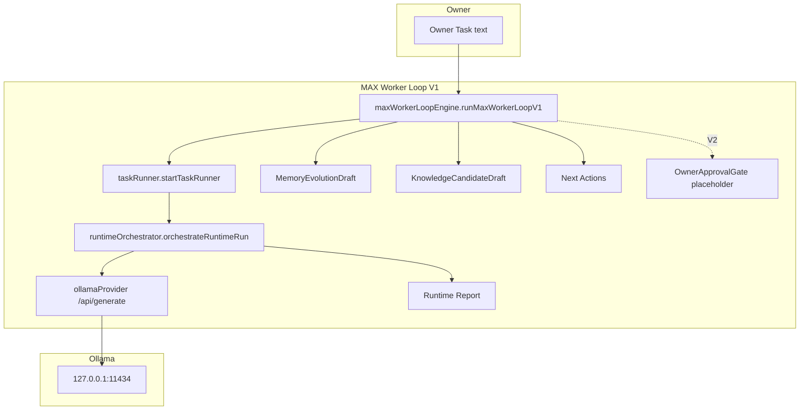

# AI-COMPANY-094C — MAX Worker Loop V1

**Ticket:** AI-COMPANY-094C  
**Роль:** MAX Worker Loop Architect  
**Дата:** 2026-07-06  
**Ветка:** `ai-company-flow`  
**Проект:** `apps/ai-company`  
**Связано:** [AI-COMPANY-094A — Environment Strategy](./AI-COMPANY-094A-environment-strategy.md)

---

## Резюме

MAX Worker Loop V1 — **безопасный reasoning-only цикл** для сотрудника MAX (`ag-max`):

```
Owner Task → MAX → Ollama → Analysis → Plan → Tool check (skip) →
Runtime Report → Memory Evolution draft → Knowledge Candidate draft → Next Actions
```

Ветка **Owner Approval → Tool Registry → Verification** заложена, но в V1 **отключена** (`safeMode: true`).

Один и тот же код работает:
- **Dev (Mac):** Ollama `127.0.0.1:11434` или custom endpoint в Settings.
- **Prod (83.166.245.27):** Ollama **только** `127.0.0.1:11434` на сервере.

---

## Что изучено в текущем Runtime

| Область | Модуль | Роль для MAX Loop |
|---------|--------|-------------------|
| Run Task | `taskRunner/taskRunner.ts` | Оркестрация: Delivery Task → Execution → `orchestrateRuntimeRun` |
| Runtime | `runtime/runtimeOrchestrator.ts` | Pipeline: context → model router → Ollama → report → memory hook |
| Task Router | `runtime/runtimeModelRouting.ts`, `modelRoute.ts` | Выбор модели (`coding` / `deep` / `fast`) |
| Runtime Reports | `runtimeReport/`, `reports/reportStorage` | Structured body: findings, risks, recommendations |
| Memory Evolution | `memoryEvolution/memoryEvolutionEngine.ts` | `onRuntimeCompletion` — prod path; V1 loop строит **draft** |
| Knowledge | `knowledge/knowledgeStorage.ts` | Query в context; V1 loop строит **Knowledge Candidate drafts** |
| Employee Personas | `runtime/runtimeEmployeePersona.ts` | MAX persona + русские role lines |
| Prompt Preview | `runtime/runtimePromptBuilder.ts` | Слои контекста для preview |
| Runtime History | `run/runStorage.ts` | История run после completion |
| Runtime Settings | `runtime/providers/runtimeHealth.ts`, `ollamaSourceMode.ts` | Ollama URL, dev/prod environment |
| Tool Registry | `mission-control/data/tools.ts`, `toolExecution/` | V2 — не вызывается в V1 |

---

## Архитектура V1



### Модули (`apps/ai-company/src/domain/maxWorkerLoop/`)

| Файл | Назначение |
|------|------------|
| `maxWorkerLoop.ts` | Фазы, статусы, `MaxWorkerLoopRecord`, `MaxWorkerLoopInput` |
| `maxWorkerLoopEngine.ts` | `runMaxWorkerLoopV1`, `assembleMaxWorkerLoopSnapshot` |
| `maxWorkerLoopReasoning.ts` | `MaxWorkerLoopReasoningResult` — analysis, plan, toolNeeded |
| `maxWorkerLoopReport.ts` | `MaxWorkerLoopReport` — envelope над Runtime Report |
| `maxWorkerLoopDrafts.ts` | Memory Evolution / Knowledge / Next Actions drafts |
| `maxWorkerLoopApproval.ts` | `OwnerApprovalGate` — placeholder V2 |
| `maxWorkerLoopStorage.ts` | Persistence loop records (V1: localStorage) |
| `maxWorkerLoopEnvironment.ts` | Dev/prod runtime assumptions |
| `index.ts` | Public exports |

---

## Dev vs Production

| Параметр | Dev (Mac) | Production (83.166.245.27) |
|----------|-----------|----------------------------|
| UI | `npm run dev` (Vite) | Static `dist/` за Caddy |
| `deployEnvironment` | `dev_mac` (auto-detect) | `prod_server` (hostname 83.166.245.27) |
| Ollama endpoint | `localhost` или **custom** | **Только** `localhost` → `127.0.0.1:11434` |
| MAX Loop code | `runMaxWorkerLoopV1` | Тот же код |
| Tool execution | **Запрещено** (V1 safe) | **Запрещено** (V1 safe) |
| Persistence | Browser localStorage | **Future:** server API + DB |

Разрешение среды: `resolveMaxWorkerRuntimeEnvironment()` в `maxWorkerLoopEnvironment.ts` + `ollamaSourceMode.ts`.

---

## Фазы цикла

| Фаза | V1 safe | Описание |
|------|---------|----------|
| `owner_task` | ✅ | Вход Owner Task |
| `max_intake` | ✅ | Task Runner создаёт Delivery Task + Runtime Run |
| `ollama_reasoning` | ✅ | Ollama generate через Runtime provider |
| `analysis` | ✅ | Из Runtime Report body |
| `plan` | ✅ | Recommendations / plan lines |
| `tool_need_check` | ✅ | Всегда `toolNeeded: false` |
| `owner_approval` | ⏭ skip | V2 |
| `tool_registry` | ⏭ skip | V2 |
| `verification` | ⏭ skip | V2 |
| `runtime_report` | ✅ | Связь с `reportId` |
| `memory_evolution_draft` | ✅ | Draft, не пишет в Employee Memory |
| `knowledge_candidate_draft` | ✅ | Draft, не пишет в Knowledge base |
| `next_actions` | ✅ | Owner decision + recommendations |

---

## Зависимости

### От Ollama

- Health: `GET /api/tags`
- Inference: `POST /api/generate`
- Model routing: `qwen2.5-coder:7b`, `deepseek-r1:8b`, `qwen3.6:27b` (catalog)
- **Не зависит** от VPS URL в prod — только localhost на сервере

### От persistent storage (future)

Сейчас в **localStorage** (browser-only):

| Ключ / модуль | Данные |
|---------------|--------|
| `ai-company-max-worker-loops` | Loop records |
| `ai-company-runtime-runs` | Runtime runs |
| `ai-company-ollama-settings` | Provider config |
| `reportStorage`, `runStorage`, etc. | Reports, history |

**Нельзя оставлять только localStorage в production:**

- Runtime Runs — audit trail
- Reports — compliance / Owner review
- Memory Evolution — employee learning
- Knowledge — company knowledge base
- Tool Calls + Owner Approvals — security gate

**V2 target:** NestJS API на `83.166.245.27` (или sidecar) + SQLite/Postgres; SPA → REST; Worker Loop на сервере рядом с Ollama.

---

## Tool Registry (V2 hook)

```typescript
// maxWorkerLoopApproval.ts — V1 always returns required: false
resolveOwnerApprovalGate(reasoning, safeMode: true)
```

Подключение V2:

1. `toolNeeded: true` из structured reasoning (LLM JSON или parser)
2. `createToolRequestApproval` (уже есть в `runtimeOrchestrator`)
3. Owner UI `/ops/approvals`
4. `submitToolRequestFromRuntime` → `registryTools` (`mission-control/data/tools.ts`)
5. **Только после approval** — shell/git/docker (отдельный worker process на сервере)

---

## API V1 (domain)

```typescript
import { runMaxWorkerLoopV1 } from '@/domain/maxWorkerLoop'

const { snapshot, loop } = await runMaxWorkerLoopV1({
  taskText: 'Проверь apps/ai-company/src/domain/maxWorkerLoop',
  projectId: 'project-ai-company',
  workspaceId: 'ws-max',
  mode: 'technical_audit',
  modelMode: 'coding',
})

// snapshot: reasoning, report, memoryEvolutionDraft, knowledgeCandidates, nextActions
```

---

## Что реализовано (094C)

- [x] Типы фаз, статусов, `MaxWorkerLoopRecord`
- [x] `MaxWorkerLoopReasoningResult`
- [x] `MaxWorkerLoopReport`
- [x] `MemoryEvolutionDraft`, `KnowledgeCandidateDraft`, `MaxWorkerLoopNextAction`
- [x] `OwnerApprovalGate` placeholder
- [x] `runMaxWorkerLoopV1` — safe path через Task Runner + Runtime
- [x] Dev/prod assumptions (`maxWorkerLoopEnvironment.ts`, `ollamaSourceMode.ts`)
- [x] localStorage persistence loop records (V1 interim)
- [ ] UI surface для MAX Loop (Run Task integration) — **094D**

---

## Что осталось для production

1. **Server-side Worker** — MAX loop как фоновый process на `83.166.245.27`, не в browser
2. **Persistent storage API** — runs, reports, drafts, approvals
3. **DNS cutover** — SPA на prod server (AI-INFRA-004)
4. **Tool branch V2** — approval + sandboxed execution
5. **UI** — MAX Loop progress panel, phase timeline
6. **Reboot / PM2** — autostart validation на сервере

---

## Риски

| Риск | Mitigation |
|------|------------|
| localStorage-only в prod | Server API в V2; не cutover без persistence plan |
| Browser tab close = lost run | Server worker + job queue |
| Large models OOM on Mac | Model routing fast/deep; prod на GPU server |
| Tool branch без sandbox | V1 safe mode — tools disabled |
| SQLite drift old vs new server | Delta-sync перед cutover (AI-INFRA-004) |

---

## Следующий шаг

**AI-COMPANY-094D** — UI integration:
- Кнопка «MAX Worker Loop» в Run Task / MAX workspace
- Phase timeline из `MaxWorkerLoopRecord.phases`
- Snapshot panel: reasoning, drafts, next actions
- Link to Runtime History / Report

**AI-INFRA-004** — deploy AI Company static + optional runtime API на `83.166.245.27`.

---

## Checks

```bash
npm --prefix apps/ai-company run build
```
