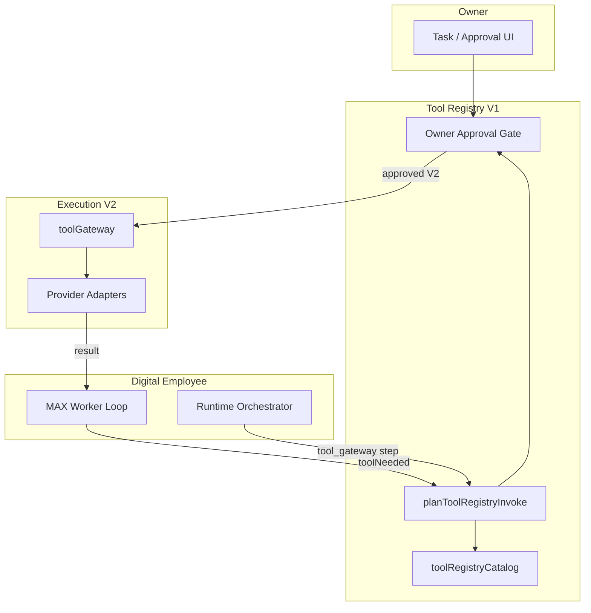

# AI-COMPANY-096 — Tool Registry V1

**Ticket:** AI-COMPANY-096  
**Роль:** Tool Registry Architect  
**Дата:** 2026-07-06  
**Ветка:** `ai-company-flow`  
**Проект:** `apps/ai-company`  
**Связано:** [ADR-002](../apps/ai-company/docs/architecture/adr-002-tool-registry.md), [094C MAX Worker Loop](./AI-COMPANY-094C-max-worker-loop-v1.md)

---

## Резюме

**Claude Code CLI** и **Codex CLI** — это **инструменты**, не цифровые сотрудники.

Tool Registry V1 — единая медиация между Employee / Runtime / MAX Worker Loop и внешними capability.  
V1 = **типы + каталог + планирование вызова**. Реального shell / Docker / CLI **нет**.

---

## Что уже есть в Runtime

| Слой | Модуль | Роль |
|------|--------|------|
| Catalog UI | `mission-control/data/tools.ts` | `RegistryTool[]` — mock inventory |
| Execution gateway | `domain/toolExecution/toolGateway.ts` | submit / approve / mock run |
| Storage | `toolExecutionStorage.ts` | localStorage `ai-company-tool-executions` |
| Runtime hook | `runtimeOrchestrator.ts` → `tool_gateway` step | `submitToolRequestFromRuntime` |
| Approvals UI | `/ops/approvals`, `domain/approval/` | Owner decisions |
| Tool log UI | `/ops/tool-executions` | History + filters |
| MAX Loop gate | `maxWorkerLoopApproval.ts` | Placeholder Owner Approval (V1 safe) |

**Поток сегодня (частично):**

```
RuntimeRun (requiresExternalTools)
  → resolveRegistryToolRef
  → submitToolRequestFromRuntime
  → waiting_approval | mock execution
  → Report + Events + Audit
```

**MAX Worker Loop V1:** `safeMode: true` — ветка tools **пропущена**.

---

## Куда подключается Tool Registry V1



| Точка | Файл | V1 | V2 |
|-------|------|----|----|
| Model reasoning | `maxWorkerLoopReasoning.ts` | `toolNeeded: false` | LLM JSON → tool id |
| Approval gate | `maxWorkerLoopApproval.ts` / `toolRegistryWorkerLoopBridge.ts` | placeholder | linked `approvalId` |
| Runtime pipeline | `runtimeOrchestrator.ts` step `tool_gateway` | mock gateway | `planToolRegistryInvoke` → gateway |
| Catalog | `domain/toolRegistry/` | canonical V1 metadata | sync with `tools.ts` |
| History | `toolExecutionStorage` | localStorage | server API |

---

## Owner Approval

**Когда появляется:**

1. `ToolRegistryEntryV1.requiresOwnerApproval === true`
2. Или `riskLevel >= high` (policy overlay)
3. Или Runtime flag `requiresExternalTools` + tool policy
4. Или MAX reasoning: `toolNeeded: true` (V2)

**Где решает Owner:**

- `/ops/approvals` — общий approval store
- Tool-specific: `approveToolRequest` / `rejectToolRequest` в `toolGateway.ts`
- MAX Loop: `OwnerApprovalGate.approvalPagePath = '/ops/approvals'`

**Связь approval ↔ execution:**

```typescript
ToolRequest.approval → waiting_approval → Owner → approved → runMockExecution (V1)
```

V2: server-side worker выполняет adapter только после `approved`.

---

## Как сотрудник понимает необходимость инструмента

| Источник | `ToolNeedSignalSource` | Пример |
|----------|------------------------|--------|
| Reasoning | `reasoning` | MAX: «нужен git diff» → `toolNeeded: true` |
| Policy | `policy` | Terminal всегда `requiresOwnerApproval` |
| Capability | `capability` | Task template `requiresExternalTools` |
| Manual | `manual` | Owner нажал «Run with Docker» |

Каждый инструмент имеет `employeeNeedHint` в каталоге V1.

---

## Журналирование и история

| Данные | V1 storage | V2 target |
|--------|------------|-----------|
| Invoke plan | in-memory / loop record | `tool_registry_invokes` table |
| Execution | `ai-company-tool-executions` | server API |
| Audit | `auditStorage` | centralized audit |
| Events | `eventStorage` | event bus |
| Reports | `reportStorage` | linked to Run |
| Logs per invoke | `ToolRegistryInvokeLogEntry[]` | append-only log stream |

**Просмотр:** `/ops/tool-executions`, Runtime History, будущая панель MAX Loop.

---

## Возврат результата в Worker Loop

```typescript
import { buildWorkerLoopToolBranchSnapshot } from '@/domain/toolRegistry'

const branch = buildWorkerLoopToolBranchSnapshot({
  reasoning,
  safeMode: false, // V2
  suggestedToolId: 'git',
  employeeId: 'ag-max',
  runtimeRunId: run.id,
  maxWorkerLoopId: loop.id,
})

// branch.invokeResult → Worker Loop phase `verification`
// branch.ownerApproval → UI + /ops/approvals
```

Фазы MAX Loop (V2):

```
tool_need_check → owner_approval → tool_registry → verification → runtime_report
```

---

## Каталог V1 — девять инструментов

| ID | Название | Риск | Owner Approval | Назначение |
|----|----------|------|----------------|------------|
| `filesystem` | Filesystem | medium | нет* | Файлы в workspace root |
| `terminal` | Terminal | critical | да | Shell (sandbox V2) |
| `git` | Git | high | да | Локальный VCS |
| `docker` | Docker | critical | да | Контейнеры / compose |
| `playwright` | Playwright | high | да | QA automation |
| `claude-code-cli` | Claude Code CLI | high | да | Coding agent **tool** |
| `codex-cli` | Codex CLI | high | да | Coding agent **tool** |
| `browser` | Browser | medium | да | Live page inspection |
| `github` | GitHub | high | да | Remote repo API/MCP |

\*Filesystem: approval на `delete` / path outside workspace — policy V2.

Подробные I/O контракты — в `toolRegistryCatalog.ts`.

---

## Модули (новые)

```
apps/ai-company/src/domain/toolRegistry/
├── toolRegistry.ts              — типы, risk, approval policy
├── toolRegistryCatalog.ts       — 9 tools metadata
├── toolRegistryInvoke.ts        — plan + result (no execution)
├── toolRegistryWorkerLoopBridge.ts — MAX Loop integration
└── index.ts
```

---

## V1 scope / out of scope

| In scope | Out of scope |
|----------|--------------|
| TypeScript types + catalog | Real shell / docker / CLI |
| `planToolRegistryInvoke` (blocked_v1) | MCP live connections |
| Worker Loop bridge types | Server persistence |
| Architecture doc | Credential vault |
| Mapping to existing `toolExecution` | Production sandbox |

---

## V2 requirements

1. **Provider adapters** — one per transport (cli, mcp, local, browser-automation)
2. **Sandbox** — terminal/docker on `83.166.245.27`, not in browser
3. **Catalog sync** — add `tool-terminal`, `tool-git`, `tool-playwright`, `tool-claude-code-cli`, `tool-codex-cli` to `tools.ts` + i18n
4. **Structured tool selection** — LLM JSON schema for `toolNeeded` + `toolId`
5. **Persistent invoke history** — replace localStorage
6. **MAX Loop UI** — phase timeline for tool branch
7. **Policy engine** — workspace path rules, command allowlist

---

## Checks

```bash
npm --prefix apps/ai-company run build
```

---

## Следующий шаг

**AI-COMPANY-097** — Tool Registry V2 adapter interface + register missing catalog entries in Mission Control + wire `tool_gateway` to `planToolRegistryInvoke` (still mock execute).
