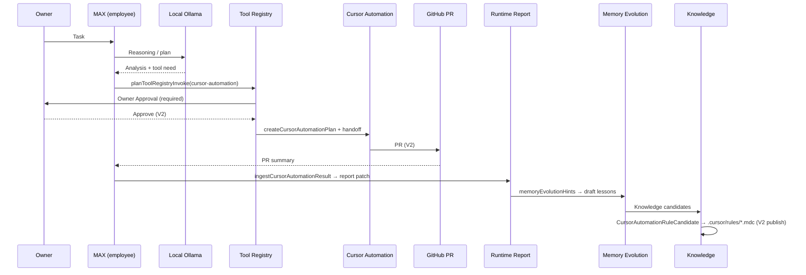

# AI-COMPANY-097A — Cursor Automation Tool

**Ticket:** AI-COMPANY-097A  
**Роль:** Cursor Automation Tool Architect  
**Дата:** 2026-07-06  
**Ветка:** `ai-company-flow`  
**Проект:** `apps/ai-company`  
**Связано:** [096 Tool Registry V1](./AI-COMPANY-096-tool-registry-v1.md), [094C MAX Worker Loop](./AI-COMPANY-094C-max-worker-loop-v1.md), [ADR-002](../apps/ai-company/docs/architecture/adr-002-tool-registry.md)

---

## Резюме

**Cursor — не сотрудник.**  
**Cursor Automation — инструмент** в Tool Registry (`cursor-automation`).

На текущем этапе Cursor Automation — **первый реальный внешний исполнитель** вместо Claude Code CLI и Codex CLI.  
Локальные модели через **Ollama остаются мозгом** AI Company.

V1 = **типы + каталог + adapter placeholder + localStorage history**.  
Реального вызова Cursor API, shell, git, docker **нет**.

---

## Целевой поток

```text
AI Company → MAX → Local Ollama → Cursor Automation → PR → MAX review → Runtime Report → Memory Evolution → Knowledge → .cursor/rules
```



---

## Что изучено

| Модуль | Путь | Роль для 097A |
|--------|------|----------------|
| Tool Registry V1 | `domain/toolRegistry/` | Каталог, invoke plan, Owner gate |
| MAX Worker Loop | `domain/maxWorkerLoop/` | Reasoning → `toolNeeded` → approval |
| Owner Approval | `maxWorkerLoopApproval.ts`, `/ops/approvals` | Gate перед внешним исполнителем |
| Runtime Reports | `domain/reports/` | Итоговый артефакт для Owner |
| Memory Evolution | `domain/memoryEvolution/` | Черновики уроков из run/report |
| Knowledge | `maxWorkerLoopDrafts.ts` | Knowledge Candidate drafts |
| Runtime History | `toolExecutionStorage`, `/ops/runs` | Журнал запусков |

---

## Инструмент `cursor-automation`

| Поле | Значение |
|------|----------|
| **Название** | Cursor Automation |
| **ID** | `cursor-automation` |
| **Registry UI id** | `tool-cursor-automation` |
| **Назначение** | Внешний исполнитель: repo-scoped изменения, build checks, PR |
| **Уровень риска** | `high` |
| **Transport** | `cursor-automation` (domain) / `rest-api` (Mission Control catalog) |
| **Owner Approval** | **Да**, всегда (`requiresOwnerApproval: true`) |

### Когда использовать

- После local Ollama reasoning, когда нужна **реализация в коде** (не только отчёт).
- Когда MAX / Atlas / Sentinel / Helm сформировали план и `toolNeeded: true` с `cursor-automation`.
- Для handoff из Runtime Run / MAX Worker Loop с явным repo scope.
- Когда результат должен вернуться как **PR** для review сотрудником.

### Когда запрещено

- Без Owner Approval.
- Вне одобренного `repository.owner/repo/branch`.
- Для DNS, серверов, production deploy (явно вне scope V1).
- Когда `MAX Worker Loop safeMode: true` (V1 default) — ветка tools пропущена.
- Вместо Ollama reasoning — Cursor **не думает за компанию**, только исполняет.

### Входные данные

```typescript
{
  title: string
  instructions: string
  repository: { owner, repo, branch }
  trigger: manual | runtime-handoff | git | schedule
  enabledTools?: string[]
  requestedByEmployeeId: string
  runtimeRunId?: string
  maxWorkerLoopId?: string
}
```

### Выходные данные

```typescript
{
  prSummary: { url, number, changedFiles, checksStatus }
  transcriptRef?: string
  artifacts: string[]
  ruleCandidates: CursorAutomationRuleCandidate[]
  runtimeReportPatch: { section: 'tool_execution', summary }
  memoryEvolutionHints: string[]
}
```

### Ожидаемый результат

1. PR в целевой ветке (V2).
2. Структурированный summary в **Runtime Report** (секция tool execution).
3. Черновики **Memory Evolution** (hints → lessons после MAX review).
4. **Knowledge candidates** → draft `.cursor/rules/*.mdc` (без записи на диск в V1).

---

## История запусков

| Слой | Ключ / поверхность |
|------|---------------------|
| Cursor Automation runs | `localStorage` → `ai-company-cursor-automation-runs` |
| Tool Registry invoke | `toolRegistryInvoke` plan + `toolExecution` |
| UI | `/ops/tool-executions`, `/ops/approvals` |
| Sync event | `ai-company-cursor-automation-sync` |

---

## Интеграция с downstream

### Runtime Report

`ingestCursorAutomationResult()` возвращает `runtimeReportPatch` — в V2 мержится в `Report.runtimeBody.toolExecution` или аналогичную секцию.

### Memory Evolution

`memoryEvolutionHints` → вход для `buildMemoryEvolutionDraft()` после MAX review PR (CI green / failing).

### Knowledge → `.cursor/rules`

`CursorAutomationRuleCandidate.proposedPath` = `.cursor/rules/<slug>.mdc`  
Контент генерируется из `KnowledgeCandidateDraft` — **draft only** в V1.

---

## TypeScript модули (097A)

```
apps/ai-company/src/domain/cursorAutomation/
  cursorAutomation.ts          — типы
  cursorAutomationAdapter.ts   — createCursorAutomationPlan, buildCursorAutomationPrompt, ingestCursorAutomationResult
  cursorAutomationStorage.ts   — localStorage history
  index.ts

apps/ai-company/src/domain/toolRegistry/
  toolRegistryCatalog.ts       — catalog entry
  toolRegistryCursorAutomationBridge.ts — planCursorAutomationHandoff()
```

### Типы

- `CursorAutomationTask`
- `CursorAutomationTrigger`
- `CursorAutomationResult`
- `CursorAutomationPrSummary`
- `CursorAutomationRuleCandidate`
- `CursorAutomationRunStatus`

### Adapter placeholders (без API)

- `createCursorAutomationPlan()` — план + persist
- `buildCursorAutomationPrompt()` — markdown для instructions
- `ingestCursorAutomationResult()` — нормализация будущего API payload

---

## Сотрудники vs инструменты

| Сотрудники (persona) | Инструменты (registry) |
|----------------------|------------------------|
| MAX (`ag-max`) | Cursor Automation ← **primary external executor (stage)** |
| Atlas (`ag-cto`) | Claude Code CLI |
| Sentinel (`ag-qa`) | Codex CLI |
| Helm (`ag-devops`) | Git, Docker, Terminal |
| — | Playwright, Browser |

---

## Принцип «локальные модели — мозг»

1. **Ollama** выполняет reasoning, анализ, план — в Runtime / MAX Worker Loop.
2. **Cursor Automation** вызывается только после reasoning + Owner Approval.
3. Сотрудник (MAX) **оркестрирует** и **ревьюит PR**, не заменяется Cursor.
4. Claude/Codex CLI остаются в каталоге, но **не primary** на текущем этапе.

---

## V1 ограничения

- `planToolRegistryInvoke` → phase `blocked_v1`
- `ingestCursorAutomationResult(raw: null)` → scaffold без PR
- `MAX Worker Loop safeMode: true` — tool branch skipped
- Нет Cursor API client в репозитории

---

## Следующий шаг (097B+)

1. **097B** — UI: handoff panel в MAX Worker Loop tool_check phase.
2. **097C** — Cursor API adapter (auth, submit, poll) за Owner gate.
3. **097D** — PR webhook → `ingestCursorAutomationResult` → auto Runtime Report section.
4. **097E** — Knowledge publish → write `.cursor/rules/*.mdc` с approval.

---

## Checks

```bash
npm --prefix apps/ai-company run build
```

Expected: green build, `cursor-automation` в `TOOL_REGISTRY_V1_CATALOG`, типы экспортируются из `domain/cursorAutomation`.
