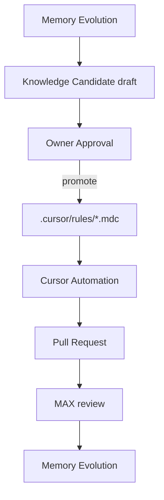

# AI-COMPANY-097B — Cursor Rules ← Knowledge Flow

**Ticket:** AI-COMPANY-097B  
**Роль:** Cursor Rules Knowledge Engineer  
**Дата:** 2026-07-06  
**Ветка:** `ai-company-flow`  
**Проект:** `apps/ai-company`

---

## Три слоя (не путать)

| Слой | Где | Для кого |
|------|-----|----------|
| **Memory Evolution** | Employee Memory | опыт сотрудника после Run |
| **Knowledge** | Knowledge base | подтверждённое правило компании |
| **`.cursor/rules/*.mdc`** | Git repo | исполняемые инструкции для **Cursor Automation** |

Memory ≠ Knowledge ≠ Cursor Rules.

---

## Поток



### Шаги

1. **Memory Evolution** — `onRuntimeCompletion` / MAX Loop draft: lessons, mistakes, improvements.
2. **Knowledge Candidate** — `buildKnowledgeCandidateDrafts`: title, content, tags, type (`best_practice` | `runbook` | `documentation`).
3. **Owner Approval** — Owner подтверждает, что правило стоит закрепить (не личный опыт, а норма).
4. **`.cursor/rules/*.mdc`** — короткий исполняемый файл с YAML frontmatter (`description`, `globs`, `alwaysApply`).
5. **Cursor Automation** — внешний агент читает rules при работе в repo.
6. **PR** — изменения через git, reviewable diff.
7. **MAX review** — Worker Loop / Runtime проверяет соответствие Runtime invariants.
8. **Новая Memory Evolution** — цикл замыкается после merge.

---

## Что уже есть в repo

```
.cursor/
└── rules/
    ├── 00-workflow.mdc           # общий workflow (alwaysApply)
    ├── 10-architecture.mdc       # SMA invariants (alwaysApply)
    ├── 20-file-size.mdc          # лимиты файлов (alwaysApply)
    ├── ai-company-core.mdc       # NEW — apps/ai-company/**
    └── service-manager-ai-core.mdc  # NEW — backend/**, web/**
```

**097B добавляет** project-scoped rules, не заменяя 00/10/20.

---

## Критерии Knowledge → Rule

Правило попадает в `.mdc`, если:

- [ ] Owner approved
- [ ] Применимо к коду (actionable, не эссе)
- [ ] ≤ ~50 строк содержимого
- [ ] Есть `globs` или `alwaysApply`
- [ ] Без секретов, IP, паролей
- [ ] Не дублирует ADR целиком — только исполняемый вывод

**Пример mapping:**

| Knowledge Candidate | Cursor Rule |
|---------------------|-------------|
| «Ollama только localhost на prod» | строка в `ai-company-core.mdc` |
| «Ticket owner = CLIENT» | уже в `10-architecture.mdc` / `service-manager-ai-core.mdc` |
| «MAX safe mode без tools в V1» | `ai-company-core.mdc` или отдельный `max-worker-loop.mdc` (097C+) |

---

## Именование файлов

```
.cursor/rules/<domain>-<topic>.mdc
```

Примеры: `ai-company-core.mdc`, `ai-company-runtime.mdc`, `service-manager-ai-core.mdc`.

---

## V2 (не в 097B)

- UI: «Promote to Cursor Rule» из Knowledge Candidate
- Генератор `.mdc` из approved Knowledge (frontmatter + body template)
- Связь `knowledgeId` ↔ `rulePath` в metadata
- MAX автоматически предлагает rule diff в PR

---

## Checks

```bash
npm --prefix apps/ai-company run build
```
