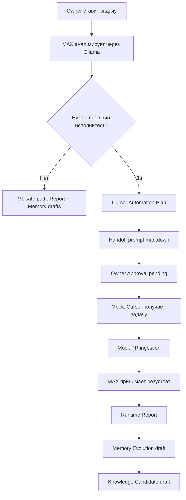

# AI-COMPANY-097C — Cursor Automation Workflow V1

**Статус:** mock V1 (без реального Cursor API)  
**Ветка:** `ai-company-flow`  
**Scope:** `apps/ai-company`

## Цель

Первый практический workflow, где **MAX** (локальная Ollama) анализирует задачу Owner, решает что нужен **внешний исполнитель** (Cursor Automation), формирует **handoff** и **mock PR**, а Owner видит статус в **MAX Worker Loop UI**.

## Что изучено

| Область | Р расположение | Роль в workflow |
|--------|----------------|-----------------|
| MAX Worker Loop UI | `domain/maxWorkerLoop/`, `MaxWorkerLoopPanel.tsx` | Отображение фаз цикла + новая секция Cursor Automation |
| Tool Registry | `domain/toolRegistry/` | Каталог инструментов; добавлен `cursor-automation` |
| Tool Execution | `domain/toolRegistry/toolRegistryInvoke.ts` | Plan → `blocked_v1`, без реального invoke |
| Tool Branch Snapshot | `toolRegistryWorkerLoopBridge.ts` | Display-only snapshot для UI |
| Runtime Reports | `domain/reports/`, snapshot в engine | Связь run → report → memory drafts |
| Owner Approval | `maxWorkerLoopApproval.ts` | V1 safe: gate для инструментов; Cursor — отдельный pending |
| Memory / Knowledge | `maxWorkerLoopDrafts.ts` | Черновики после Runtime Report |
| `.cursor/rules` | `cursorAutomationRules.ts` | Статический каталог для prompt template |

## Workflow MAX → Cursor Automation



### Эвристика «нужен внешний исполнитель»

`detectExternalExecutorNeed()` в `cursorAutomationPlan.ts` — keyword heuristic по тексту задачи (`implement`, `PR`, `cursor`, `реализ`, `fix`, …).

## Что реализовано

### Domain module `domain/cursorAutomation/`

| Файл | Назначение |
|------|------------|
| `cursorAutomationTypes.ts` | Plan, Handoff, ExpectedResult, MockIngestion, WorkflowSnapshot |
| `cursorAutomationRules.ts` | Ссылки на `.cursor/rules` для prompt |
| `cursorAutomationPlan.ts` | Plan builder + heuristic |
| `cursorAutomationHandoff.ts` | Prompt template + handoff struct |
| `cursorAutomationMockIngestion.ts` | Mock PR / report ingestion |
| `cursorAutomationWorkflow.ts` | `buildCursorAutomationWorkflowSnapshot()` |
| `index.ts` | Public exports |

### Интеграция

- `MaxWorkerLoopSnapshot.cursorAutomation` — собирается в `assembleMaxWorkerLoopSnapshot()`
- Tool Registry: `cursor-automation` (10-й инструмент)
- UI: секция **Cursor Automation (V1 mock)** в `MaxWorkerLoopPanel`
- i18n: `maxWorkerLoop.cursorAutomation.*` (ru/en)

### Шаблон prompt (handoff)

Включает:

- цель, репозиторий, ветку, область файлов
- запреты, обязательные проверки, формат отчёта
- что нельзя делать, ожидаемый PR
- правила из `.cursor/rules`

### Структуры

**Handoff** (`CursorAutomationHandoff`):

- `handoffId`, `promptMarkdown`, `plan`, `deliveryMode: mock_v1`

**Expected result** (`CursorAutomationExpectedResult`):

- `pullRequest`, `report`, `artifacts`

**Mock ingestion** (`CursorAutomationMockIngestion`):

- симулированный PR URL, build status, notes

## Что пока mock

| Компонент | Поведение V1 |
|-----------|--------------|
| Cursor API | Не вызывается |
| Owner Approval | Всегда `pending` (нет wire-up на `/ops/approvals`) |
| PR URL | `https://github.com/example/.../pull/mock-*` |
| Tool invoke | `blocked_v1` в Tool Branch Snapshot |
| Ollama decision | Keyword heuristic, не LLM structured output |
| Handoff persistence | Только в snapshot, без localStorage |

## Что нужно для реального автономного запуска

1. **Cursor SDK / Automations API** — submit handoff, poll run status, webhook on PR
2. **Owner Approval wire-up** — approve → unlock handoff delivery
3. **LLM structured output** — MAX возвращает `{ externalExecutor: true, toolId, plan }` из Ollama
4. **Real ingestion** — parse PR metadata, CI checks, diff stats → `CursorAutomationExpectedResult`
5. **Runtime integration** — post-ingestion hook → Memory Evolution (не только draft)
6. **Secrets** — Cursor API token в env, не в repo
7. **safeMode: false path** — снять `blocked_v1` после policy review

## Проверка

```bash
npm --prefix apps/ai-company run build
```

## Следующий шаг

**AI-COMPANY-098** — Owner Approval gate для Cursor handoff + localStorage persistence + submit stub (still no cloud until credentials).

## Связанные задачи

- AI-COMPANY-096 — Tool Registry V1
- AI-COMPANY-095 — Memory V2 audit
