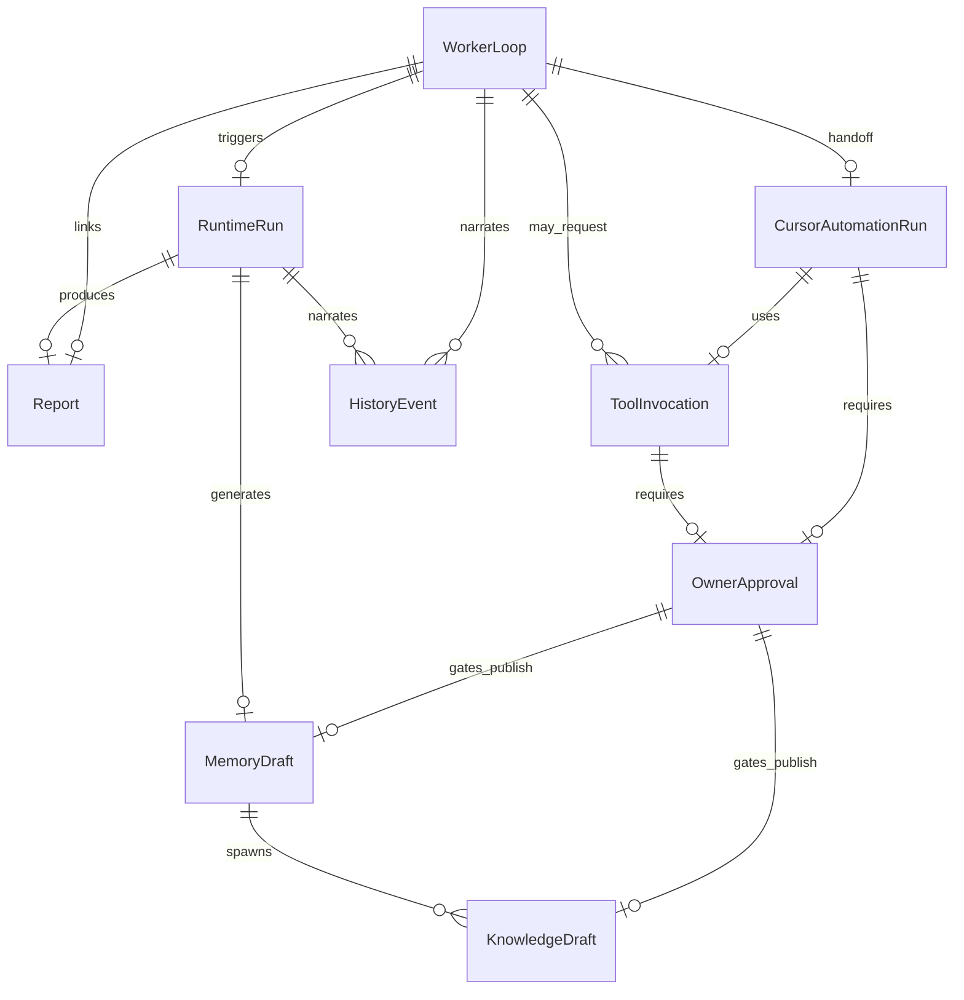

# AI-COMPANY-098B — Runtime Persistence V1

**Статус:** contract only (без backend, без изменения Runtime)  
**Ветка:** `ai-company-flow`  
**Scope:** `apps/ai-company`  
**TypeScript:** `src/domain/runtimePersistence/`

## Проблема

MAX Worker Loop и связанный Runtime сегодня опираются на **browser localStorage**:

- данные привязаны к одному браузеру;
- нет multi-user / multi-device sync;
- черновики Memory/Knowledge из Worker Loop **не персистятся**;
- Run History и Company Events дублируют timeline;
- production AI Company на сервере так работать не должен.

Цель 098B — **контракт постоянного хранения**, не реализация backend.

---

## Что изучено

| Область | Модуль | localStorage key | Persisted сегодня |
|--------|--------|------------------|-------------------|
| **Run History** | `run/runStorage.ts` | `ai-company-run-history` | ✅ (UI projection) |
| **RuntimeRun** | `runtime/runtimeOrchestrator` | runtime runs store | ✅ canonical |
| **Reports** | `reports/reportStorage.ts` | `ai-company-reports` | ✅ + `companyId` |
| **Memory Evolution** | `memoryEvolution/memoryEvolutionStorage.ts` | `ai-company-memory-evolution` | ✅ после completion |
| **Memory Draft** | `maxWorkerLoop/maxWorkerLoopDrafts.ts` | — | ❌ snapshot only |
| **Knowledge** | `knowledge/knowledgeStorage.ts` | `ai-company-knowledge` | ✅ published items |
| **Knowledge Draft** | `maxWorkerLoop/maxWorkerLoopDrafts.ts` | — | ❌ snapshot only |
| **Tool Registry / Invoke** | `toolRegistry/*`, `toolExecution/*` | `ai-company-tool-executions` | ✅ partial |
| **Owner Approval** | `approval/approvalStorage.ts` | `ai-company-approvals` | ✅ |
| **OwnerApprovalGate** | `maxWorkerLoop/maxWorkerLoopApproval.ts` | — | ❌ ephemeral |
| **Cursor Automation** | `cursorAutomation/cursorAutomationStorage.ts` | `ai-company-cursor-automation-runs` | ✅ task rows |
| **Cursor handoff (097C)** | `cursorAutomation/cursorAutomationWorkflow.ts` | — | ❌ snapshot only |
| **History / Events** | `events/eventStorage.ts` | `ai-company-events` | ✅ timeline |
| **Worker Loop** | `maxWorkerLoop/maxWorkerLoopStorage.ts` | `ai-company-max-worker-loops` | ✅ (comment: V2 port) |

---

## Runtime Persistence V1 — модель

### Принципы

1. **Multi-tenant:** каждая запись имеет `tenant.companyId` (+ optional `workspaceId`).
2. **Owner:** human Owner, digital employee или system — через `PersistenceOwnerRef`.
3. **Relations:** явные FK через `relations.refs` + denormalized quick links на aggregate root.
4. **HistoryEvent:** append-only audit trail; idempotency key для webhook replay.
5. **Draft vs Published:** MemoryDraft / KnowledgeDraft → OwnerApproval → publish → MemoryEvolution / Knowledge.
6. **Runtime не меняем:** контракт параллелен существующим `*Storage.ts`.

### ER-диаграмма (целевая)



---

## Каталог сущностей

Общий каркас для всех записей (`PersistenceRecordBase`):

| Поле | Тип | Описание |
|------|-----|----------|
| `id` | string | UUID / prefixed id |
| `version` | `'v1'` | версия контракта |
| `tenant` | `{ companyId, workspaceId }` | multi-tenant scope |
| `owner` | `PersistenceOwnerRef` | инициатор |
| `timestamps` | `{ createdAt, updatedAt, finishedAt }` | ISO-8601 |
| `status` | enum | см. ниже |
| `payload` | JSON object | domain-specific body |
| `relations` | `{ refs[] }` | FK graph |

### 1. RuntimeRun

| | |
|---|---|
| **id** | `run-*` / UUID |
| **owner** | employee (`ag-max`, …) |
| **status** | `queued \| running \| waiting_approval \| completed \| failed \| cancelled` |
| **payload** | profile, model, provider, pipeline, resultSummary, optional runtimeSnapshot |
| **relations** | → Report, → WorkerLoop, → HistoryEvent[] |

Denormalized: `reportId`.

### 2. WorkerLoop

| | |
|---|---|
| **id** | `max-loop-*` |
| **owner** | human Owner (task author) |
| **status** | `draft \| queued \| running \| waiting_approval \| completed \| failed \| cancelled` |
| **payload** | phases, input, safeMode, cursorAutomationRequired |
| **relations** | → RuntimeRun, → Report, → ToolInvocation[], → CursorAutomationRun, → MemoryDraft |

Denormalized: `runtimeRunId`, `reportId`.

### 3. ToolInvocation

| | |
|---|---|
| **id** | `treg-plan-*` / `tool-exec-*` |
| **owner** | employee |
| **status** | `planned \| approval_pending \| submitted \| running \| completed \| failed \| cancelled \| blocked_v1` |
| **payload** | toolRegistryId, action, input/output, needSignal, approvalId |
| **relations** | → RuntimeRun, → WorkerLoop, → OwnerApproval |

### 4. OwnerApproval

| | |
|---|---|
| **id** | `approval-*` |
| **owner** | employee (requester) |
| **status** | `pending \| approved \| rejected \| cancelled \| expired` |
| **payload** | title, subjectKind, subjectId, policyRule, decision |
| **relations** | → ToolInvocation \| CursorAutomationRun \| MemoryDraft \| KnowledgeDraft |

Port method: `decide(id, approved|rejected)`.

### 5. MemoryDraft

| | |
|---|---|
| **id** | `mem-draft-*` |
| **owner** | employee |
| **status** | `draft \| pending_review \| approved \| published \| rejected \| superseded` |
| **payload** | lessons[], estimated XP, source, publishedEvolutionId |
| **relations** | → RuntimeRun, → Report, → WorkerLoop, → OwnerApproval |

**Gap today:** `MemoryEvolutionDraft` только в snapshot.

### 6. KnowledgeDraft

| | |
|---|---|
| **id** | `kc-draft-*` |
| **owner** | employee |
| **status** | `draft \| pending_review \| approved \| published \| rejected \| archived` |
| **payload** | title, content, type, tags, publishedKnowledgeId |
| **relations** | → RuntimeRun, → MemoryDraft, → WorkerLoop, → OwnerApproval |

**Gap today:** `KnowledgeCandidateDraft` только в snapshot.

### 7. CursorAutomationRun

| | |
|---|---|
| **id** | `car-*` / `cah-*` |
| **owner** | employee (MAX) |
| **status** | `draft \| planned \| approval_pending \| handoff_ready \| queued \| running \| completed \| failed \| cancelled` |
| **payload** | instructions, repository, promptMarkdown, deliveryMode, prUrl, buildStatus |
| **relations** | → WorkerLoop, → RuntimeRun, → ToolInvocation, → OwnerApproval |

Merge 097A `CursorAutomationTask` + 097C handoff при миграции.

### 8. Report

| | |
|---|---|
| **id** | `report-*` |
| **owner** | employee |
| **status** | `draft \| published \| archived` |
| **payload** | findings, risks, recommendations, runtimeBody |
| **relations** | → RuntimeRun, → WorkerLoop |

### 9. HistoryEvent

| | |
|---|---|
| **id** | `evt-*` |
| **owner** | system / employee |
| **status** | `recorded` (append-only) |
| **payload** | kind, label, severity, metadata, idempotencyKey |
| **relations** | → subjectRef (any entity) |

Unify `CompanyEvent` + `RunHistory.timeline` + Worker Loop phase transitions.

---

## Port contracts

Файл: `runtimePersistencePort.ts`

```typescript
RuntimePersistencePort {
  mode: 'localStorage' | 'server_api' | 'hybrid'
  runtimeRuns: RuntimeRunPersistencePort
  workerLoops: WorkerLoopPersistencePort
  toolInvocations: ToolInvocationPersistencePort
  ownerApprovals: OwnerApprovalPersistencePort
  memoryDrafts: MemoryDraftPersistencePort
  knowledgeDrafts: KnowledgeDraftPersistencePort
  cursorAutomationRuns: CursorAutomationRunPersistencePort
  reports: ReportPersistencePort
  historyEvents: HistoryEventPersistencePort
}
```

Каждый entity port: `getById`, `list`, `upsert`, (+ domain queries).

**Сегодня:** порты **не реализованы**. Существующие `*Storage.ts` остаются canonical для UI.

---

## Как предлагается хранить данные (production target)

### Backend (будущее)

| Слой | Технология |
|------|------------|
| API | NestJS module `RuntimePersistenceModule` |
| ORM | Prisma |
| DB | PostgreSQL |
| Tenant filter | `companyId` на каждой таблице + RLS optional |
| Blobs | `payload JSONB`, large snapshots → S3 |
| Events | `history_event` table + optional Kafka for audit |
| Auth | Owner JWT / ServiceManager session |

### Prisma sketch (не реализовано)

```prisma
model RuntimeRunRecord {
  id          String   @id
  companyId   String
  workspaceId String?
  status      String
  ownerKind   String
  ownerId     String
  payload     Json
  reportId    String?
  createdAt   DateTime
  updatedAt   DateTime
  finishedAt  DateTime?
  @@index([companyId, createdAt])
}
// … аналогично для worker_loop, tool_invocation, …
```

### Migration path

1. **098C** — `LocalStoragePersistenceAdapter` implements ports (dev bridge).
2. **099** — dual-write: localStorage + API.
3. **100** — read from API; localStorage fallback off.
4. Import script: read existing keys → upsert via API.

---

## Что потребуется в будущем backend

- [ ] NestJS CRUD endpoints per entity (+ list filters)
- [ ] Prisma schema + migrations
- [ ] `companyId` propagation from ServiceManager auth
- [ ] Owner Approval `decide` endpoint with audit
- [ ] HistoryEvent append API (idempotent)
- [ ] Persist MemoryDraft / KnowledgeDraft from Worker Loop snapshot
- [ ] Link CursorAutomationRun handoff blob (prompt markdown)
- [ ] Webhook ingestion for Cursor Automation results
- [ ] Retention policy (90d tool logs, permanent knowledge)
- [ ] GDPR delete cascade

---

## Gap analysis (критичное для production)

| Gap | Risk | Fix in |
|-----|------|--------|
| MemoryDraft snapshot-only | Потеря lessons | 098C adapter + backend |
| KnowledgeDraft snapshot-only | Потеря candidates | 098C adapter + backend |
| OwnerApprovalGate ephemeral | Нет audit trail | Persist on tool_need_check |
| Dual timeline (events + run history) | Inconsistent UX | Unified HistoryEvent |
| No companyId on WorkerLoop | Multi-tenant break | Add on migrate |
| Cursor handoff in snapshot | Handoff lost on refresh | Merge into CursorAutomationRun row |

---

## TypeScript (098B deliverable)

```
apps/ai-company/src/domain/runtimePersistence/
  runtimePersistenceCommon.ts    — base types, tenant, owner
  runtimePersistenceEntities.ts  — 9 entity records
  runtimePersistencePort.ts      — port interfaces
  runtimePersistenceInventory.ts — localStorage mapping
  index.ts
```

**Не подключено** к `runtimeOrchestrator`, `maxWorkerLoopEngine`, `*Storage.ts`.

---

## Проверка

```bash
npm --prefix apps/ai-company run build
```

---

## Следующий шаг

**AI-COMPANY-098C** — `LocalStoragePersistenceAdapter` + mappers V0→V1 + persist MemoryDraft/KnowledgeDraft from Worker Loop snapshot (still client-side, but through port contract).

---

## Связанные документы

- [AI-COMPANY-097C — Cursor Automation Workflow V1](./AI-COMPANY-097C-cursor-automation-workflow-v1.md)
- [AI-COMPANY-095 — Memory V2](./AI-COMPANY-095-memory-v2.md)
- [AI-COMPANY-096 — Tool Registry V1](./AI-COMPANY-096-tool-registry-v1.md)
