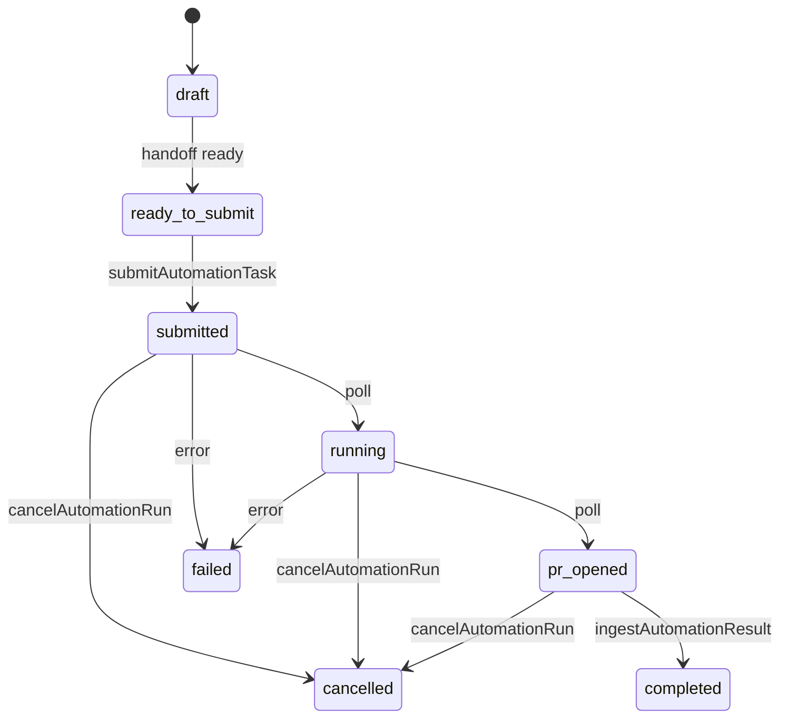

# AI-COMPANY-099B — Cursor Automation Service Adapter V1

**Статус:** contract + mock adapter (без реального Cursor API)  
**Ветка:** `ai-company-flow`  
**Scope:** `apps/ai-company/src/domain/cursorAutomation/`

## Цель

Подготовить **интерфейс сервисного адаптера** Cursor Automation, чтобы позже заменить mock submit на настоящий вызов — без изменения Runtime orchestrator.

---

## Что изучено

| Модуль | Файлы | Роль |
|--------|-------|------|
| **cursorAutomation** | `cursorAutomation.ts`, `cursorAutomationAdapter.ts`, `cursorAutomationWorkflow.ts` | Task, handoff, plan builder, legacy ingest |
| **Tool Registry** | `toolRegistryCatalog.ts` (`cursor-automation`) | Tool id, risk, approval policy |
| **Owner Approval** | `cursorAutomationOwnerApproval.ts`, `approvalStorage.ts` | Gate перед submit |
| **MAX Worker Loop** | `maxWorkerLoopEngine.ts`, snapshots | Handoff + Tool Branch UI |
| **Runtime Persistence** | `runtimePersistenceEntities.ts` | `CursorAutomationRunPersistenceRecord` |
| **Reports** | `report.ts`, `runtimeReportQuality.ts` | Patch section `tool_execution` |
| **Knowledge** | `maxWorkerLoopDrafts.ts` | `KnowledgeCandidateDraft` → rule candidates |

**Gap до 099B:** submit/ status / cancel были размазаны между workflow mock и `ingestCursorAutomationResult` без единого adapter contract.

---

## Adapter contract

Файл: `cursorAutomationServiceAdapterTypes.ts`

```typescript
type CursorAutomationServiceAdapter = {
  adapterKind: 'mock_v1' | 'cursor_api_v1'
  submitAutomationTask(input)
  getAutomationStatus(adapterRunId)
  cancelAutomationRun(adapterRunId)
  ingestAutomationResult(input)
  mapPrToRuntimeReportPatch(task, pr)
  mapResultToMemoryEvolutionHints(task, pr)
  mapResultToCursorRulesCandidates(knowledgeCandidates)
}
```

### Статусы adapter run

| Status | Значение |
|--------|----------|
| `draft` | Запись создана, handoff не готов |
| `ready_to_submit` | Handoff + Owner Approval OK |
| `submitted` | Отправлено в Cursor (mock: localStorage) |
| `running` | Agent выполняет задачу |
| `pr_opened` | PR создан, ждём CI / review |
| `completed` | Ingestion завершён, MAX может принять |
| `failed` | Ошибка API / agent / CI |
| `cancelled` | Owner отменил до completion |



---

## Mock adapter (099B)

Файл: `cursorAutomationServiceAdapterMock.ts`

- `createCursorAutomationServiceAdapterMock()` — factory
- `getCursorAutomationServiceAdapterMock()` — singleton для dev
- Storage: `localStorage` key `ai-company-cursor-automation-adapter-runs`
- **Без HTTP**, **без credentials**
- Poll simulation: `getAutomationStatus` advances `submitted → running → pr_opened`
- Mock PR URL: `https://github.com/{owner}/{repo}/pull/mock-{branch}`

Helpers:

- `markCursorAutomationAdapterRunReady()` — перевод в `ready_to_submit`
- `listCursorAutomationAdapterRuns()` — debug / UI V2

---

## Mappers

Файл: `cursorAutomationServiceAdapterMappers.ts`

| Function | Output |
|----------|--------|
| `mapPrToRuntimeReportPatch` | `{ section: 'tool_execution', summary, toolRegistryV1Id }` |
| `mapResultToMemoryEvolutionHints` | string[] для Memory Evolution |
| `mapResultToCursorRulesCandidates` | `.cursor/rules/*.mdc` drafts из Knowledge |
| `buildNormalizedAutomationResult` | `CursorAutomationResult` для MAX |

---

## Как подключить реальный Cursor API (V2)

### 1. Реализация адаптера

```typescript
// cursorAutomationServiceAdapterCursorApi.ts (future)
export function createCursorAutomationServiceAdapterCursorApi(deps: {
  fetch: typeof fetch
  getToken: () => string | null
}): CursorAutomationServiceAdapter
```

Замена mock:

```typescript
const adapter =
  import.meta.env.VITE_CURSOR_ADAPTER === 'cursor_api_v1'
    ? createCursorAutomationServiceAdapterCursorApi(...)
    : getCursorAutomationServiceAdapterMock()
```

Runtime orchestrator **не меняем** — вызов только из Worker Loop / Tool Execution bridge после Owner Approval.

### 2. Environment variables

| Variable | Где | Назначение |
|----------|-----|------------|
| `CURSOR_API_TOKEN` | **Server only** (NestJS `.env`) | Bearer token Cursor Automations / Cloud Agents |
| `CURSOR_AUTOMATION_API_BASE_URL` | Server | `https://api.cursor.com` (или актуальный endpoint) |
| `CURSOR_AUTOMATION_WEBHOOK_SECRET` | Server | HMAC verify входящих webhook |
| `CURSOR_AUTOMATION_WEBHOOK_PATH` | Server | `/api/ai-company/cursor-automation/webhook` |
| `GITHUB_APP_*` | Server (optional) | PR metadata если Cursor не отдаёт полный diff |

**Frontend (`apps/ai-company`) — токены НЕ хранить.** Только server-side proxy.

### 3. Где хранить токены

- Production: secrets manager / server `.env` (не в git)
- Dev: `apps/ai-company/.env.local` **запрещён** для CURSOR_API_TOKEN — только backend `.env`
- Rotation: Owner через infra playbook; audit log в `HistoryEvent`

### 4. submitAutomationTask (real)

```
POST /api/ai-company/cursor-automation/runs
Body: { promptMarkdown, repository, branch, fileScope, metadata: { workerLoopId, runtimeRunId } }
→ { externalRunId, status: 'submitted' }
```

Backend validates:

- `companyId` from session
- Owner Approval record `approved`
- Tool Registry policy `cursor-automation` + risk `high`

### 5. getAutomationStatus (real)

```
GET /api/ai-company/cursor-automation/runs/:externalRunId
→ { status, prUrl, buildStatus, ... }
```

Poll from UI каждые N секунд **или** push через webhook.

### 6. PR link

Источники (priority):

1. Cursor Automation API response (`pullRequest.url`)
2. GitHub webhook `pull_request` event (linked by branch / labels)
3. GitHub API fallback (`GET /repos/{owner}/{repo}/pulls?head=...`)

Сохранять в `CursorAutomationAdapterRunRecord.prUrl` + `CursorAutomationRunPersistenceRecord.payload.prUrl`.

### 7. Webhook ingestion

```
POST /api/ai-company/cursor-automation/webhook
Headers: X-Cursor-Signature: sha256=...
Body: { event: 'run.completed' | 'pr.opened' | 'checks.completed', runId, payload }
```

Backend:

1. Verify signature (`CURSOR_AUTOMATION_WEBHOOK_SECRET`)
2. Idempotency key → `HistoryEvent`
3. `ingestAutomationResult({ adapterRunId, raw: body, task })`
4. Notify MAX Worker Loop (event / poll refresh)

### 8. PR → Runtime Report

```
ingestAutomationResult()
  → mapPrToRuntimeReportPatch(task, pr)
  → patch Report.runtimeBody.tool_execution section
  → link reportId on RuntimeRun + WorkerLoop
```

MAX читает обновлённый Report в snapshot — **без** прямого LLM вызова на ingest.

### 9. Результат для MAX

```
ingestAutomationResult().normalized → CursorAutomationResult
  ├── runtimeReportPatch  → Report UI
  ├── memoryEvolutionHints → MemoryDraft (098C persistence)
  ├── ruleCandidates      → Knowledge / .cursor/rules review queue
  └── prSummary           → Tool Branch Snapshot UI
```

Flow:

```
Owner task → MAX (Ollama) → handoff → Owner Approval
→ adapter.submitAutomationTask → poll getAutomationStatus
→ webhook or poll pr_opened → adapter.ingestAutomationResult
→ MAX Worker Loop snapshot refresh → Memory/Knowledge drafts
```

---

## Mapping → Runtime Persistence V1

`mapAdapterStatusToPersistenceHint()` в types:

| Adapter status | Persistence hint |
|----------------|------------------|
| draft | draft |
| ready_to_submit | handoff_ready |
| submitted | queued |
| running / pr_opened | running |
| completed | completed |
| failed | failed |
| cancelled | cancelled |

---

## Риски

| Risk | Mitigation |
|------|------------|
| Token leak в frontend | Server proxy only |
| Submit без Owner Approval | `validateSubmitInput` + backend guard |
| Duplicate webhook ingest | `idempotencyKey` на HistoryEvent |
| PR на wrong branch | Handoff plan `workingBranch` + CI check |
| Mock mistaken for prod | `adapterKind` badge в UI |
| Cross-tenant access | `companyId` на каждой adapter run record |

---

## TypeScript deliverable

```
cursorAutomationServiceAdapterTypes.ts   — contract + statuses
cursorAutomationServiceAdapterMappers.ts — pure mappers
cursorAutomationServiceAdapterMock.ts      — mock implementation
index.ts                                   — exports
```

**Не подключено** к `runtimeOrchestrator`, `maxWorkerLoopEngine`.

---

## Проверка

```bash
npm --prefix apps/ai-company run build
```

---

## Следующий шаг

**AI-COMPANY-100B** — wire mock adapter в Worker Loop submit button + status poll UI; NestJS proxy stub endpoint (still mock response).

---

## Связанные документы

- [AI-COMPANY-097C — Cursor Automation Workflow V1](./AI-COMPANY-097C-cursor-automation-workflow-v1.md)
- [AI-COMPANY-098B — Runtime Persistence V1](./AI-COMPANY-098B-runtime-persistence-v1.md)
