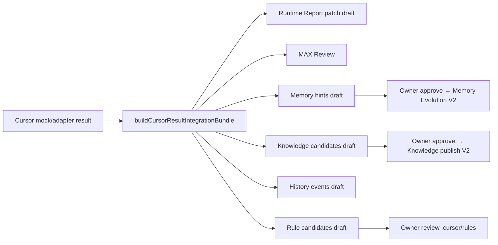

# AI-COMPANY-099C — Cursor Result → Runtime Report Integration

**Статус:** V1 mock (без реального Cursor API, без auto-publish)  
**Ветка:** `ai-company-flow`  
**Scope:** `apps/ai-company`

## Цель

Cursor Automation — **часть цикла MAX**, не отдельная задача. Результат Cursor возвращается в:

- Runtime Report (draft patch)
- MAX Review
- Memory Evolution (hints / draft)
- Knowledge Candidate (draft)
- Runtime History (append-only events)

---

## Что изучено

| Модуль | Роль |
|--------|------|
| `reports/report.ts` | Primary артеfact reasoning; patch не мержится автоматически |
| `cursorAutomationMockIngestion.ts` | Mock PR / expected result (097C) |
| `cursorAutomationServiceAdapterMappers.ts` | Базовые mappers PR → Report / Memory / Rules (099B) |
| `cursorAutomationSubmit*.ts` | Submit run после Owner Approval (099A) |
| `maxWorkerLoopDrafts.ts` | MemoryEvolutionDraft, KnowledgeCandidateDraft |
| `maxWorkerLoopEngine.ts` | `enrichCursorAutomationSnapshot()` — сборка bundle |
| `runtimePersistenceEntities.ts` | `HistoryEventPersistencePayload` shape |
| `MaxWorkerLoopCursorResultPanel.tsx` | UI секция результата |

---

## Domain module

Файл: `cursorAutomationResultIntegration.ts`

### Функции

| Function | Output | Auto-publish |
|----------|--------|--------------|
| `buildCursorResultRuntimeReportPatch` | `CursorResultRuntimeReportPatch` | ❌ `status: draft_patch` |
| `buildCursorResultMaxReview` | `CursorResultMaxReview` | ❌ acceptance gate |
| `buildCursorResultMemoryHints` | `CursorResultMemoryHint[]` | ❌ `draft_hint` |
| `buildCursorResultKnowledgeCandidates` | `CursorResultKnowledgeCandidate[]` | ❌ `publishStatus: draft` |
| `buildCursorResultHistoryEvents` | `CursorResultHistoryEventDraft[]` | ❌ append-only drafts |
| `buildCursorResultIntegrationBundle` | полный bundle | — |
| `buildCursorResultIntegrationIfReady` | bundle или null | — |

### Единая структура bundle

```typescript
CursorResultIntegrationBundle {
  source: 'mock_v1' | 'adapter_v1'
  ingestedAt: string
  submitRunId: string | null
  runtimeReportPatch   // → Report UI section tool_execution
  maxReview            // → MAX acceptance
  memoryHints          // → Memory Evolution draft path
  knowledgeCandidates  // → Knowledge queue (draft)
  ruleCandidates       // → .cursor/rules review queue
  historyEvents        // → Runtime Persistence HistoryEvent
}
```

---

## Flow: Cursor → AI Company



### Триггеры integration

`buildCursorResultIntegrationIfReady()` возвращает bundle когда:

1. **Submit path (099A):** `submitRun` со status `submitted_mock | submitted_pending_real_adapter | waiting_for_result | completed`
2. **Mock workflow path (097C):** loop `completed` + `externalExecutorRequired` + `expectedResult` (без submitRun)

Runtime orchestrator **не изменён** — integration только в snapshot read path.

---

## UI — MAX Worker Loop

Компонент: `MaxWorkerLoopCursorResultPanel`

Показывает при `snapshot.cursorAutomation.resultIntegration`:

| Секция | Содержимое |
|--------|------------|
| Что вернул Cursor | summary, PR URL, build status |
| Что принял MAX | review badge pending/accepted |
| Patch для Runtime Report | summary + sections + draft note |
| Memory Evolution | hints list (draft only) |
| Knowledge Candidate | titles + proposed rule paths |
| .cursor/rules | rule candidate paths |
| Runtime History | history event labels |

Стили: `max-worker-loop.css` → `.acMaxLoopCursorResult*`

i18n: `maxWorkerLoop.cursorResult.*` (ru/en)

---

## Ограничения V1

- Knowledge **не публикуется** автоматически (`publishStatus: draft`)
- Memory **не пишется** в permanent storage (`status: draft_hint`)
- Report patch **не мержится** в `reportStorage` (`draft_patch`)
- History events **не персистятся** в `eventStorage` (draft shape only)
- Real Cursor API — через 099B adapter + future webhook

---

## Связь с Runtime Persistence V1 (098B)

History events используют `HistoryEventPersistencePayload` kinds:

- `cursor_automation_submitted`
- `cursor_automation_completed`
- `report_created`
- `memory_draft_created`
- `knowledge_draft_created`

Backend V2: append via `HistoryEventPersistencePort.append()`.

---

## Проверка

```bash
npm --prefix apps/ai-company run build
```

Autonomous demo / Worker Loop с Cursor keywords → после completed run → panel «Cursor Result → MAX Integration».

---

## Следующий шаг

**AI-COMPANY-100C** — persist HistoryEvent drafts + Owner «Accept patch → Report» action; wire 099B adapter ingest → `buildCursorResultIntegrationBundle`.

---

## Связанные документы

- [AI-COMPANY-099B — Cursor Automation Adapter V1](./AI-COMPANY-099B-cursor-automation-adapter-v1.md)
- [AI-COMPANY-097C — Cursor Automation Workflow V1](./AI-COMPANY-097C-cursor-automation-workflow-v1.md)
- [AI-COMPANY-098B — Runtime Persistence V1](./AI-COMPANY-098B-runtime-persistence-v1.md)
