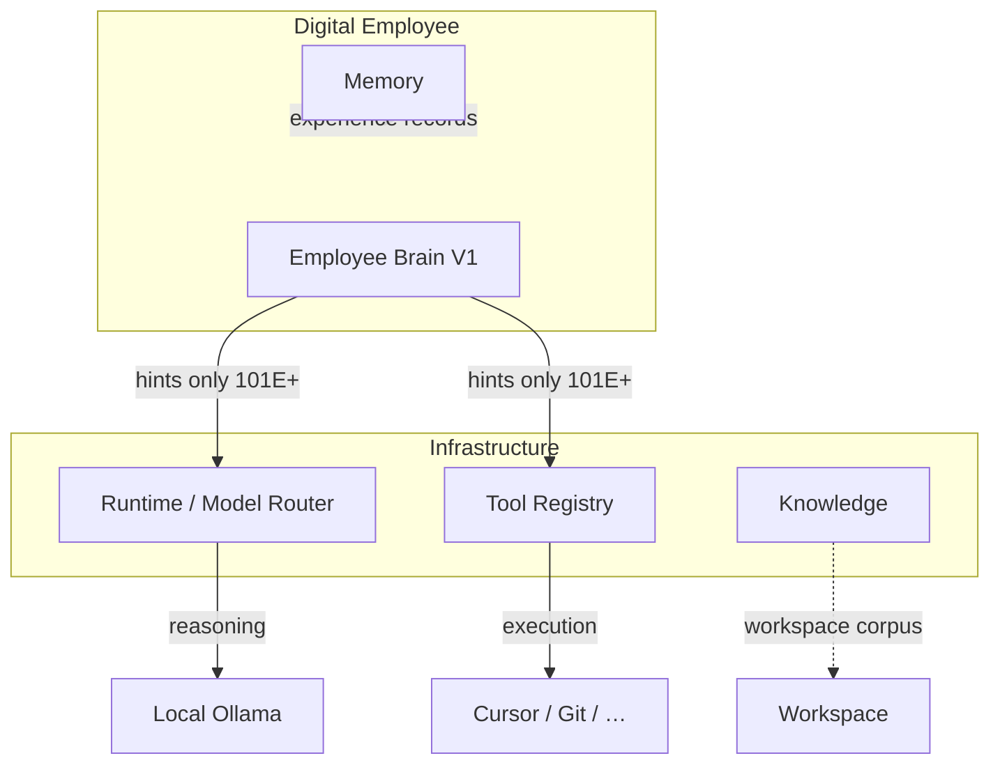

# AI-COMPANY-101D — Employee Brain V1

**Ticket:** AI-COMPANY-101D  
**Роль:** Employee Brain Architect  
**Дата:** 2026-07-07  
**Проект:** `apps/ai-company`

---

## Резюме

**Employee Brain** — первый независимый слой принятия решений цифрового сотрудника.

| Слой | Что это |
|------|---------|
| **Brain** | Policy: как решать, что предпочитать, какой риск допустим |
| **LLM / Runtime** | Reasoning engine — исполняет inference |
| **Memory** | Опыт после Run — принадлежит Employee |
| **Knowledge** | Корпус компании / Workspace |
| **Tool Registry** | Исполнители (Cursor, Git, Docker, …) |

**101D = типы + defaults + projector + localStorage + docs.**  
Runtime orchestrator **не изменён**.

---

## Модули

```
apps/ai-company/src/domain/employeeBrain/
├── employeeBrainTypes.ts      # enums + sub-types
├── employeeBrain.ts           # EmployeeBrainV1 aggregate + invariants
├── employeeBrainDefaults.ts   # presets ag-max, ag-cto, ag-qa, ag-devops
├── employeeBrainProjector.ts  # CustomEmployee → Brain (read-only)
├── employeeBrainStorage.ts    # localStorage CRUD + ensure*
└── index.ts
```

| Storage key | `ai-company-employee-brain` |
| Version | `v1` |
| Id format | `brain-{employeeId}` |

---

## Что хранит Brain V1

| Поле | RU | Пример |
|------|-----|--------|
| `specialization` | Специализация | Senior Developer, Coding, Architecture |
| `decisionProfile` | Стиль решений | pragmatic, evidence-first |
| `modelStrategy` | Стратегия моделей | local_first, model-qwen-36-27b |
| `toolStrategy` | Стратегия инструментов | external_executor_first, cursor-automation |
| `autonomyLevel` | Автономность | execute_with_approval |
| `acceptableRisk` | Допустимый риск | moderate |
| `reasoningPreferences` | Предпочтения reasoning | report, ru, concrete artifacts |
| `constraints` | Ограничения | No production deploy, blocked capabilities |

---

## Связь с существующими доменами



| Домен | Связь с Brain в 101D |
|-------|----------------------|
| Employee | 1 Brain per employeeId |
| Runtime | Projector reads `primaryModel` labels → catalog ids; **no orchestrator hook** |
| Worker Loop | Future: filter tool proposals |
| Memory | Orthogonal — Brain не пишет memory |
| Knowledge | Orthogonal |
| Tool Registry | `ToolRegistryV1ToolId` in toolStrategy |

---

## Presets (roster)

| employeeId | autonomy | risk | tool policy |
|------------|----------|------|-------------|
| `ag-max` | execute_with_approval | moderate | external_executor_first |
| `ag-cto` | propose_and_wait | low | minimal_tools |
| `ag-qa` | recommend | minimal | minimal_tools + playwright |
| `ag-devops` | propose_and_wait | low | docker + terminal |

---

## API (V1 local)

```typescript
import {
  ensureEmployeeBrain,
  getEmployeeBrainByEmployeeId,
  projectEmployeeBrainFromCustomEmployee,
} from '../domain/employeeBrain'

const brain = ensureEmployeeBrain('ag-max')
```

---

## Инварианты (101D)

- Brain ≠ LLM, Memory, Knowledge
- `onRuntimeCompletion` / orchestrator **не импортирует** employeeBrain
- Permission / Owner Approval остаются выше Brain
- Multi-tenant: `companyId` на записи Brain (nullable в local V1)

---

## Следующий шаг

**101E** — read-only Brain context in Runtime prompt assembly (opt-in flag).  
**101F** — Worker Loop tool proposal filter via `toolStrategy`.

---

## Связанные файлы

- `apps/ai-company/docs/domain/employee-brain.md`
- `apps/ai-company/docs/domain/employee.md`
- `docs/ai-company/AI-COMPANY-096-tool-registry-v1.md`
- `docs/ai-company/AI-COMPANY-095-memory-v2.md`
