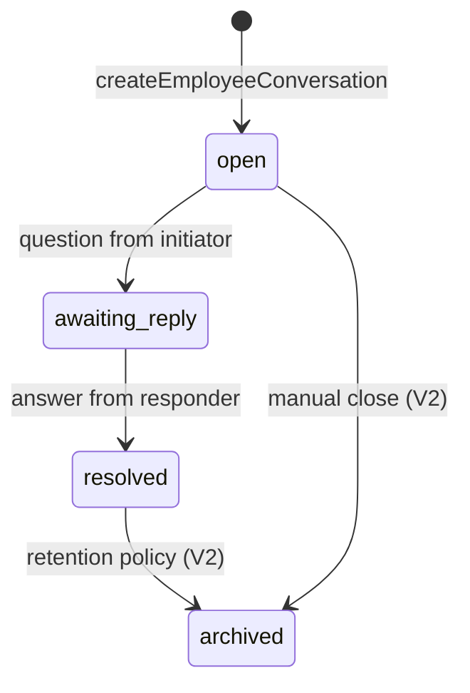
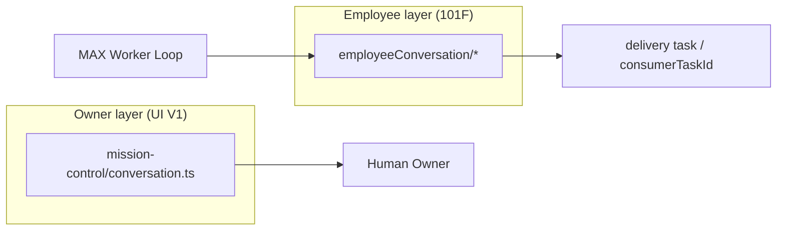

# AI-COMPANY-101F — Employee Conversation V1

**Статус:** domain + storage V1 (без UI, без сети)  
**Ветка:** `ai-company-flow`  
**Scope:** `apps/ai-company`  
**TypeScript:** `src/domain/employeeConversation/`

## Цель

Подготовить **внутренний доменный слой** общения цифровых сотрудников друг с другом.

| Не это | Почему |
|--------|--------|
| Owner chat (`mission-control/data/conversation.ts`) | Owner ↔ Employee, UI-first |
| Telegram / MAX Messenger | Внешние каналы — out of scope |
| Runtime / Ollama invoke | V2 integration |

---

## Сущности V1

| Сущность | Назначение |
|----------|------------|
| **EmployeeConversation** | Aggregate root — диалог employee↔employee |
| **EmployeeConversationParticipant** | Участники (initiator / responder / observer) |
| **EmployeeConversationMessage** | Turn: question, answer, clarification, … |
| **EmployeeConversationContext** | companyId, project, origin/consumer task, run, workerLoop |
| **EmployeeConversationDecision** | Явное решение, извлечённое из переписки |
| **EmployeeConversationAttachmentRef** | Ссылка на report/run/task/file — без blob |

### Lifecycle



---

## Границы с существующим Conversation



- **Owner Conversation** — exploratory chat с одним employee.
- **Employee Conversation** — consult между сотрудниками; результат **потребляется** задачей (consumerTaskId).

---

## Storage V1

| Key | `ai-company-employee-conversations` |
| Engine | `localStorage` (browser) |
| Port V2 | `EmployeeConversationStoragePort` → NestJS + Prisma |

### API

| Function | Описание |
|----------|----------|
| `loadEmployeeConversations()` | Read all |
| `createEmployeeConversation(input)` | New aggregate |
| `appendEmployeeConversationMessage(id, input)` | Add turn |
| `recordEmployeeConversationDecision(id, input)` | Persist decision |
| `consumeEmployeeConversationMessage(id, input)` | Mark answer used by task |
| `listEmployeeConversations(filter)` | Query |
| `clearEmployeeConversations()` | Dev reset |

---

## Reference scenario: MAX → Atlas

Модуль: `employeeConversationScenario.ts`

```text
1. MAX (ag-max) создаёт consultation с Atlas (ag-cto)
2. MAX отправляет question (architecture boundary)
3. Atlas отвечает answer (inReplyTo)
4. MAX фиксирует Decision (accepted)
5. MAX consume answer → consumerTaskId + consumedAt на message
```

Запуск:

```typescript
import { runMaxAtlasConsultationScenarioV1 } from '../domain/employeeConversation'

const result = runMaxAtlasConsultationScenarioV1({
  originTaskId: 'task-max-origin',
  consumerTaskId: 'task-max-consumer',
  workerLoopId: 'loop-optional',
})
// result.conversation — persisted in localStorage
// result.consumedSummary — текст для Worker Loop / report patch
```

---

## Multi-tenant

- `context.companyId` обязателен (default: `company-ai-company`)
- `workspaceId` / `projectId` optional scope
- Production: все записи фильтруются по `companyId`

---

## Constraints (101F)

- ❌ UI
- ❌ HTTP / WebSocket
- ❌ Runtime orchestrator changes
- ❌ Owner chat refactor
- ✅ Types + localStorage + scenario + docs

---

## Checks

```bash
npm --prefix apps/ai-company run build
```

---

## Следующий шаг (V2)

1. **Worker Loop integration** — phase `consult_peer` → create/load conversation
2. **UI inbox** — employee consult threads (read-only V1 panel)
3. **Server port** — Prisma tables mirroring V1 JSON shape
4. **Event emission** — `employee_conversation.message`, `employee_conversation.decision`

---

## Revision

| Version | Date | Change |
|---------|------|--------|
| 1.0 | 2026-07-07 | Initial Employee Conversation V1 (101F) |
