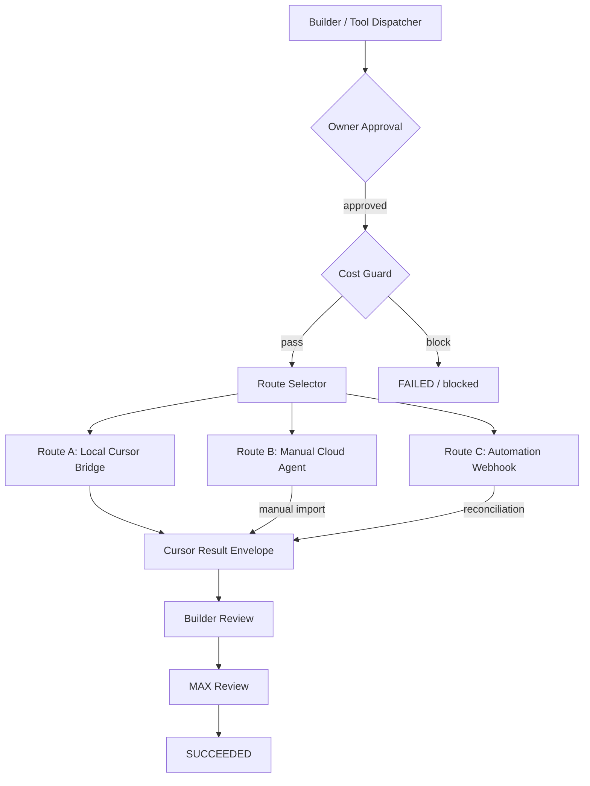
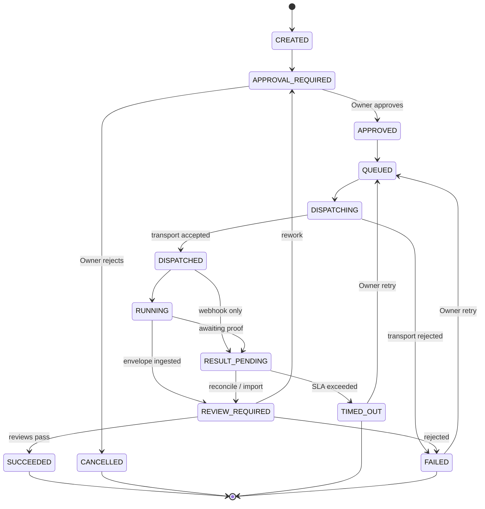
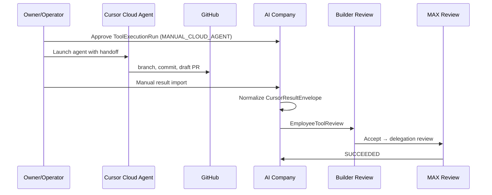
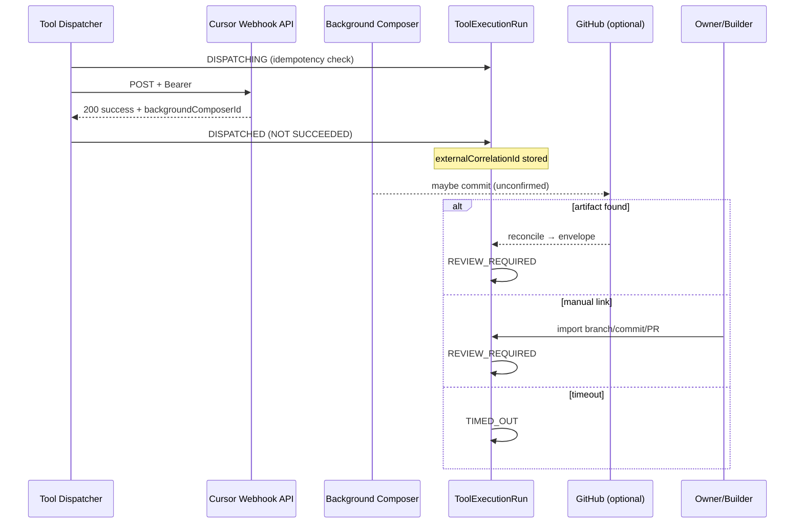

# AI-COMPANY-108 — Path C Cursor Execution Architecture V1

> **Status:** Architecture specification (design only)  
> **Decision:** Path C  
> **Date:** 2026-07-14  
> **Research basis:** AI-COMPANY-105, 106, 106A, 107  
> **Production code:** None in this task

---

## 1. Context

AI Company delegates work to external Cursor execution surfaces through **Tool Dispatcher** and persists canonical state in **ToolExecutionRun**. Research (105–107) closed the question of Cursor Automations vs Cloud Agents API vs Local Bridge.

**Problem:** Cursor Automation Webhook returns HTTP 200 and `backgroundComposerId` but does **not** guarantee payload visibility, repository artifacts, completion callbacks, or idempotency. Manual Cloud Agent works on the current subscription. Local Cursor Bridge (113E/F) already provides controlled local execution and **Cursor Result Envelope** ingest.

**Goal:** Define a stable execution architecture where AI Company owns lifecycle truth, does not treat transport enqueue as task success, avoids default paid API paths, and can swap transports later without redesigning ToolExecutionRun.

**Related docs:**

| Document | Role |
|----------|------|
| [cursor-automations-research-v1.md](../research/cursor-automations-research-v1.md) | Platform facts |
| [cursor-automation-webhook-smoke-test-v1.md](../research/cursor-automation-webhook-smoke-test-v1.md) | Live HTTP contract |
| [ai-company-107/final-decision.md](../research/evidence/ai-company-107/final-decision.md) | Path C decision |
| [AI-COMPANY-113F](../ai-company/AI-COMPANY-113F-cursor-result-envelope-employee-review-v1.md) | Result envelope + review |
| `apps/ai-company/src/domain/toolExecution/toolExecutionRunTypes.ts` | Current run model (v1) |

---

## 2. Confirmed research facts

| # | Fact | Implication |
|---|------|-------------|
| 1 | Webhook accepts HTTP POST + Bearer | Route C transport viable |
| 2 | 401 without / wrong key | Auth required at edge |
| 3 | Success enqueue: `{"success":true,"backgroundComposerId":"bc-..."}` | **DISPATCHED** only — store as `externalCorrelationId` |
| 4 | Duplicate POST → second enqueue, no HTTP dedup | AI Company must idempotency |
| 5 | Payload visibility in Automation | **Not confirmed** |
| 6 | Repo artifact / completion on configured branch | **Not confirmed** in 107 |
| 7 | Manual Cloud Agent: branch, commit, push, draft PR | Route B viable |
| 8 | Local Cursor Bridge + envelope ingest exists | Route A primary |
| 9 | Extra credits / paid API default | **Forbidden** by product policy |
| 10 | Cloud Agents API | Available officially but **not default** due to cost guard |

---

## 3. Architectural decision

**Path C — layered execution:**

```text
Primary automated:   Local Cursor Bridge
Operator fallback:   Manual Cloud Agent
Secondary trigger:   Cursor Automation Webhook (optional)
Not source of truth: Cursor Automation runtime / Cloud Agents API transport
Canonical SoT:       ToolExecutionRun (+ ExecutionAttempt records)
```

---

## 4. Why Path C

| Alternative | Why not primary |
|-------------|-----------------|
| **Path A** (Automation webhook primary) | No guaranteed completion, payload, or repo result; HTTP 200 ≠ execution success |
| **Path B** (Cloud Agents API default) | Cost constraint; API polling not proven included; duplicates transport already covered by manual agent |
| **Path C** | Uses proven local + manual paths; webhook as optional enqueue; canonical lifecycle stays in AI Company |

---

## 5. Canonical ToolExecutionRun lifecycle

### 5.1 Source of truth

**ToolExecutionRun** is the **only** canonical execution record for Builder → Employee → Owner flows. Cursor surfaces (Bridge, Cloud Agent UI, Automation) are **transports**, not lifecycle owners.

### 5.2 Canonical states (target model)

| State | Meaning |
|-------|---------|
| `CREATED` | Run record created; not yet submitted for approval |
| `APPROVAL_REQUIRED` | Waiting Owner (or policy) approval before dispatch |
| `APPROVED` | Approved; eligible for queue |
| `QUEUED` | In Work Queue; awaiting dispatcher |
| `DISPATCHING` | Route selection + preflight (cost, env, secrets) |
| `DISPATCHED` | Transport accepted request (**includes Automation HTTP 200**) |
| `RUNNING` | Execution in progress on chosen route |
| `RESULT_PENDING` | Transport done or unknown; awaiting result / reconciliation |
| `REVIEW_REQUIRED` | Result ingested; Builder or MAX review |
| `SUCCEEDED` | Execution + review pipeline complete (per policy) |
| `FAILED` | Terminal failure (transport, execution, or policy) |
| `CANCELLED` | Owner or system cancelled before success |
| `TIMED_OUT` | Reconciliation or execution exceeded SLA |

### 5.3 Success dimensions (orthogonal)

| Dimension | Definition | Example |
|-----------|------------|---------|
| **Transport success** | External surface accepted the handoff | Webhook HTTP 200 + `backgroundComposerId` |
| **Execution success** | Intended work produced verifiable outcome | Envelope ingested; or manual import with commit/PR |
| **Review success** | Builder + MAX (and Owner where required) accepted | `EmployeeToolReview` accepted → MAX handoff |

**Invariant:** `transport success ⇏ execution success ⇏ review success`.

Automation HTTP 200 maps to **`DISPATCHED`** at most. Transition to `RUNNING` / `RESULT_PENDING` requires explicit policy (e.g. operator confirms UI run, or reconciliation finds artifact).

### 5.4 Mapping to current v1 implementation

Current `ToolExecutionRunStatus` (113A) is a **subset**. Future implementation phases align v1 → canonical:

| Canonical | Current v1 (approx.) |
|-----------|----------------------|
| `CREATED` | `draft` |
| `APPROVAL_REQUIRED` | `awaiting_owner` |
| `APPROVED` | `approved` |
| `QUEUED` | `queued` |
| `DISPATCHING` / `DISPATCHED` | *(new — split from `running`)* |
| `RUNNING` | `running` |
| `RESULT_PENDING` | *(new)* |
| `REVIEW_REQUIRED` | `result_received`, `awaiting_employee_review` |
| `SUCCEEDED` | `accepted` |
| `FAILED` | `failed`, `rejected` |
| `CANCELLED` | `cancelled` |
| `TIMED_OUT` | *(new)* |
| Rework loop | `rework_requested` → back to `APPROVAL_REQUIRED` or `QUEUED` |

---

## 6. Route definitions

### Route A — `LOCAL_CURSOR_BRIDGE`

| Aspect | Design |
|--------|--------|
| **Purpose** | Primary automated, controlled local Cursor execution |
| **Trigger** | Tool Dispatcher after approval + route selection |
| **Mechanism** | Inbox package (`cursor-inbox/<runId>/`), `task.md`, outbox `result.json` (113E/F) |
| **Observability** | Full local lifecycle; filesystem + ingest |
| **Result** | `CursorResultEnvelope` → Builder Review → MAX Review |
| **Cost** | `INCLUDED_IN_SUBSCRIPTION` (local; no Cursor cloud metered enqueue) |
| **Best for** | Scoped file changes, checks, envelope-compliant tasks |

### Route B — `MANUAL_CLOUD_AGENT`

| Aspect | Design |
|--------|--------|
| **Purpose** | Operator-assisted complex development |
| **Trigger** | Owner/Developer launches Cloud Agent in Cursor UI |
| **Mechanism** | Human copies handoff context; agent works on GitHub |
| **Observability** | Branch, commit, draft PR (proven in 107 pre-flight) |
| **Result** | **Manual Result Import** → normalized envelope → review pipeline |
| **Cost** | `INCLUDED_IN_SUBSCRIPTION` (current plan; no auto-buy credits) |
| **Best for** | Multi-file refactors, PR-based delivery, when Bridge insufficient |

### Route C — `CURSOR_AUTOMATION_WEBHOOK`

| Aspect | Design |
|--------|--------|
| **Purpose** | Secondary event-driven **enqueue** only |
| **Trigger** | HTTP POST after approval (optional adapter) |
| **Mechanism** | `POST` → `backgroundComposerId` stored as `externalCorrelationId` |
| **Observability** | **Partial** — no confirmed callback; reconciliation required |
| **Result** | `RESULT_PENDING` until manual link, GitHub discovery, or timeout |
| **Cost** | `INCLUDED_IN_SUBSCRIPTION` if no billing prompt (107); guard still applies |
| **Best for** | Non-critical, event-driven experiments; **not** guaranteed completion tasks |

---

## 7. ExecutionRoute enum (design)

```typescript
/** Design-only — not implemented in this task */
export enum ExecutionRoute {
  LOCAL_CURSOR_BRIDGE = 'LOCAL_CURSOR_BRIDGE',
  MANUAL_CLOUD_AGENT = 'MANUAL_CLOUD_AGENT',
  CURSOR_AUTOMATION_WEBHOOK = 'CURSOR_AUTOMATION_WEBHOOK',
}
```

Stored on `ToolExecutionRun` (future field `executionRoute`) and on each `ExecutionAttempt`.

---

## 8. Route selection policy

**Inputs:** task complexity, `fileScope`, approval state, environment, cost guard, Bridge availability, criticality, idempotency context.

| Condition | Selected route |
|-----------|----------------|
| Automatic controlled run + full lifecycle + local env available + envelope path | **LOCAL_CURSOR_BRIDGE** |
| Complex GitHub work; PR/branch required; operator participation OK | **MANUAL_CLOUD_AGENT** |
| Event-driven; no completion callback required; non-critical; external verification OK | **CURSOR_AUTOMATION_WEBHOOK** |
| Unknown or `ADDITIONAL_COST_REQUIRED` cost | **Block** — no dispatch |
| Critical task requiring guaranteed result | **Never** webhook-only — Bridge or Manual |

**Default order when multiple eligible:** `LOCAL_CURSOR_BRIDGE` → `MANUAL_CLOUD_AGENT` → `CURSOR_AUTOMATION_WEBHOOK` (last resort).

**Builder / Tool Dispatcher** applies policy; Owner can override in approval UI (future).

---

## 9. Idempotency

Cursor webhook has **no** deduplication. AI Company owns idempotency.

### 9.1 Identifiers

| Field | Scope | Purpose |
|-------|-------|---------|
| `toolExecutionRunId` | Canonical | Primary business execution id |
| `idempotencyKey` | Business task | Hash of `(companyId, workItemId, toolRequestId, intentVersion)` |
| `clientRequestId` | API/UI client | Optional caller-supplied uuid |
| `externalCorrelationId` | Transport | e.g. `backgroundComposerId` from webhook |
| `requestFingerprint` | Attempt | Hash of route + payload + attemptNumber |

### 9.2 Rules

1. **One business task → one ToolExecutionRun** unless Owner explicitly creates a new run (new `idempotencyKey` version).
2. **Duplicate webhook POST** with same `idempotencyKey`: return existing run reference; **do not** create second run; optional new `ExecutionAttempt` only if policy allows explicit retry.
3. **Retry** increments `attemptNumber` on same run — never new business task.
4. Store **all** `backgroundComposerId` values on attempts (duplicate enqueues from Cursor create multiple external ids — detect and warn).
5. Dispatcher checks `idempotencyKey` before `DISPATCHING`.

### 9.3 Duplicate policy

| Scenario | Action |
|----------|--------|
| Same idempotencyKey, run in non-terminal state | Reject duplicate dispatch; link client to existing run |
| Same idempotencyKey, run `SUCCEEDED` | Reject; return cached outcome |
| Same idempotencyKey, run `FAILED` / `TIMED_OUT` | Owner-approved retry → new **attempt**, same run |
| Webhook returns new `backgroundComposerId` for duplicate HTTP | Log warning; attach to latest attempt; reconciliation may find multiple Cloud runs |

---

## 10. ExecutionAttempt (design entity)

Nested under ToolExecutionRun (or separate collection keyed by `toolExecutionRunId`).

```typescript
/** Design-only */
type ExecutionAttempt = {
  id: string
  toolExecutionRunId: string
  attemptNumber: number
  route: ExecutionRoute
  status: 'pending' | 'dispatching' | 'dispatched' | 'running' | 'result_pending' | 'succeeded' | 'failed' | 'cancelled' | 'timed_out'
  startedAt: string
  finishedAt: string | null
  requestFingerprint: string
  externalCorrelationId: string | null   // backgroundComposerId, branch name, etc.
  transportStatus: 'not_started' | 'accepted' | 'rejected' | 'error'
  transportHttpStatus: number | null
  executionStatus: 'unknown' | 'running' | 'succeeded' | 'failed' | 'pending'
  errorCode: string | null
  errorMessage: string | null
  resultEnvelopeRef: string | null       // path or storage key to CursorResultEnvelope
  costGuardStatus: CostGuardStatus
}
```

One run may have multiple attempts (retry, route switch after failure).

---

## 11. Cursor Result Envelope (unified)

Extends existing **CursorResultEnvelope v1** (113F) with route and correlation metadata.

### 11.1 Canonical envelope (logical superset)

```json
{
  "version": "v1",
  "toolExecutionRunId": "ter-...",
  "workItemId": "wi-...",
  "employeeId": "ag-...",
  "route": "LOCAL_CURSOR_BRIDGE | MANUAL_CLOUD_AGENT | CURSOR_AUTOMATION_WEBHOOK",
  "status": "completed | failed | partial | result_pending",
  "summary": "...",
  "branch": "feature/...",
  "commitSha": "abc123...",
  "pullRequestUrl": "https://github.com/.../pull/...",
  "changedFiles": ["path/to/file"],
  "checks": [{ "name": "build", "status": "passed", "outputSummary": "..." }],
  "artifacts": [],
  "errors": [],
  "warnings": [],
  "assumptions": [],
  "unfinishedItems": [],
  "externalCorrelationId": "bc-...",
  "startedAt": "ISO-8601",
  "finishedAt": "ISO-8601",
  "completedAt": "ISO-8601"
}
```

### 11.2 Route-specific expectations

| Route | Minimum envelope to leave `RESULT_PENDING` |
|-------|---------------------------------------------|
| **LOCAL_CURSOR_BRIDGE** | Full 113F envelope from outbox ingest |
| **MANUAL_CLOUD_AGENT** | Import form: branch, commitSha, PR URL, summary, checks, changedFiles |
| **AUTOMATION_WEBHOOK** | `status: result_pending` + `externalCorrelationId` until reconciliation or manual link |

### 11.3 Ingest path (unchanged for Bridge)

`cursorResultIngest` → validate → `ToolExecutionRun` → `EmployeeToolReview` (Builder) → MAX (112H).

---

## 12. Manual Cloud Agent result import

### 12.1 Actors

Owner or Builder (with permission) submits import after manual Cloud Agent completes.

### 12.2 Import payload (design)

| Field | Required |
|-------|----------|
| `toolExecutionRunId` | Yes |
| `branch` | Yes |
| `commitSha` | Yes |
| `pullRequestUrl` | Optional |
| `summary` | Yes |
| `changedFiles` | Yes |
| `checks` | Recommended |
| `status` | `completed` \| `failed` \| `partial` |

### 12.3 Flow

```text
ToolExecutionRun (MANUAL_CLOUD_AGENT, RUNNING)
  → Owner/Builder submits import
  → Normalize to CursorResultEnvelope
  → cursorResultIngest (same pipeline as Bridge)
  → REVIEW_REQUIRED → Builder Review → MAX Review
  → SUCCEEDED | FAILED
```

### 12.4 Validation

- `toolExecutionRunId` must be `MANUAL_CLOUD_AGENT` route and `RUNNING` or `RESULT_PENDING`
- `commitSha` / branch verifiable via GitHub (future; optional in v1 import)
- No secrets in import text
- `changedFiles` ⊆ approved `fileScope` where policy applies

---

## 13. Automation result reconciliation

**No fake completion.** Callback not confirmed (107).

### 13.1 Allowed reconciliation sources

| Source | Priority | Notes |
|--------|----------|-------|
| Manual link (Owner/Builder) | Highest | Bind branch/PR/commit to run |
| GitHub branch/commit discovery | Medium | Poll `origin` for expected path/file — bounded, read-only |
| PR discovery | Medium | Match title/body/run id if present |
| Cursor UI reference | Low | Operator copies run URL / composer id |
| Official API poll | Future | Only if cost guard = `INCLUDED_IN_SUBSCRIPTION` |

### 13.2 Reconciliation state machine

```text
DISPATCHED (webhook 200)
  → RESULT_PENDING (default)
  → [reconciliation window T_reconcile]
      → artifact found → ingest envelope → REVIEW_REQUIRED
      → manual import → REVIEW_REQUIRED
      → timeout → TIMED_OUT
      → operator cancel → CANCELLED
```

### 13.3 Forbidden

- Auto-`SUCCEEDED` on HTTP 200
- Synthetic envelope without evidence
- Unlimited polling Cloud Agents API on paid meter

---

## 14. Owner approval model

| Gate | Routes affected |
|------|-----------------|
| **Approval before dispatch** | All routes (default) |
| **Manual Cloud Agent** | **Required** — operator launch |
| **Automation Webhook** (repo-changing) | **Required** before POST |
| **Local Bridge** | Per existing Builder/Owner policy (113B/D) |
| **Approval before merge** | Out of Cursor execution — separate Owner decision on PR |
| **Approval before deployment** | **Never** automatic from Cursor routes |

Stages:

1. `APPROVAL_REQUIRED` → Owner approves tool request / run
2. Dispatch only when `APPROVED` + Cost Guard pass
3. Merge/deploy gates remain in Work Queue / Decisions — not bypassed by Cloud Agent

---

## 15. Cost Guard

Mandatory before `DISPATCHING`.

### 15.1 States

```typescript
/** Design-only */
enum CostGuardStatus {
  INCLUDED_IN_SUBSCRIPTION = 'INCLUDED_IN_SUBSCRIPTION',
  UNKNOWN_COST = 'UNKNOWN_COST',
  ADDITIONAL_COST_REQUIRED = 'ADDITIONAL_COST_REQUIRED',
  BLOCKED_BY_COST_POLICY = 'BLOCKED_BY_COST_POLICY',
}
```

### 15.2 Rules

| Rule | Enforcement |
|------|-------------|
| No automatic credit purchase | Block `ADDITIONAL_COST_REQUIRED` |
| No auto Max Mode toggle | Owner explicit only |
| No auto switch to paid Cloud Agents API | Block unless documented included |
| Unknown cost route | `UNKNOWN_COST` → block until Owner acknowledges |
| Show billing mode on approval card | Owner sees route + cost status |

### 15.3 Default by route

| Route | Default cost status |
|-------|---------------------|
| LOCAL_CURSOR_BRIDGE | `INCLUDED_IN_SUBSCRIPTION` |
| MANUAL_CLOUD_AGENT | `INCLUDED_IN_SUBSCRIPTION` (monitor usage) |
| CURSOR_AUTOMATION_WEBHOOK | `INCLUDED_IN_SUBSCRIPTION` if no prompt; else block |
| Cloud Agents API (future) | `UNKNOWN_COST` until pricing scope documented |

---

## 16. Failure handling

| Failure | Run transition | Attempt | Owner visibility |
|---------|----------------|---------|----------------|
| Webhook 401 | `FAILED` | `transportStatus: rejected` | Fix key / rotation |
| Webhook 400 (disabled, composer) | `FAILED` or retry after fix | `errorMessage` preserved | Dashboard checklist |
| Webhook 500 | `FAILED` or retry (bounded) | transport error | Incident |
| Webhook 200, no result | `RESULT_PENDING` → `TIMED_OUT` | `executionStatus: pending` | Reconcile UI |
| Duplicate enqueue (external) | Same run; warn | Multiple `externalCorrelationId` | Ops note |
| Missing artifact | `RESULT_PENDING` / `TIMED_OUT` | — | Manual import |
| Cloud Agent failed | `FAILED` | via manual import `failed` | Builder review |
| Local Bridge unavailable | `FAILED` | fallback offer Manual | Queue message |
| Timeout reconciliation | `TIMED_OUT` | — | Retry approval |
| Owner rejection | `CANCELLED` / `FAILED` | — | Decision log |
| Builder/MAX review failure | `rework_requested` / `FAILED` | new attempt policy | Existing 113F |

---

## 17. Security

| Topic | Policy |
|-------|--------|
| Webhook secrets | `.ai-company/cursor-automation-webhook.env` only; gitignored |
| Rotation | After exposure; regenerate in Cursor UI; update env |
| Logs / evidence | Redact `Bearer`, `crsr_*`, full webhook URL, `bc-*` ids |
| Scopes | Webhook key per automation; no production secrets in task packages |
| Environments | DEV / Stage / Prod separation; no prod credentials in Cloud tasks |
| Envelope ingest | `scanCursorLocalSecurityViolations` (113F) |
| Automation payload | Treat as untrusted; no auto-trust of webhook JSON |

---

## 18. Environment policy

Permanent pipeline:

```text
Local DEV → full local verification → Stage → Production (after Stage success)
```

| Rule | Detail |
|------|--------|
| Cursor execution | Must not skip Stage |
| Cloud Agent / Automation | **No direct Production deploy** |
| Test branches | e.g. `test/cursor-automation-webhook-contract` for experiments only |
| Production changes | Owner merge + deployment pipeline only |

---

## 19. Mermaid diagrams

### A. Route selection



### B. ToolExecutionRun lifecycle



### C. Manual Cloud Agent result import



### D. Automation webhook enqueue and reconciliation



---

## 20. Risks

| Risk | Severity | Mitigation |
|------|----------|------------|
| Treating HTTP 200 as success | Critical | State machine + docs; code review gate |
| Webhook duplicate enqueues | High | Idempotency + attempt logging |
| No Automation callback | High | RESULT_PENDING + reconciliation only |
| Manual path operator error | Medium | Structured import form |
| Cost drift on Cloud usage | Medium | Cost Guard + Owner visibility |
| v1 status enum mismatch | Medium | Phased migration (§22) |
| Secret leakage in chat/logs | Medium | Rotation + redaction policy |

---

## 21. Future migration path

**Transport plug-in pattern** — swap implementation without changing canonical lifecycle:

```text
ExecutionTransport (interface)
  ├── LocalBridgeTransport      (primary)
  ├── ManualCloudAgentTransport (handoff + import)
  ├── AutomationWebhookTransport (enqueue only)
  └── CloudAgentsApiTransport   (future; Cost Guard gated)
```

ToolExecutionRun fields stable: `id`, `idempotencyKey`, `executionRoute`, `attempts[]`, `canonicalStatus`.

Adding Cloud Agents API later:

1. Implement `CloudAgentsApiTransport`
2. Map API run id → `externalCorrelationId`
3. Poll/SSE only if `INCLUDED_IN_SUBSCRIPTION`
4. Same envelope + review pipeline

---

## 22. Implementation phases (future tasks — not executed here)

| Phase | Task theme | Deliverable |
|-------|------------|-------------|
| 1 | Execution route policy | Route selector + `ExecutionRoute` on run |
| 2 | Cost Guard | `CostGuardStatus` on dispatch gate |
| 3 | Result envelope normalization | Unified envelope fields + `result_pending` |
| 4 | Manual Cloud Agent import | UI + ingest for Route B |
| 5 | Local Bridge hardening | Retry, attempt model, idempotency |
| 6 | Optional Automation Webhook adapter | Enqueue-only transport + reconciliation |
| 7 | Stage validation | E2E on Stage branch |
| 8 | Production rollout | Owner-approved enablement |

---

## 23. Explicit non-goals (this document and immediate follow-up)

- Cursor Adapter production implementation
- Tool Dispatcher code changes (this task)
- ToolExecutionRun storage migration
- Database migrations
- New HTTP API endpoints
- UI implementation
- New Cursor smoke tests
- Credit purchase automation
- Cloud Agents API as default
- Production deployment
- Fake Automation completion
- Bypassing Stage → Prod policy

---

## 24. Summary

| Principle | Decision |
|-----------|----------|
| Source of truth | **ToolExecutionRun** |
| Primary automated route | **Local Cursor Bridge** |
| Operator fallback | **Manual Cloud Agent** |
| Secondary trigger | **Automation Webhook** (enqueue only) |
| HTTP 200 meaning | **DISPATCHED** only |
| `backgroundComposerId` | **externalCorrelationId**, not result |
| Result shape | **Cursor Result Envelope** (+ `result_pending`) |
| Idempotency | **AI Company owned** |
| Cost | **Guard required**; no auto paid paths |
| Research | **Closed** (107); architecture **open for implementation phases** |
