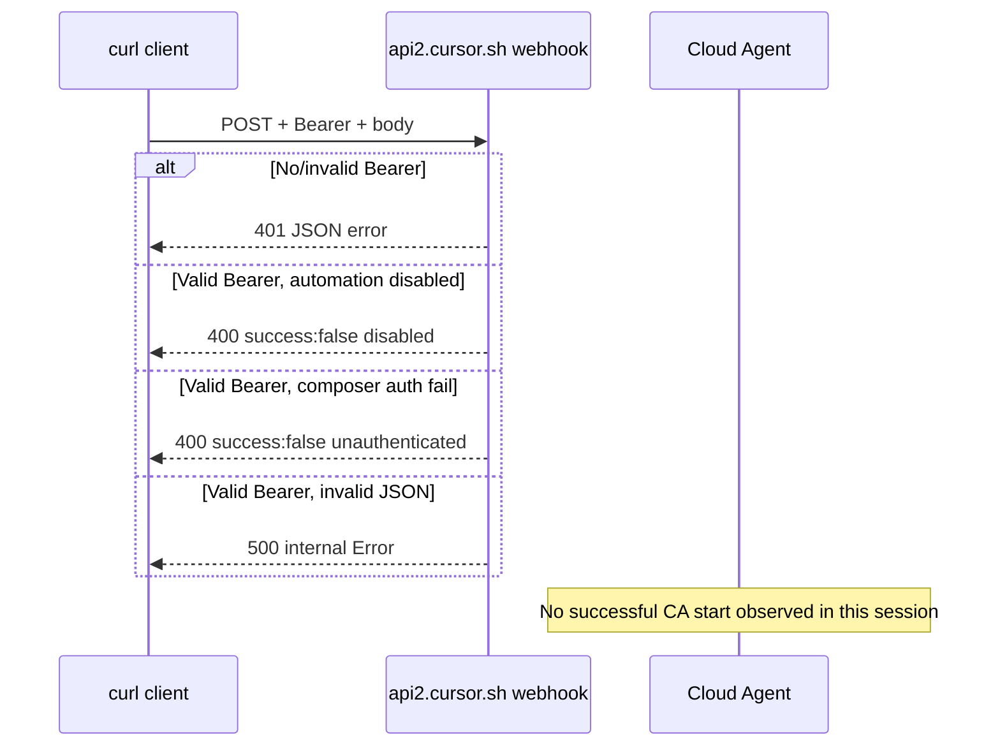

# AI-COMPANY-106 — Cursor Automation Webhook Contract Smoke Test V1

> **Status:** completed (live HTTP contract verified; **no successful agent run** observed)  
> **Date (UTC):** 2026-07-10  
> **Parent research:** [cursor-automations-research-v1.md](./cursor-automations-research-v1.md)  
> **Evidence:** [evidence/ai-company-106/](./evidence/ai-company-106/)

---

## 1. Objective

Экспериментально зафиксировать **фактический HTTP-контракт** inbound Webhook Trigger Cursor Automations на реальном Workspace-аккаунте: auth, request/response, поведение при ошибках, latency, возможность корреляции с execution/run.

Production Adapter **не** создавался.

---

## 2. Environment

| Parameter | Value |
|-----------|-------|
| Repository | `igormahachkala/servicemanager-ai-2.0` (local path) |
| Test branch (intended) | `test/cursor-automation-webhook-contract` |
| Automation name | AI-COMPANY-106 Webhook Contract Smoke (user-saved) |
| Webhook host | `api2.cursor.sh` |
| Webhook path pattern | `/automations/webhook/{automation-uuid}` |
| Client | `curl` from macOS, UTC timestamps |
| Test window | 2026-07-10 ~14:31–14:35 UTC |

---

## 3. Workspace plan and permissions

| Item | Observation |
|------|-------------|
| Webhook endpoint | Responds on `https://api2.cursor.sh/automations/webhook/***REDACTED***` |
| Automation state | Transitioned during session: **disabled** → **enabled** |
| Cloud Agent start | After enable: **blocked** with `[unauthenticated] Error` |
| Successful run | **None observed** in UI/repo during test window |
| GitHub commit from automation | **None** — `tmp/cursor-automation-smoke-result.json` not created |

**Interpretation (factual):** webhook HTTP layer accepts Bearer token, but Workspace could not start background composer in authenticated POST attempts during this session.

---

## 4. Automation configuration

Configured by user in Cursor Automations UI (draft prefilled via Agents Window earlier in session):

- **Trigger:** Webhook (`webhook: {}`)
- **Intended branch:** `test/cursor-automation-webhook-contract`
- **Intended action:** write `tmp/cursor-automation-smoke-result.json`, commit on test branch only
- **Safety:** no PR, no deploy, no external notifications

Exact saved UI config (model, repo binding, tools) — **not exported**; only runtime HTTP behavior captured.

---

## 5. Authentication mechanism

### Confirmed by live test

| Case | Header | HTTP | Body |
|------|--------|------|------|
| No auth | — | **401** | `{"code":"error","message":"Invalid API key or missing required scope"}` |
| Wrong Bearer | `Authorization: Bearer crsr_wrong...` | **401** | same as above |
| Valid Bearer | `Authorization: Bearer crsr_***` | **400** (run not started) | see §9 |

**Contract:** `Authorization: Bearer <webhook-api-key>` where key prefix observed as `crsr_`.

Auth validation occurs **before** automation disabled / composer start errors (401 vs 400 distinction).

---

## 6. Test matrix

See [evidence/ai-company-106/test-matrix.md](./evidence/ai-company-106/test-matrix.md).

All TC-01…TC-09 executed. TC-10 performed as post-run discovery (no runs to inspect).

---

## 7. Raw HTTP contract

### Request

```
POST /automations/webhook/{automation-uuid} HTTP/2
Host: api2.cursor.sh
Authorization: Bearer crsr_***REDACTED***
Content-Type: application/json   (for JSON cases)
```

Optional (accepted at HTTP layer, run still failed):

- Query string: `?source=ai-company&testId=ai-company-106-tc09`
- Custom headers: `X-AI-Company-Test-ID`, `X-AI-Company-Source`

Body: **no documented schema**; server accepts empty body, `{}`, nested JSON, and `text/plain` at HTTP layer.

### Response headers (common)

```
HTTP/2 401|400|500
content-type: application/json; charset=utf-8
vary: Origin
access-control-allow-credentials: true
access-control-expose-headers: Grpc-Status, Grpc-Message, ...
```

### Response bodies observed

**401 — missing/invalid Bearer**

```json
{"code":"error","message":"Invalid API key or missing required scope"}
```

**400 — automation disabled (early phase)**

```json
{"success":false,"error":"Automation ***AUTOMATION_ID_REDACTED*** is disabled"}
```

**400 — enabled but composer failed (later phase)**

```json
{"success":false,"error":"Failed to start background composer: [unauthenticated] Error"}
```

**500 — malformed JSON body**

```json
{"code":"internal","message":"Error"}
```

### Latency (curl `time_total`)

| Case | Typical range |
|------|---------------|
| 401 auth reject | ~0.55–0.66 s |
| 400 composer fail | ~1.1–1.5 s |
| 500 invalid JSON | ~0.52 s |

---

## 8. Payload visibility

| Question | Live result |
|----------|-------------|
| JSON body accepted at HTTP layer? | **Yes** (returns 400 composer error, not 415) |
| Empty body accepted? | **Yes** (with valid auth) |
| `text/plain` accepted? | **Yes** (HTTP 400, same composer error) |
| Payload visible to agent? | **Not observed** — no run reached execution |
| Nested structure preserved? | **Unknown** — no agent output |
| Query string visible to agent? | **Unknown** |
| Custom headers visible to agent? | **Unknown** |

---

## 9. Response contract

| Field | Observed |
|-------|----------|
| `success: true` | **Never observed** |
| `success: false` | **Yes** on 400 errors |
| `error` string | **Yes** — human-readable reason |
| `code` | **Yes** on 401/500 (`error`, `internal`) |
| Execution / run ID | **No** — absent in all responses |
| Agent URL | **No** |
| Status polling hint | **No** |
| Idempotency key echo | **No** |

**Immediate acknowledgement:** HTTP response returns in **< 2 s**; does **not** block until automation completes (TC-07 timing confirms even failed enqueue is fast).

---

## 10. Execution lifecycle observations



| Lifecycle step | Observed |
|----------------|----------|
| Webhook accepted (HTTP) | Yes (401/400/500, never hung) |
| Run enqueued | **Not confirmed** |
| Run RUNNING | **No** |
| Commit pushed | **No** |
| Correlation token returned | **No** |

---

## 11. Result discovery (TC-10)

Methods checked / applicable:

| Method | Result this session |
|--------|---------------------|
| HTTP response body | **No** execution id / result |
| Cursor Automations UI / runs | **Not captured** (no successful run) |
| Git commit on test branch | **No** new commits |
| `tmp/cursor-automation-smoke-result.json` | **Not created** |
| PR / diff | **N/A** |
| Cloud Agents API polling | **Not attempted** (no run id) |
| Slack / email side effect | **Not configured / not observed** |
| Outbound webhook callback | **N/A** |

---

## 12. Duplicate and idempotency behavior (TC-06)

Two identical POSTs with same `testId` (`ai-company-106-tc06-dup`):

- Both returned **400** `Failed to start background composer: [unauthenticated] Error`
- **No evidence** of deduplication or idempotency key support
- **No** separate commits (no runs)

**Conclusion:** idempotency **not confirmed** (success path required).

---

## 13. Timeout behavior (TC-07)

| Metric | Value |
|--------|-------|
| HTTP response time | ~1.44 s |
| Client timeout | Not hit (default curl) |
| Server waits for agent completion | **No** — response immediate |
| Agent continues after response | **Unknown** — run never started |

---

## 14. Workspace limitations discovered

1. Automation must be **enabled** — disabled → explicit 400 error.
2. Even with valid webhook auth, Workspace returned **`[unauthenticated] Error`** when starting background composer.
3. Test branch may not exist on remote — local branch only at test time; may block repo-backed runs once composer works.
4. Invalid JSON → **500 internal** (not 400 validation error).

---

## 15. Security observations

- Webhook key **required** — unauthenticated POST rejected.
- Committed evidence **redacts** Bearer token, automation UUID, full URL.
- User pasted live token in chat — **rotate/regenerate** webhook key after testing recommended.
- Do not store webhook keys in repository (`.ai-company/cursor-automation-webhook.env` gitignored).

---

## 16. Confirmed facts (live smoke test)

1. URL: `https://api2.cursor.sh/automations/webhook/{uuid}`
2. Auth: `Authorization: Bearer crsr_...`
3. Missing/invalid auth → **401** with `Invalid API key or missing required scope`
4. Valid auth errors → **400** with `success:false` and `error` string
5. Malformed JSON → **500** `internal`
6. JSON and text/plain bodies reach HTTP handler (not 415)
7. HTTP response is **fast** and **non-blocking** for agent completion
8. **No execution/run identifier** in HTTP response (success or failure)
9. Disabled automation → explicit error before composer start

---

## 17. Unconfirmed capabilities (still)

| Capability | Reason |
|------------|--------|
| `success: true` response shape | No successful enqueue |
| Execution / run ID in response | Never returned |
| Payload → agent prompt mapping | No run output |
| Query/header forwarding to agent | No run output |
| Idempotency / dedup | Success path not reached |
| Duplicate → two runs | Success path not reached |
| Result via commit/PR | No run |
| Webhook rate limits | Not hit |
| Max payload size | Not tested to failure |

---

## 18. Risks

| Risk | Severity |
|------|----------|
| No run ID → cannot correlate ToolExecutionRun | **Critical** for Path A |
| Workspace composer `[unauthenticated]` opaque failure | **High** |
| Error body inconsistency (`code` vs `success`) | Medium |
| 500 on bad JSON vs 400 on business errors | Medium |
| Secret pasted in chat / logs | Medium — rotate key |

---

## 19. Recommendation

### Decision table

| Capability | Official docs | Live test | Adapter impact |
|------------|---------------|-----------|----------------|
| External Automation trigger | Confirmed | **Partial** (HTTP yes, run no) | Trigger unreliable until workspace fixed |
| Authentication contract | Partial | **Confirmed** | Can implement Bearer auth |
| JSON payload accepted | No | **Confirmed** (HTTP) | OK for request body |
| Payload accessible to agent | No | **No** | Blocker for task-id in prompt |
| Immediate HTTP acknowledgement | No | **Confirmed** | Async model required |
| Execution ID returned | No | **No** | **Blocker** for correlation |
| Status polling available | No (Automations) | **No** | Need Cloud Agents API or side channel |
| Structured result returned | No | **No** | Blocker |
| Completion callback available | No | **No** | Blocker |
| Duplicate protection available | No | **No** | Unknown |
| Commit or PR discoverable | No | **No** | No run |

### Architectural choice: **Path B — Cloud Agents API v1**

**Rationale (facts only):**

1. Webhook **auth contract** is usable, but **no successful run** and **no execution identifier** in HTTP response.
2. Cannot correlate inbound webhook POST → ToolExecutionRun without undocumented/indirect discovery.
3. Cloud Agents API v1 documents run IDs, status polling, SSE, cancel, artifacts — required for Builder execution observability.
4. Workspace blocker (`[unauthenticated] Error`) affects Automations generally; API path should be validated separately but is the documented programmatic surface.

### Path C (Hybrid) — deferred

Revisit Automations webhook for **scheduled/event-native** triggers **after**:

- successful smoke rerun with green composer start,
- confirmed payload visibility,
- confirmed result discovery (commit or UI run id).

Until then, **Local Cursor Bridge** remains fallback for controlled handoff (AI-COMPANY-113E).

### Follow-up for user (workspace)

Before re-running smoke test:

1. Enable automation in Cursor Automations UI.
2. Fix Cloud Agent / GitHub integration auth (dashboard → Cloud Agents → integrations).
3. Push `test/cursor-automation-webhook-contract` to GitHub.
4. Regenerate webhook API key (token was exposed in chat).
5. Re-run TC-03 only; confirm run in UI + commit in repo.

---

## Evidence index

| File | Content |
|------|---------|
| `tc-01-request.txt` … `tc-09-request.txt` | Sanitized curl |
| `tc-01-response.txt` … `tc-09-response.txt` | Sanitized HTTP responses |
| `tc-08a/b/c-*` | Auth matrix |
| `tc-06a/b-*` | Duplicate attempts |
| `test-matrix.md` | Summary table |

---

## Research metadata

| Field | Value |
|-------|-------|
| Task | AI-COMPANY-106 |
| Production code | None |
| Commit scope | docs/research only |
| Live token handling | gitignored local env only |
