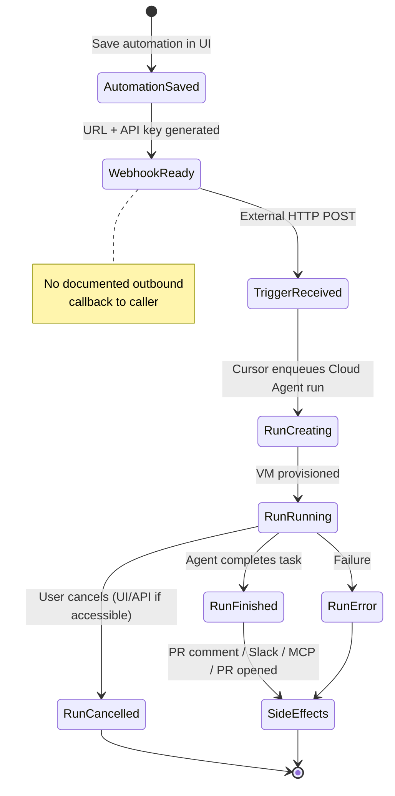
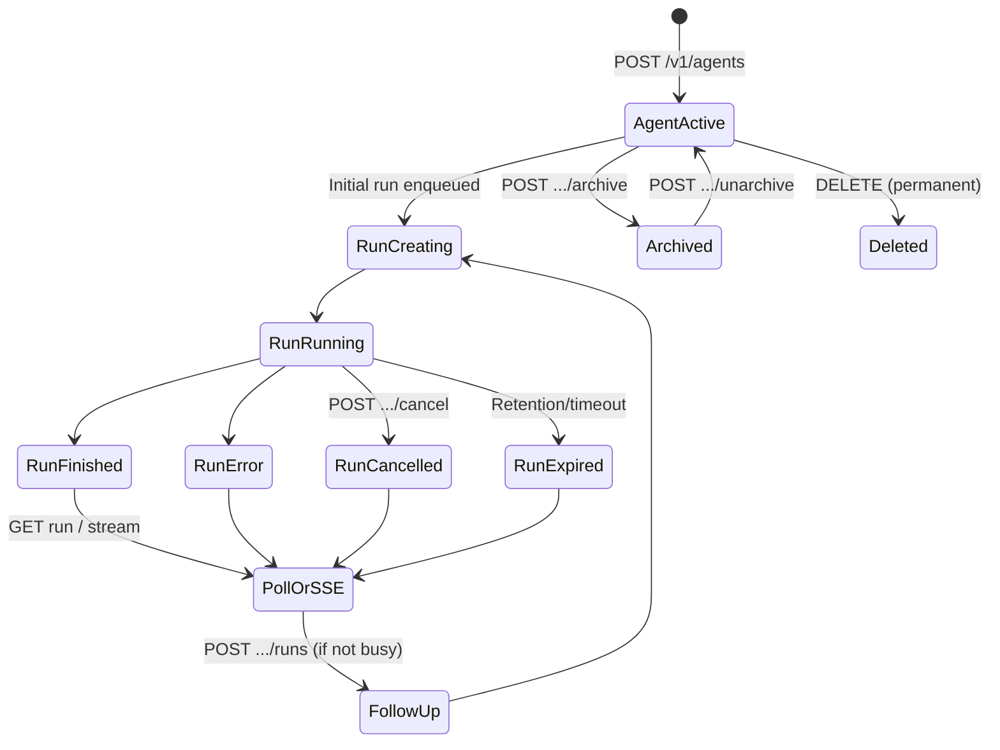

# AI-COMPANY-105 — Cursor Automations Technical Research V1

> **Статус:** исследование завершено (только факты из официальной документации Cursor)  
> **Дата:** 2026-07-10  
> **Scope:** официальные возможности Cursor Automations и связанный Cloud Agents API  
> **Out of scope:** production-интеграция, адаптер, архитектурные решения

---

## Executive Summary

Cursor предоставляет **два связанных, но разных** механизма запуска cloud agents:

| Механизм | Назначение | Программный запуск извне |
|----------|------------|--------------------------|
| **Cursor Automations** | Конфигурируемые workflows (триггеры + prompt + tools) в UI | **Частично:** inbound **Webhook (HTTP POST)** после сохранения automation; **нет** публичного REST CRUD API для Automations |
| **Cloud Agents API** (v1 public beta, v0 legacy) | Программное создание/управление cloud agents и runs | **Да:** `https://api.cursor.com` + API key (Basic/Bearer) |

Automations **всегда** создают Cloud Agent runs, но **не управляются** через Cloud Agents API как named automation resources. Для интеграции «запустить сохранённый workflow по HTTP» официально документирован только **Webhook trigger** Automations. Для «создать agent/run с произвольным prompt» — **Cloud Agents API**.

---

## 1. Trigger

### 1.1 Можно ли запускать Automation извне?

**Да, частично — через Webhook trigger.**

Официально: Webhook triggers создают private HTTP endpoint; **POST к endpoint запускает run**. URL и API key выдаются **после сохранения** automation в dashboard.

- Источник: [Automations — Webhook triggers](https://cursor.com/docs/cloud-agent/automations#webhook-triggers)
- Источник: [Help — Automations (таблица триггеров)](https://cursor.com/help/ai-features/automations#which-triggers-are-available)

**Нет** официального публичного API для:
- создания/обновления/удаления Automations;
- запуска automation по ID через Cloud Agents API;
- CLI-команды «trigger saved automation».

Создание automation — через UI (`cursor.com/automations`), Agents Window, skill `/automate`, marketplace templates.

- Источник: [Automations — Getting started](https://cursor.com/docs/cloud-agent/automations#getting-started)
- Skill `/automate`: creation-only, finish через `open_automation` (локальный Agents Window handoff, не HTTP API)

### 1.2 Webhook Trigger

**Существует.** Подтверждено официально.

| Аспект | Статус | Источник |
|--------|--------|----------|
| Тип | Inbound HTTP POST | [automations#webhook-triggers](https://cursor.com/docs/cloud-agent/automations#webhook-triggers) |
| URL | Генерируется после save | Там же |
| Auth | API key (выдаётся в dashboard) | Там же |
| Метод | POST | [help/automations](https://cursor.com/help/ai-features/automations) |

**Не документировано официально** (отмечено в § «Неподтверждённое»):
- точный URL path/host;
- формат заголовка Authorization;
- schema тела POST;
- формат HTTP response (execution id, status).

### 1.3 HTTP Trigger

**Да — Webhook trigger и есть HTTP trigger** (private endpoint, POST).

Отдельного «generic HTTP GET trigger» или публичного «Automation Run API» в документации **нет**.

### 1.4 API запуска

**Для Automations — нет** dedicated Automation Run API в официальной документации.

**Для Cloud Agents — да:**

| API | Endpoint | Назначение |
|-----|----------|------------|
| v1 (beta) | `POST /v1/agents` | Создать agent + initial run |
| v1 | `POST /v1/agents/{id}/runs` | Follow-up run |
| v0 (legacy) | `POST /v0/agents` | Launch agent |

- Источник: [Cloud Agents API v1](https://cursor.com/docs/cloud-agent/api/endpoints)
- Источник: [Cloud Agents API v0](https://cursor.com/docs/cloud-agent/api/v0)

Это **не эквивалент** запуска сохранённой Automation (нет полей automationId, inherited triggers/tools config).

### 1.5 CLI запуск

**Cloud Agents через CLI — да.** Cursor CLI (`agent`) поддерживает API key auth через `CURSOR_API_KEY` или `--api-key`.

- Источник: [CLI Authentication](https://cursor.com/docs/cli/reference/authentication)

**Запуск сохранённой Automation через CLI — не документирован.** CLI создаёт ad-hoc agent sessions, не триггерит named automation workflow.

Service accounts (Enterprise) могут auth CLI и API для cloud agent runs:

- Источник: [Service Accounts](https://cursor.com/docs/account/enterprise/service-accounts)

### 1.6 Внутренние ограничения триггеров (подтверждённые)

| Ограничение | Детали | Источник |
|-------------|--------|----------|
| Multi-trigger OR | Automation запускается при срабатывании **любого** триггера | [automations#triggers](https://cursor.com/docs/cloud-agent/automations#triggers) |
| Scheduled delay | Cron может стартовать с задержкой, но не раньше указанного времени | [automations#scheduled-triggers](https://cursor.com/docs/cloud-agent/automations#scheduled-triggers) |
| Fork PRs | PR из fork не поддерживаются (кроме merged trigger) | [automations#source-control-triggers](https://cursor.com/docs/cloud-agent/automations#source-control-triggers) |
| Slack channels | Только public channels для Slack triggers | [automations#slack-triggers](https://cursor.com/docs/cloud-agent/automations#slack-triggers) |
| Webhook после save | URL/key только после сохранения automation | [automations#webhook-triggers](https://cursor.com/docs/cloud-agent/automations#webhook-triggers) |
| Team Owned scope change | После promote — regenerate webhook API key; MCP OAuth → service account | [automations#permissions](https://cursor.com/docs/cloud-agent/automations#permissions) |
| Max Mode | Automations **всегда** Max Mode, toggle off недоступен | [automations#billing](https://cursor.com/docs/cloud-agent/automations#billing) |

### 1.7 Полный список триггеров Automations

Scheduled (cron), GitHub/GitLab/Bitbucket events, Slack, **Webhook**, Linear, Sentry, PagerDuty.

- Источник: [automations#triggers](https://cursor.com/docs/cloud-agent/automations#triggers)
- Источник: [help/automations](https://cursor.com/help/ai-features/automations)

---

## 2. Cloud Agents API

### 2.1 Существует ли официальный API?

**Да.** Cloud Agents API — public beta (v1), legacy v0.

- Base URL: `https://api.cursor.com`
- Источник: [Cloud Agents API v1](https://cursor.com/docs/cloud-agent/api/endpoints)
- Обзор auth/rate limits: [Cursor APIs Overview](https://cursor.com/docs/api)

**Важно:** API управляет **agents/runs**, не **Automations** как конфигурациями workflow.

### 2.2 Доступные endpoints (v1)

| Группа | Method | Path | Назначение |
|--------|--------|------|------------|
| Agents | POST | `/v1/agents` | Create agent + initial run |
| Agents | GET | `/v1/agents` | List agents |
| Agents | GET | `/v1/agents/{id}` | Get agent |
| Runs | POST | `/v1/agents/{id}/runs` | Create follow-up run |
| Runs | GET | `/v1/agents/{id}/runs` | List runs |
| Runs | GET | `/v1/agents/{id}/runs/{runId}` | Get run (status, result, git) |
| Runs | GET | `/v1/agents/{id}/runs/{runId}/stream` | SSE stream |
| Runs | POST | `/v1/agents/{id}/runs/{runId}/cancel` | Cancel run |
| Usage | GET | `/v1/agents/{id}/usage` | Token usage per run |
| Artifacts | GET | `/v1/agents/{id}/artifacts` | List artifacts |
| Artifacts | GET | `/v1/agents/{id}/artifacts/download` | Presigned URL (15 min) |
| Lifecycle | POST | `/v1/agents/{id}/archive` | Archive |
| Lifecycle | POST | `/v1/agents/{id}/unarchive` | Unarchive |
| Lifecycle | DELETE | `/v1/agents/{id}` | Permanent delete |
| Models | GET | `/v1/models` | List models + params |
| Repos | GET | `/v1/repositories` | List GitHub repos (strict rate limit) |
| Worker tokens | POST | `/v1/sub-tokens` | User-scoped worker token (Enterprise) |

Источник: [Cloud Agents API v1 — Endpoints](https://cursor.com/docs/cloud-agent/api/endpoints)

**v0 legacy** (миграция на v1): `/v0/agents`, followup, stop, conversation, artifacts, webhooks on create.

- Источник: [Cloud Agents API v0](https://cursor.com/docs/cloud-agent/api/v0)

**v1 webhooks:** «Webhooks are coming soon»; v0 поддерживает outbound webhooks.

- Источник: [Cloud Agents API v1 intro](https://cursor.com/docs/cloud-agent/api/endpoints)

### 2.3 OAuth

**Для Cloud Agents API — нет.** Auth через API keys (Basic или Bearer).

OAuth документирован для **MCP integrations** (per-user, team-shared servers), не для REST API keys.

- Источник: [Capabilities — MCP OAuth](https://cursor.com/docs/cloud-agent/capabilities#mcp-tools)
- Источник: [API Overview — Authentication](https://cursor.com/docs/api)

### 2.4 API Keys

**Да.**

| Тип ключа | Где создать | Использование |
|-----------|-------------|---------------|
| User API key | Dashboard → API Keys | API + CLI |
| Service account key | Dashboard → API Keys → Service Accounts (Enterprise) | API + CLI, team usage pool |
| Automation webhook key | Dashboard automation (после save) | Inbound webhook trigger only |

- User/CLI: [CLI Authentication](https://cursor.com/docs/cli/reference/authentication)
- Service accounts: [Service Accounts](https://cursor.com/docs/account/enterprise/service-accounts)
- Webhook: [automations#webhook-triggers](https://cursor.com/docs/cloud-agent/automations#webhook-triggers)

Auth schemes для `api.cursor.com`:
- Basic: `-u YOUR_API_KEY:` (password empty)
- Bearer: `Authorization: Bearer YOUR_API_KEY`

- Источник: [API Overview](https://cursor.com/docs/api)

### 2.5 Необходимые права

| Контекст | Требования |
|----------|------------|
| Cloud Agents API | Valid API key; доступ к repo через Cursor GitHub app |
| Service accounts | Enterprise plan; team-level GitHub integration для repo access |
| Automations webhook | Key привязан к конкретной automation (regenerate при scope change) |
| Team Owned automations | Team admin для promote; shared service account identity |

- [Service Accounts — Repository access](https://cursor.com/docs/account/enterprise/service-accounts)
- [Automations — Permissions & Identity](https://cursor.com/docs/cloud-agent/automations#permissions)

---

## 3. Execution Lifecycle

### 3.1 Как создаётся запуск

**Automation path:**
1. Trigger fires (cron, git event, Slack, webhook POST, Linear, Sentry, PagerDuty)
2. Cursor создаёт **Cloud Agent run** с конфигурацией automation (prompt, model, repos, tools)
3. Run выполняется в isolated VM

**Cloud Agents API path:**
1. `POST /v1/agents` → agent (`ACTIVE`) + run (`CREATING`)
2. Run transitions через lifecycle states
3. Follow-up: `POST /v1/agents/{id}/runs` (409 `agent_busy` если run уже active)

### 3.2 Состояния выполнения

**Run statuses (v1):** `CREATING`, `RUNNING`, `FINISHED`, `ERROR`, `CANCELLED`, `EXPIRED`

**Agent status (v1):** `ACTIVE` (durable identity)

**v0 agent statuses:** `CREATING`, `RUNNING`, `FINISHED`, `ERROR` (flatter model)

- Источник: [Get A Run — v1](https://cursor.com/docs/cloud-agent/api/endpoints)
- Источник: [Agent Status — v0](https://cursor.com/docs/cloud-agent/api/v0)

### 3.3 Статус выполнения

**Cloud Agents API — да:**
- `GET /v1/agents/{id}/runs/{runId}` — polling
- `GET .../stream` — SSE real-time
- `latestRunId` на agent record

**Automation-specific run API — не документирован.** Нет публичного REST «get automation run by webhook invocation id».

Diagnostics: Cursor Cloud MCP tool `get-automation` (by automation ID) — для agent-side inspection, не integration API.

- Источник: [Capabilities — Cursor Cloud MCP](https://cursor.com/docs/cloud-agent/capabilities#cursor-cloud-mcp)

### 3.4 Отмена

**Cloud Agents API v1:** `POST /v1/agents/{id}/runs/{runId}/cancel` → `CANCELLED` (terminal).

**v0:** `POST /v0/agents/{id}/stop` — pause (follow-up может restart).

**Automation run cancel API — не документирован** для external integrators.

### 3.5 Очередь

**Не документировано** для Automations (parallel runs, queue depth, FIFO).

**Cloud Agents API:** one active run per agent (`409 agent_busy`).

### 3.6 Повторный запуск

| Механизм | Подтверждение |
|----------|---------------|
| Re-trigger automation | Каждый trigger event → новый run (implicit) |
| Follow-up prompt | `POST /v1/agents/{id}/runs` |
| Re-POST webhook | Документировано: POST starts a run (each POST = new run, implicit) |
| Idempotent create | v1 `agentId` client-supplied → `409 agent_id_conflict` on duplicate |

### 3.7 Диаграмма жизненного цикла

#### Automation (Webhook trigger → Cloud Agent run)



#### Cloud Agents API v1 (programmatic)



---

## 4. Callback

### 4.1 Callback после завершения Automation

**Outbound webhook callback для Automation runs — не документирован.**

Результаты доставляются через **side-effect tools**, настроенные в automation:
- Comment on PR
- Send to Slack
- MCP actions
- Pull request creation (default enabled for repo-backed)

- Источник: [Automations — Tools](https://cursor.com/docs/cloud-agent/automations#tools)

### 4.2 Webhook callback (outbound)

| Контекст | Поддержка | Источник |
|----------|-----------|----------|
| Automation completion → your URL | **Не документировано** | — |
| Cloud Agents API v0 create with `webhook.url` | **Да** — `statusChange` on `FINISHED`/`ERROR` | [Webhooks v0](https://cursor.com/docs/cloud-agent/api/webhooks) |
| Cloud Agents API v1 | **Coming soon** | [API v1 intro](https://cursor.com/docs/cloud-agent/api/endpoints) |

v0 webhook payload example:

```json
{
  "event": "statusChange",
  "timestamp": "2024-01-15T10:30:00Z",
  "id": "bc_abc123",
  "status": "FINISHED",
  "source": { "repository": "https://github.com/your-org/your-repo", "ref": "main" },
  "target": {
    "url": "https://cursor.com/agents?id=bc_abc123",
    "branchName": "cursor/add-readme-1234",
    "prUrl": "https://github.com/your-org/your-repo/pull/1234"
  },
  "summary": "Added README.md with installation instructions"
}
```

Verification: HMAC-SHA256 via `X-Webhook-Signature: sha256=<hex>`.

### 4.3 Polling

**Cloud Agents API v1:** `GET /v1/agents/{id}/runs/{runId}` — terminal fields `result`, `durationMs`, `git`.

### 4.4 SSE

**Cloud Agents API v1:** `GET /v1/agents/{id}/runs/{runId}/stream`

Event types: `status`, `assistant`, `thinking`, `tool_call`, `interaction_update`, `heartbeat`, `result`, `error`, `done`.

Resume via `Last-Event-ID`. Retention header `X-Cursor-Stream-Retention-Seconds`; `410 stream_expired` after window.

- Источник: [Stream A Run — v1](https://cursor.com/docs/cloud-agent/api/endpoints)

### 4.5 WebSocket

**Не документирован** для Cloud Agents / Automations integration.

### 4.6 Другие способы уведомления

- GitHub PR comments / approvals (automation tool)
- Slack messages (automation tool)
- Artifacts on PR (screenshots, videos)
- Cursor dashboard / Agents Window UI
- Cursor Cloud MCP diagnostics (`run-info`, `batch-fetch-details`)

---

## 5. Payload

### 5.1 Automation Webhook (inbound) — что можно передать

**Официально документировано:**
- POST body отправляется на private endpoint
- Auth via API key from dashboard

**Не документировано официально:**
- JSON schema body
- mapping fields → prompt variables
- max payload size
- Content-Type requirements

Automation configuration (fixed at save time, not per-request via API):
- prompt/instructions
- model selection
- repository(s) / environment
- enabled tools (PR comment, Slack, MCP, memories, computer use)
- triggers config

- Источник: [Automations](https://cursor.com/docs/cloud-agent/automations)

### 5.2 Cloud Agents API v1 create — что можно передать

| Поле | Поддержка | Лимиты / notes |
|------|-----------|----------------|
| `prompt.text` | ✅ required | Instruction text |
| `prompt.images` | ✅ optional | Max 5, 15 MB each; png/jpeg/gif/webp |
| `model.id`, `model.params` | ✅ optional | From `GET /v1/models` |
| `name` | ✅ optional | Max 100 chars |
| `repos[]` | ✅ optional | Max 20; `url`, `startingRef`, `prUrl` |
| `env` | ✅ optional | `cloud` / `pool` / `machine` |
| `workOnCurrentBranch` | ✅ optional | Default false → `cursor/...` branch |
| `autoCreatePR` | ✅ optional | |
| `envVars` | ✅ beta | Max 50 entries; value max 4096 bytes; names max 255, no `CURSOR_` prefix |
| `mcpServers[]` | ✅ optional | Max 50; http/sse/stdio |
| `customSubagents[]` | ✅ optional | Max 20 |
| `mode` | ✅ optional | `agent` or `plan` |
| `agentId` | ✅ optional | Idempotent create; mutually exclusive with `envVars` |

**Не через API v1 create:**
- arbitrary file upload in request body (files live in repo or artifacts output)
- `owner` field
- generic `metadata` / custom fields block

Пример create:

```bash
curl --request POST \
  --url https://api.cursor.com/v1/agents \
  -u YOUR_API_KEY: \
  --header 'Content-Type: application/json' \
  --data '{
    "prompt": { "text": "Add a README with setup instructions" },
    "repos": [{ "url": "https://github.com/your-org/your-repo", "startingRef": "main" }],
    "autoCreatePR": true
  }'
```

- Источник: [Create An Agent — v1](https://cursor.com/docs/cloud-agent/api/endpoints)

### 5.3 Secrets / environment

Dashboard secrets (not inline in Automation webhook):
- Environment Variable
- Runtime Secret (redacted in transcripts/commits)
- Build Secret (Docker build only)

- Источник: [Security & Network — Secret protection](https://cursor.com/docs/cloud-agent/security-network)
- Источник: [Cloud Environment Setup — Secrets](https://cursor.com/docs/cloud-agent/setup)

API session secrets: `envVars` on create (encrypted at rest, deleted with agent).

---

## 6. Result

### 6.1 Automation run result (external integrator view)

**Не документирован structured JSON response** от webhook trigger POST.

Observed outputs (через side effects, не return payload):
- PR opened / branch pushed
- PR comment / Slack message
- MCP tool side effects
- Artifacts on PR (if enabled)

Run inspection возможен **косвенно** через Cloud Agents UI или Cursor Cloud MCP, если integrator знает agent/run IDs — но связь webhook invocation → run ID **не документирована**.

### 6.2 Cloud Agents API v1 result

**Get A Run (terminal):**

```json
{
  "id": "run-00000000-0000-0000-0000-000000000001",
  "agentId": "bc-00000000-0000-0000-0000-000000000001",
  "status": "FINISHED",
  "createdAt": "2026-04-13T18:30:00.000Z",
  "updatedAt": "2026-04-13T18:45:00.000Z",
  "durationMs": 12357,
  "result": "Added README.md with installation instructions and usage examples.",
  "git": {
    "branches": [{
      "repoUrl": "github.com/your-org/your-repo",
      "branch": "cursor/add-readme-a1b2",
      "prUrl": "https://github.com/your-org/your-repo/pull/123"
    }]
  }
}
```

**Create response** returns `agent` + initial `run` with ids.

**Artifacts:** `GET /v1/agents/{id}/artifacts` → presigned download URL (15 min).

**Conversation:** via agent UI; v0 has `/conversation` endpoint.

**Usage:** `GET /v1/agents/{id}/usage` — token counts per run.

**Errors:** run status `ERROR`; stream `error` events; HTTP 4xx/5xx on API.

---

## 7. Authentication

### 7.1 Механизмы (подтверждённые)

| Механизм | Где | Документация |
|----------|-----|--------------|
| **User API Key** (Basic/Bearer) | `api.cursor.com`, CLI | [API Overview](https://cursor.com/docs/api), [CLI Auth](https://cursor.com/docs/cli/reference/authentication) |
| **Service Account API Key** (Enterprise) | API, CLI, cloud agents | [Service Accounts](https://cursor.com/docs/account/enterprise/service-accounts) |
| **Automation Webhook API Key** | Inbound webhook only | [automations#webhook-triggers](https://cursor.com/docs/cloud-agent/automations#webhook-triggers) |
| **Browser login (CLI)** | Interactive CLI | [CLI Auth](https://cursor.com/docs/cli/reference/authentication) |
| **MCP OAuth** | MCP servers (not REST API) | [Capabilities](https://cursor.com/docs/cloud-agent/capabilities) |
| **v0 outbound webhook secret** | HMAC verification | [Webhooks](https://cursor.com/docs/cloud-agent/api/webhooks) |
| **Worker sub-tokens** | My Machines (1h, service account) | [Cloud Agents API v1](https://cursor.com/docs/cloud-agent/api/endpoints) |

### 7.2 Не документировано для integration API

| Механизм | Статус |
|----------|--------|
| OAuth для Cloud Agents REST | ❌ |
| Workspace Token (отдельный тип) | ❌ (используются API keys) |
| PAT (GitHub-style) | ❌ |
| Session Token (browser session для API) | ❌ |

### 7.3 Auth errors (API Overview)

- `401` — invalid API key
- `403` — insufficient permissions
- `429` — rate limit

---

## 8. Limits

### 8.1 Тарифы / billing

Automations billed as **Cloud Agent usage** at **API pricing** for selected model.

- Always **Max Mode** (no toggle off)
- Team Owned → team usage pool + shared service account
- Private / Team Visible → creator's usage

Plans with Cloud Agents access: Pro, Pro Plus, Ultra (individual); Teams, Enterprise (business).

- Источник: [Automations — Billing](https://cursor.com/docs/cloud-agent/automations#billing)
- Источник: [Models & Pricing](https://cursor.com/docs/account/pricing)

Teams: Cursor Token Rate $0.25/M tokens on non-Auto third-party models.

### 8.2 API rate limits

Per team, reset every minute. Cloud Agents API: «Standard rate limiting» (exact numbers not published).

`429` response:

```json
{
  "error": "Too Many Requests",
  "message": "Rate limit exceeded. Please try again later."
}
```

Documented endpoint-specific limits:
- `GET /v1/repositories` (and v0): **1 req/min, 30 req/hour** per user
- v0 artifacts list/download: **300 req/min, 6000 req/hour**

- Источник: [API Overview — Rate Limits](https://cursor.com/docs/api)
- Источник: [List GitHub Repositories — v1](https://cursor.com/docs/cloud-agent/api/endpoints)

### 8.3 Execution limits (подтверждённые)

| Limit | Value | Источник |
|-------|-------|----------|
| Active runs per agent | 1 (`409 agent_busy`) | [Create A Run — v1](https://cursor.com/docs/cloud-agent/api/endpoints) |
| Repos per agent | Max 20 | [Create An Agent — v1](https://cursor.com/docs/cloud-agent/api/endpoints) |
| Images per prompt | Max 5, 15 MB each | Там же |
| envVars | Max 50; value 4096 bytes | Там же |
| mcpServers | Max 50 | Там же |
| customSubagents | Max 20 | Там же |
| Agent name | Max 100 chars | Там же |
| Artifact presigned URL | 15 minutes | [Download An Artifact — v1](https://cursor.com/docs/cloud-agent/api/endpoints) |
| SSE stream retention | Header `X-Cursor-Stream-Retention-Seconds`; then `410` | [Stream A Run — v1](https://cursor.com/docs/cloud-agent/api/endpoints) |
| v0 artifacts age | Agents older than 6 months → `400` | [v0 Artifacts](https://cursor.com/docs/cloud-agent/api/v0) |
| VM resources | Default profile; Enterprise can request more | [Setup — Resource limits](https://cursor.com/docs/cloud-agent/setup) |
| Environment snapshots | 90 days inactivity retention | [Security — Data retention](https://cursor.com/docs/cloud-agent/security-network) |
| CI autofix follow-ups | Max 10 per PR | [Capabilities](https://cursor.com/docs/cloud-agent/capabilities) |

### 8.4 Не документировано

- Max parallel automation runs per team/user
- Webhook payload size limit
- Automation run timeout (wall-clock)
- Max log size via API
- Automation webhook rate limit

---

## 9. Security

### 9.1 Secrets

| Type | Visibility to agent | Storage |
|------|---------------------|---------|
| Environment Variable | Visible | Encrypted at rest + in transit |
| Runtime Secret | Redacted as `[REDACTED]` in transcripts/commits; still in terminal env | Encrypted |
| Build Secret | Docker build only | Encrypted |
| API `envVars` | Session-scoped shell env | Encrypted at rest, deleted with agent |

- Источник: [Security & Network — Secret protection](https://cursor.com/docs/cloud-agent/security-network)
- Источник: [Setup — Secrets tab](https://cursor.com/docs/cloud-agent/setup)

MCP sensitive fields (`env`, `headers`, `CLIENT_SECRET`) redacted after save — cannot read back.

- Источник: [Capabilities — Custom MCP servers](https://cursor.com/docs/cloud-agent/capabilities)

### 9.2 Execution security

- Isolated AWS VMs; code on VM disks while agent accessible
- Internet access by default; egress controls configurable (user/team/environment)
- Auto-run terminal commands (unlike foreground agent) — prompt injection / exfiltration risk documented
- Signed commits (HSM Ed25519)
- Privacy Mode supported; Legacy Privacy Mode **not** supported for Cloud Agents

- Источник: [Security & Network](https://cursor.com/docs/cloud-agent/security-network)

### 9.3 Automation-specific

- Memories persist across runs — risk with untrusted input
- MCP gives agent all tools on connected server — trust boundary
- Team Owned automations → regenerate webhook key after promote
- Protected Git Scopes (Enterprise)

- Источник: [Automations — Memories](https://cursor.com/docs/cloud-agent/automations#memories)
- Источник: [Automations — Permissions](https://cursor.com/docs/cloud-agent/automations#permissions)

### 9.4 Best practices (official)

- Verify webhook signatures (v0 outbound)
- Use HTTPS for webhook endpoints
- Return 2xx quickly; handle retries
- Prefer HTTP MCP over stdio
- Use Runtime Secrets for credentials
- Do not allowlist broad S3 wildcards for artifact uploads
- Rotate service account keys regularly

- Источник: [Webhooks — Best practices](https://cursor.com/docs/cloud-agent/api/webhooks)
- Источник: [Service Accounts — Security best practices](https://cursor.com/docs/account/enterprise/service-accounts)
- Источник: [Security — Artifact uploads](https://cursor.com/docs/cloud-agent/security-network)

---

## 10. Documentation — Official Sources

| Topic | URL |
|-------|-----|
| **Automations** | https://cursor.com/docs/cloud-agent/automations |
| **Help: Automations** | https://cursor.com/help/ai-features/automations |
| **Cloud Agents overview** | https://cursor.com/docs/cloud-agent |
| **Cloud Agents API v1** | https://cursor.com/docs/cloud-agent/api/endpoints |
| **Cloud Agents API v0 (legacy)** | https://cursor.com/docs/cloud-agent/api/v0 |
| **Webhooks (v0 outbound)** | https://cursor.com/docs/cloud-agent/api/webhooks |
| **API Overview (auth, rate limits)** | https://cursor.com/docs/api |
| **Capabilities** | https://cursor.com/docs/cloud-agent/capabilities |
| **Environment setup & secrets** | https://cursor.com/docs/cloud-agent/setup |
| **Security & network** | https://cursor.com/docs/cloud-agent/security-network |
| **CLI authentication** | https://cursor.com/docs/cli/reference/authentication |
| **Service accounts (Enterprise)** | https://cursor.com/docs/account/enterprise/service-accounts |
| **Pricing** | https://cursor.com/docs/account/pricing |
| **Changelog** | https://cursor.com/changelog |
| **Automations UI** | https://cursor.com/automations |
| **Cloud Agents dashboard** | https://cursor.com/dashboard?tab=cloud-agents |
| **Egress IP ranges** | https://cursor.com/docs/ips.json |

---

## Выводы

1. **Cursor Automations ≠ Cloud Agents API.** Automations — declarative workflows с triggers/tools; API — imperative agent/run management.

2. **Единственный официально документированный external trigger для Automations — inbound Webhook (HTTP POST).** CRUD Automations и programmatic run status для automation invocations **не документированы**.

3. **Cloud Agents API v1 (beta)** — полноценная интеграционная поверхность: create/list/get runs, SSE stream, cancel, artifacts, usage. **Outbound webhooks в v1 — coming soon** (использовать v0 или polling/SSE).

4. **CLI** подходит для ad-hoc cloud agent tasks с API key, **не** для triggering named Automations.

5. **Результат Automation run** для external caller **не возвращается как structured API response**; нужны side channels (PR, Slack, polling Cloud Agent if run ID known, v0 webhook if using API path).

6. **Billing:** Automations always Max Mode; usage-based API pricing.

7. **Enterprise service accounts** — рекомендуемый путь для production automation без привязки к личному аккаунту.

---

## Неподтверждённые возможности

> Не включать в архитектуру без верификации на реальном аккаунте.

| # | Вопрос | Статус |
|---|--------|--------|
| 1 | Точный webhook URL format (`host`, path, automation ID) | Только UI после save; **не** в automations.md |
| 2 | Webhook auth header format (`Authorization: Bearer crsr_...`?) | Dashboard показывает key; exact header **не** в primary docs |
| 3 | Webhook POST request body schema | **Не документирован** |
| 4 | Webhook POST response body (run id, 202 accepted, etc.) | **Не документирован** |
| 5 | REST API для list/get/update Automations | **Не документирован** (skill `/automate` explicitly forbids backend automation tools from chat) |
| 6 | REST API для get/cancel конкретного automation run by invocation | **Не документирован** |
| 7 | Outbound callback URL на completion Automation run | **Не документирован** (в отличие от v0 Cloud Agents webhook) |
| 8 | Mapping webhook JSON → prompt template variables | **Не документирован** |
| 9 | Parallel automation runs / queue semantics | **Не документирован** |
| 10 | Webhook payload size / rate limits | **Не документирован** |
| 11 | Wall-clock timeout для automation run | **Не документирован** |
| 12 | Exact Cloud Agents API «standard rate limiting» numbers | **Не опубликованы** (кроме repos/artifacts endpoints) |
| 13 | Public OpenAPI spec URL | Referenced in docs; not fetched in this research |

---

## Риски

| Риск | Severity | Mitigation direction |
|------|----------|---------------------|
| **Automation webhook — incomplete contract** (no request/response schema) | High | Prototype on real account; capture actual HTTP exchange; не строить strict parser до верификации |
| **No outbound callback for Automations** | High | Polling Cloud Agent API, side effects (PR/Slack), or v0 webhook path if acceptable |
| **v1 API beta — breaking changes** | Medium | Pin to v1 with migration plan; monitor changelog |
| **v1 webhooks «coming soon»** | Medium | SSE/polling for v1; v0 webhook only if legacy acceptable |
| **agent_busy (1 run/agent)** | Medium | Design for agent-per-task or queue externally |
| **Max Mode always on for Automations** | Medium | Cost model in architecture; model selection matters |
| **Webhook key rotation on Team Owned promote** | Medium | Operational runbook for key rotation |
| **Memories + untrusted webhook input** | Medium | Disable memories or sanitize inputs if webhook accepts external data |
| **Auto-run terminal + internet** | Medium | Network allowlist; Runtime Secrets; egress policy |
| **No automation run ID in webhook response** | High | Cannot correlate invocation → run without undocumented behavior or indirect discovery |
| **Enterprise service accounts required for durable automation identity** | Low–Medium | Plan for Enterprise or accept user-scoped billing/identity |
| **envVars beta silent ignore** | Medium | Verify on first run before production reliance |

---

## Рекомендации (для следующего этапа — AI-COMPANY Adapter design)

> Это **рекомендации на основе фактов**, не production-реализация.

1. **Разделить integration paths:**
   - **Path A — Saved Automation:** inbound webhook trigger (если нужен pre-configured workflow).
   - **Path B — Programmatic Agent:** Cloud Agents API v1 create/run/stream (если нужен full control над payload и observability).

2. **Перед проектированием Adapter — smoke test на реальном аккаунте:**
   - Create automation with webhook trigger
   - Capture: URL, auth header, request/response bodies, time to first run visible in dashboard
   - Document actual behavior as ADR appendix

3. **Observability baseline для Path B (API):**
   - Create → poll `GET run` or SSE stream → artifacts/PR URL from `git.branches`
   - Plan for v1 webhooks when released

4. **Auth:** User API key для PoC; Service Account для production (Enterprise).

5. **Не полагаться на structured return от Automation webhook** — design envelope ingestion from side channels (PR, Slack, manual Cursor Result) until contract verified.

6. **Cost guardrails:** model selection, run cancellation API, usage endpoint monitoring.

7. **Security:** Runtime Secrets for credentials; network allowlist for production; disable Memories for untrusted triggers.

---

## Связанные документы в репозитории

| Document | Relation |
|----------|----------|
| `docs/ai-company/AI-COMPANY-097C-cursor-automation-workflow-v1.md` | Mock workflow (pre-research) |
| `docs/ai-company/AI-COMPANY-099B-cursor-automation-adapter-v1.md` | Adapter design draft (awaiting this research) |
| `docs/ai-company/AI-COMPANY-113F-cursor-result-envelope-employee-review-v1.md` | Result envelope (local bridge, not Cloud API) |

---

## Live Account Verification

> **Source:** [AI-COMPANY-106 smoke test](./cursor-automation-webhook-smoke-test-v1.md) · 2026-07-10 UTC  
> **Evidence:** [evidence/ai-company-106/](./evidence/ai-company-106/)

### confirmed by official documentation

(Без изменений относительно AI-COMPANY-105 — см. разделы 1–10 выше.)

- Webhook trigger exists; POST starts a run (product intent).
- API key issued after save in dashboard.
- Cloud Agents API v1 run lifecycle, SSE, cancel — documented separately from Automations webhook.

### confirmed before agent start (106 + 106A)

| Topic | Live fact |
|-------|-----------|
| Webhook URL host/path | `https://api2.cursor.sh/automations/webhook/{uuid}` |
| Auth header | `Authorization: Bearer crsr_...` |
| Missing/invalid auth | HTTP **401** |
| Disabled automation | HTTP **400** — `Automation … is disabled` (106 only) |
| JSON at HTTP layer | Accepted; errors as 400/500 |
| Composer start failure | HTTP **400** — `Failed to start background composer: [unauthenticated] Error` (106 + **106A after key rotation + branch push**) |
| Response latency | ~0.5–1.5 s; non-blocking |
| Execution ID in HTTP response | **Absent** |
| Test branch on GitHub remote | **Yes** (106A) |
| Webhook key rotation | **Done** locally (106A); not in git |

### confirmed after successful agent start

**None.** No successful Cloud Agent run observed through Automations webhook as of 106A.

### still undocumented

(Unchanged from 106 — official docs do not specify webhook success body, payload mapping, idempotency.)

### still unverified (blocked on green run)

| Topic | Status |
|-------|--------|
| `success: true` response | Not observed |
| Run / execution ID (HTTP or UI) | Not observed |
| Payload → agent prompt | Not observed |
| Query / custom headers in agent | Not observed |
| Duplicate / idempotency | Not tested (106A skipped) |
| Commit / PR result discovery | Not observed |
| Async long-run behavior (TC-07) | Not tested (106A skipped) |

### Impact on recommendations (106A)

**Path B (Cloud Agents API v1)** — unchanged. **Path A** remains blocked. **Path C** deferred until green Automations webhook run succeeds.

> **106A addendum:** [Green Run Verification](./cursor-automation-webhook-smoke-test-v1.md#green-run-verification-ai-company-106a) · evidence [ai-company-106a/](./evidence/ai-company-106a/)

---

## Research Metadata

| Field | Value |
|-------|-------|
| Task | AI-COMPANY-105 (+ live verification AI-COMPANY-106) |
| Method | Official Cursor documentation + live webhook smoke test |
| Production code | None (by design) |
| Assumptions | None — unconfirmed items listed explicitly |
| API Overview fetch | Partial via curl (WebFetch timeout); rate limit table confirmed |
| Account verification | **Performed** — see [cursor-automation-webhook-smoke-test-v1.md](./cursor-automation-webhook-smoke-test-v1.md) |
