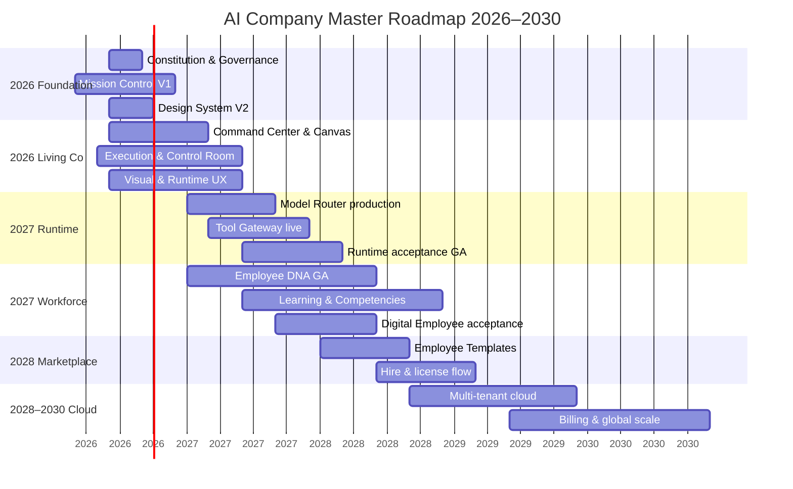

# Master Roadmap 2026–2030

> **Status:** Governance · Strategic timeline  
> **Task:** AI-COMPANY-063  
> **Parent:** [North Star Roadmap 2030](../../apps/ai-company/docs/north-star/roadmap-2030.md) · [Product Principles](../principles/product-principles.md)

Single **master roadmap** for AI Company platform and product. Dates are **directional**. Dependencies flow top → bottom; phases may overlap.

Horizon: **2026 Q2 → 2030 Q4**.

---

## Timeline at a glance

---

## 2026 — Foundation & Living Company

### H1 2026 (completed / in progress)

| Deliverable | Outcome |
|-------------|---------|
| North Star constitution | Source of truth |
| Domain model + ADRs | Employee-centric architecture |
| Mission Control shell | `/ops` operational UI |
| Core engines (mock) | Tasks, Runtime, Approvals, Reports, Events |
| Sprint & Collaboration V1 | Delivery coordination |
| AI Photo Lab vertical slice | Control Room, Canvas, Handoffs |

### H2 2026

| Deliverable | Outcome |
|-------------|---------|
| **Product & Design Governance Pack** | PRB, manifesto, UX gates (this pack) |
| **Executive Command Center** | Owner orientation surface |
| **Visual Execution Lab** | Observable employee work (mock) |
| Workday engine | Digital employee day structure |
| Design System V2 tokens in Figma | Visual language enforcement |
| UX debt registry operational | Measurable design quality |

**Exit 2026:** Owner answers North Star success criteria from `/ops` without expert navigation.

---

## 2027 — Real Runtime & Workforce

### Q1–Q2 2027

| Theme | Key results |
|-------|-------------|
| Runtime production path | Ollama + cloud adapters behind Model Router |
| [Runtime acceptance](../runtime/runtime-acceptance.md) | GA criteria met for governed runs |
| Live execution monitor | Runtime UI bound to real pipeline |
| Tool Gateway | ADR-002 enforced server-side |

### Q3–Q4 2027

| Theme | Key results |
|-------|-------------|
| Employee DNA complete | All acceptance pillars wired |
| [Digital Employee acceptance](../employees/digital-employee-acceptance.md) | Hire → operate checklist |
| Learning & competencies | Training loops affect assignment suggestions |
| Reputation & goals | Career visible on profile |

**Exit 2027:** Model swap mid-quarter without redefining employees; Runs auditable end-to-end.

---

## 2028 — Marketplace & Template Economy

| Theme | Key results |
|-------|-------------|
| Employee Templates | Marketplace sells DNA + skills + workflows |
| Template → Hire → Company Employee | Self-serve onboarding |
| Template versioning & updates | Platform pushes without breaking tenants |
| Partner templates (optional) | Third-party authors |

**Exit 2028:** New customer company operational in < 1 day from template.

See [marketplace-vision.md](../../apps/ai-company/docs/north-star/marketplace-vision.md).

---

## 2029 — AI Company Cloud

| Theme | Key results |
|-------|-------------|
| Multi-tenant SaaS | companyId isolation production-grade |
| Auth, billing, usage metering | Commercial operation |
| Data residency options | Enterprise readiness |
| SLA & observability | Platform SRE |

**Exit 2029:** First paying customer companies on cloud without forked codebase.

---

## 2030 — Scale & Category Leadership

| Theme | Key results |
|-------|-------------|
| Global marketplace catalog | Categories, search, trust scores |
| Cross-company analytics (platform) | Anonymized benchmarks |
| Advanced org simulation | What-if staffing, capacity |
| Ecosystem API | Partners build on OS primitives |

**Exit 2030:** AI Company recognized as **category** (Digital Organization OS), not feature bundle.

---

## Capability map by year

| Capability | 2026 | 2027 | 2028 | 2029 | 2030 |
|------------|:----:|:----:|:----:|:----:|:----:|
| Command Center | ● | ● | ● | ● | ● |
| Company Canvas | ● | ● | ● | ● | ● |
| Mock Runtime | ● | ○ | | | |
| Production Runtime | | ● | ● | ● | ● |
| Visual Lab (live) | ○ | ● | ● | ● | ● |
| Employee DNA complete | ○ | ● | ● | ● | ● |
| Marketplace | | ○ | ● | ● | ● |
| Multi-tenant cloud | | | ○ | ● | ● |

● primary · ○ partial

---

## Governance integration

| Gate | When |
|------|------|
| [Product Review Board](../product/product-review-board.md) | Every feature |
| [UX Review Checklist](../design/ux-review-checklist.md) | Every UI merge |
| [Runtime acceptance](../runtime/runtime-acceptance.md) | Before Runtime GA |
| [Digital Employee acceptance](../employees/digital-employee-acceptance.md) | Before template/marketplace GA |

---

## Revision

| Version | Date | Change |
|---------|------|--------|
| 1.0 | 2026-06-24 | Master roadmap 2026–2030 (AI-COMPANY-063) |
